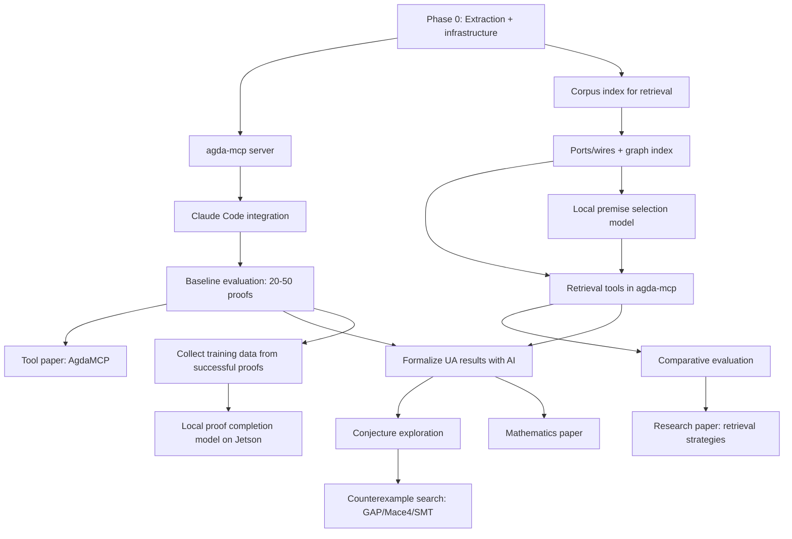

<!-- File: PLAN.md -->

# PLAN.md — Agda-Native AI Reasoning Environment

**Version:** 2.0 (living document)
**Date:** 2026-03-04
**Companion docs:**

- [`MANIFESTO.md`][MANIFESTO] (why — the Agda-native AI reasoning environment vision)
- `PLAN.md` (what / when / how)
- [`docs/representation.md`][representation] (data contracts)
- `docs/HowToRun.md` (how to run)

---

## 0. North Star

Build the **missing interaction layer** between frontier AI models and the Agda proof
assistant, augmented by **local, specialized models** for retrieval, ranking, and
routine proof completion — creating an environment where any sufficiently capable LLM
can reason effectively with Agda.

### What success looks like

1.  **Infrastructure**.  An MCP server (`agda-mcp`) that lets any MCP-compatible
    coding agent interact with Agda programmatically — inspecting goals, filling
    holes, getting diagnostics, searching the corpus.
2.  **Retrieval**.  A structured corpus with type-aware search, dependency graph
    navigation, and (optionally) neural premise selection powered by local models.
3.  **Demonstration**.  Real proofs in `agda-algebras` completed with AI assistance
    via `agda-mcp`, documented and reproducible.
4.  **Publication**.  At least one tool paper (AIM / ITP / CICM) describing the
    system and its evaluation.

---

## 1. Guiding principles

### 1.1 Build the environment, not the brain

Frontier LLMs improve monthly.  Our job is to give them the best possible interface
to Agda, not to train a competing general reasoner.  We build

+ the **interaction layer** (agda-mcp / AgdaJang),
+ the **retrieval layer** (structured corpus, search, premise selection),
+ the **evaluation layer** (benchmarks, fixtures, typecheck-based scoring).

The "intelligence" comes from whatever frontier model the user plugs in.

### 1.2 Local models for narrow tasks

Where a small, domain-specific model outperforms a general LLM — premise selection,
proof-term ranking, type-aware embeddings, routine proof completion — we train and
run locally.  These models are **tools in the MCP server's toolkit**, not
replacements for the frontier model.

Target hardware: NVIDIA Jetson AGX Orin 64GB (or equivalent desktop GPU).  This
constrains us to models ≤ 7B–13B (QLoRA fine-tuning) or ≤ 30B (quantized inference).
For specialized tasks (ranking, embeddings), 1B–3B models are likely sufficient.

### 1.3 Keep the core schema tiny

The canonical JSONL row schema remains

+ identity (`prettyQname` etc.),
+ statement (`type`, `typeAst`),
+ optional proof body (`body`, `hasBody`),
+ minimal dependencies (`dependencies`).

Everything else is a **derived view** produced by ETL.

### 1.4 Version everything structural

`typeAstVersion` already exists; keep that approach.  Add future versions as new
fields or values; don't break old ones without a major milestone.

### 1.5 Agda remains the final arbiter

All external tools — frontier LLMs, local models, SMT solvers, retrieval
engines — are *supporting actors*.  They propose candidates; **Agda checks**.

---

## 2. Architecture

```
┌──────────────────────────────────────────────────────────┐
│                    User / Editor                         │
│            (Emacs agda2-mode / VSCode / CLI)             │
└──────────────────────┬───────────────────────────────────┘
                       │
                       ▼
┌──────────────────────────────────────────────────────────┐
│              Frontier LLM Agent                          │
│         (Claude Code / Codex CLI / etc.)                 │
│                                                          │
│  Handles: strategy, planning, novel reasoning,           │
│           error interpretation, proof decomposition      │
└──────────────────────┬───────────────────────────────────┘
                       │ MCP
                       ▼
┌──────────────────────────────────────────────────────────┐
│                   agda-mcp server                        │
│                                                          │
│  Proof state tools:  get-goal, fill-hole, check-file,    │
│                      get-diagnostics                     │
│                                                          │
│  Search tools:       find-by-type, find-by-name,         │
│                      dependency-neighbors,               │
│                      premise-select (neural)             │
│                                                          │
│  Context tools:      get-file, list-modules,             │
│                      inspect-dependency-graph            │
└────────┬────────────────────────────┬────────────────────┘
         │                            │
         ▼                            ▼
┌─────────────────┐     ┌──────────────────────────────────┐
│    AgdaJang     │     │     Local models (Jetson)        │
│                 │     │                                  │
│ Programmatic    │     │  Premise selector (QUILL-like)   │
│ interaction     │     │  Type-aware embeddings           │
│ with Agda:      │     │  Proof-term ranker               │
│ goals, holes,   │     │  Routine proof completer (7B)    │
│ diagnostics,    │     │                                  │
│ type-checking   │     │  (Optional — system works        │
│                 │     │   without these, just slower)    │
└────────┬────────┘     └──────────────────────────────────┘
         │
         ▼
┌─────────────────┐
│      Agda       │
│  (typechecker   │
│   = oracle)     │
└─────────────────┘
```

**Key design property**.  The system works end-to-end with just the MCP server,
AgdaJang, and a frontier LLM.  Local models are performance optimizations that
improve retrieval quality, reduce API costs, and enable offline/low-connectivity use.

---

## 3. Data extraction: purpose and relationship to prior work

### 3.1 Why extract data?

Extracted data serves **three** purposes (none of which is "train a general-purpose
prover").

1.  **Retrieval corpus**.  The MCP server's search tools need a structured, queryable
    index of the Agda library: types, dependencies, interfaces.  This is the primary
    consumer of canonical JSONL rows.

2.  **Specialized model training**.  Premise selection, embedding, and ranking models
    are trained on corpus data.  These are narrow tasks where small models trained on
    domain-specific data outperform general LLMs.

3.  **Evaluation and benchmarking.**  Measuring whether the system works requires a
    catalogue of proof obligations with known solutions.

### 3.2 Relationship to Agda2Train (Kogkalidis, Melkonian & Bernardy)

Our extractor (`agda-backend-jsonl`) and Agda2Train are complementary.

|                       | agda-backend-jsonl (ours)                   | AGDA2TRAIN (Kogkalidis et al.)              |
|-----------------------|---------------------------------------------|---------------------------------------------|
| **Granularity**       | One row per definition                      | Many states per definition (sub-term level) |
| **Primary use**       | Retrieval, graph, LLM context               | Training neural proof-step predictors       |
| **Unique strength**   | Ports/wires, dependency graph, clean schema | Full typing context at every sub-term       |
| **Output size**       | Compact                                     | Very large                                  |
| **Human readability** | High                                        | Low                                         |

A combined system uses Agda2Train's data to train premise selection models
(like QUILL) and our data to power the retrieval/search tools in the MCP server.
This is the basis for potential collaboration.

---

## 4. Roadmap (phases)

### Phase 0 — Solid infrastructure (current → 2 weeks)

**Goal**.  Reliable, reproducible corpus extraction with a clean schema.

**Deliverables**.

+  Canonical JSONL extraction works end-to-end on agda-algebras + stdlib slices
   (`make extract-lib` runs, resumes, validates).
+  `representation.md` is accurate and complete.
+  CI passes; `clone → nix develop → run tests → extract` is one-page reproducible.

**Active issues**. tbd

### Phase 1 — agda-mcp + first proofs (near-term, 2–6 weeks)

**Goal**.  Build the MCP server, connect Claude Code to Agda, get real proofs type-checking.

**Deliverables**.

1.  **agda-mcp server** — thin MCP wrapper around AgdaJang exposing

    + `get-goal`: inspect the type of a hole and its local context;
    + `fill-hole`: propose a candidate term and get typecheck feedback;
    + `check-file`: load/reload a file and get all diagnostics;
    + `search-by-name`: find definitions matching a name pattern;
    + `search-by-type`: find definitions with compatible type signatures;
    + `get-dependencies`: retrieve the dependency neighborhood of a definition.

2.  **Claude Code integration** — demonstrate Claude Code using agda-mcp to fill
    holes in agda-algebras.  Document what works and what doesn't.

3.  **Baseline evaluation** — curate 20–50 proof obligations from agda-algebras
    (holes with known solutions).  Measure: success rate, number of iterations,
    wall-clock time.

4.  **Tool paper draft** — "AgdaMCP: An MCP Server for AI-Assisted Proof Development
    in Agda."  Target venue: AIM (fall meeting) or ITP/CICM.

**Issue mapping:**

- Update #23 (AgdaJang ↔ policy integration) to target MCP protocol.
- New issue: agda-mcp server implementation.
- New issue: baseline evaluation benchmark (20–50 proof obligations).
- New issue: Claude Code integration testing and documentation.

### Phase 2 — Retrieval and local models (medium-term, 6–12 weeks)

**Goal**.  Improve proof success rate by adding structure-aware retrieval and
training specialized local models.

**Deliverables**.

1.  **Ports/wires implementation** (#61) — emit interface descriptions and
    dependency edges.  Build the graph index.

2.  **Retrieval integration in agda-mcp** — search tools that use the graph index,
    type-signature matching, and (later) neural premise selection to find relevant
    lemmas for a given goal.

3.  **Local premise selection model** — train a QUILL-like model (or collaborate with
    Kogkalidis/Melkonian to adapt QUILL) on the agda-algebras + stdlib corpus.  Run
    inference on Jetson.

4.  **Local proof-term ranker** — fine-tune a small model (1B–3B) to rank candidate
    proof terms by likelihood of type-checking.  This reduces Agda invocations in the
    propose-check-refine loop.

5.  **Comparative evaluation** — measure improvement from retrieval and local models
    vs. Phase 1 baseline (frontier model alone).

**Research paper target**.  "Structure-Aware Retrieval for AI-Assisted Proof
Development in Agda" — compare retrieval strategies (text-based vs. type-based vs.
neural premise selection) on proof completion tasks.

### Phase 3 — Research mathematics (longer-term, 3–6 months)

**Goal**.  Use the system to do real mathematics — formalize new results in universal
algebra with AI assistance.

**Deliverables**.

1.  **Extend agda-algebras** with AI assistance — formalize results relevant to the
    finite lattice representation problem (FLRP).  Document the experience.

2.  **Conjecture exploration** — given a set of results, use the agent to suggest
    plausible extensions and attempt to prove or refute them.

3.  **Counterexample search** — integrate external tools (GAP, Mace4, or SMT solvers)
    as additional MCP tools for searching for finite countermodels.

4.  **Mathematics paper** — a paper with AI-assisted formal proofs, demonstrating the
    system on real research-level mathematics.

### Phase 4 — Routine proof completion model (stretch goal)

**Goal**.  Train a local 7B model (QLoRA on Jetson) that handles routine proof
obligations without calling the frontier model.

This is viable once we have enough successful proof completions from Phases 1–3 to
generate training data.  The model learns patterns like "this is a homomorphism
proof, apply the standard strategy" and handles the predictable 60% of proof
obligations locally, reserving the frontier model for genuinely novel situations.

**Deliverable**.  A local proof completion model that runs on Jetson (or equivalent
desktop GPU), with measured success rate on routine obligations vs. frontier model.

---

## 5. Dependency graph



---

## 6. Now / Next / Later

### NOW (1–2 weeks)

1.  Close the representation chain: #57 → #58 → #59 (converter → ETL → docs).
2.  Fix identity correctness: #53 (operator pretty-name bug).
3.  Sketch the agda-mcp server API (what operations, what MCP tool definitions, what
    response formats).
4.  Try Claude Code on agda-algebras *without* MCP — document what works and what
    doesn't.  This establishes the baseline that agda-mcp needs to beat.

### NEXT (2–6 weeks)

1.  Build agda-mcp: the thinnest possible MCP wrapper around AgdaJang.
2.  Connect Claude Code via agda-mcp; get the first 2–3 proofs type-checking.
3.  Curate the evaluation benchmark (20–50 proof obligations).
4.  Talk to Orestis about collaboration.
5.  Start tool paper draft.

### LATER (6+ weeks)

1.  Implement ports/wires (#61) and graph-based retrieval.
2.  Train/adapt premise selection model for retrieval.
3.  Begin formalizing UA results with AI assistance.
4.  Counterexample search integration.
5.  Local proof completion model (Jetson).

---

## 7. Data representation and derived views

The data contract is specified in `docs/representation.md`.  Here wesummarize what
views exist, what they're for, and how they feed into the system.

### 7.1 Canonical JSONL rows (backend output)

One row per definition.  Used for: retrieval index, graph construction, evaluation
benchmark source, LLM prompt context.

### 7.2 Derived views

+  **Graph edge list**: `(prettyQname, dep, depKind)` — for retrieval, curriculum,
   and dependency analysis.
+  **Ports/wires** — interface descriptions for type-aware search and compatibility
   matching.
+  **Proof-completion dataset**: `(goal, context) → target` — for training the local
   proof completion model and for evaluation.
- **Embedding training pairs:** pairs of (goal, relevant-lemma) for training
  type-aware embedding models.

### 7.3 What we do NOT extract (and why)

+  **Sub-term proof states** (Agda2Train's specialty).  These are needed for training
   neural proof-step predictors (QUILL-like models) but are not needed for retrieval
   or LLM prompting.  If we collaborate with Kogkalidis/Melkonian, we use their tool
   for this purpose rather than duplicating it.

---

## 8. Local model training plan

### 8.1 Models to train (ordered by priority)

1.  **Type-aware embedding model** (Phase 2)

    +  Architecture: sentence-transformer variant, fine-tuned on (type, relevant-lemma) pairs from the corpus.
    +  Size: ~100M–400M parameters.
    +  Purpose: powers semantic search in agda-mcp.
    +  Training data: derived from dependency graph + proof bodies.

2.  **Premise selection model** (Phase 2)

    +  Architecture: QUILL (Kogkalidis et al.) or a simpler classifier/ranker.
    +  Size: custom architecture, relatively small.
    +  Purpose: given a goal, rank which lemmas are most likely useful.
    +  Training data: AGDA2TRAIN output (collaboration with Melkonian) or derived from our corpus.

3.  **Proof-term ranker** (Phase 2–3)

    +  Architecture: small classifier (1B–3B), fine-tuned to predict whether a candidate term will typecheck.
    +  Purpose: cheap filter before expensive Agda invocations.
    +  Training data: collected from Phase 1–2 propose-check-refine loops (both successes and failures).

4.  **Routine proof completion model** (Phase 4)

    +  Architecture: 7B LLM, QLoRA fine-tuned.
    +  Purpose: handle predictable proof obligations without API calls.
    +  Training data: successful proof completions from Phases 1–3.
    +  Hardware: NVIDIA Jetson AGX Orin 64GB.

### 8.2 What we do NOT train

+  A general-purpose Agda theorem prover.
+  A model intended to compete with frontier LLMs on open-ended reasoning.
+  Anything requiring datacenter-scale compute.

---

## 9. Collaboration: Kogkalidis, Melkonian & Bernardy (KMB)

### 9.1 What they have

+  Agda2Train: sub-term-level proof state extraction.
+  QUILL: structure-aware neural architecture for premise selection.
+  Algebraic Positional Encodings: tree-structure-aware attention.
+  A published, evaluated system (NeurIPS 2024).

### 9.2 What we have

+  agda-backend-jsonl: definition-level structural corpus extraction.
+  AgdaJang: programmatic interaction with Agda (goals, holes, diagnostics).
+  Ports/wires knowledge-graph view (in progress).
+  agda-algebras: a substantial universal algebra formalization.

### 9.3 The combination

+  KMB's **QUILL** becomes a retrieval tool behind our **agda-mcp** server.
+  KMB's **AGDA2TRAIN** generates training data for premise selection; our
   **agda-backend-jsonl** generates the retrieval index and LLM context.
+  **AgdaJang** provides the interaction loop that neither tool currently has.
+  The resulting system is the Agda equivalent of Numina-Lean-Agent, but with
   structure-aware retrieval that Lean tools lack.

---

## 10. Research questions

+  **H1**. Agda's term-level proofs provide richer, more direct signals for
   AI-assisted proof search than tactic-level representations.

   *Testable*.  Compare proof completion rates using structural (term-level)
   retrieval vs. text-level retrieval on matched proof obligations.

+  **H2**.  Cubical Agda enables AI reasoning about equality, transport, and quotient
   constructions that is not possible in systems where these features are axiomatic.

   *Testable*.  Identify proof tasks requiring computational univalence or HITs and
   test whether AI agents can handle them.

+  **H3**.  A hybrid architecture combining frontier LLMs (for reasoning) with local
   specialized models (for retrieval and ranking) outperforms either component alone
   on Agda proof completion.

   *Testable*. Compare success rates across configurations: frontier-only,
   local-only, and hybrid.

---

## 11. Maintenance

+  Every issue declares: inputs/outputs, acceptance criteria, which phase it belongs to.
+  PLAN.md is updated when: a phase milestone closes, a new research direction gains
   a concrete hook, or the architecture changes.
+  The GitHub issue list is generated dynamically (see Appendix A of the original
   PLAN.md for the `gh` command).

---

## 12. Dropped or deferred from v1

The following items from PLAN v1 are explicitly **not** in the current plan.  They
may be revisited if circumstances change.

+  **Custom general-purpose prover model**.

   Replaced by frontier LLM + MCP architecture.  Training a general Agda prover is
   not competitive with frontier models and not a good use of limited resources.

+  **Fine-tuning pipeline for next-tactic/next-step prediction**.

   The "Workstream E" from v1 assumed we'd train a model to predict proof steps from
   definition rows.  This is subsumed by (a) using frontier models for reasoning and
   (b) training narrow local models for specific tasks (premise selection, ranking).

+  **SMT as oracle tactic / reflection-based tactics** (Phases 2–3 of v1).

   Interesting but premature.  Counterexample search  via external tools (GAP,
   Mace4, SMT) is retained as a Phase 3 stretch goal, but deep Agda-reflection
   integration is deferred.

+  **FastAPI model server**.

   Replaced by MCP server.  The MCP protocol is the standard that coding agents
   (Claude Code, Codex CLI) already speak.

+  **Heyting/entailment derived views, Abramsky/GoI wiring semantics**.

   Intellectually interesting research directions, but not blocking any phase.
   Retained as "safe to explore" side investigations if time permits.

[MANIFESTO]: https://github.com/formalverification/agda-ai-prover/blob/main/MANIFESTO.md
[representation]: https://github.com/formalverification/agda-ai-prover/blob/main/docs/representation.md

