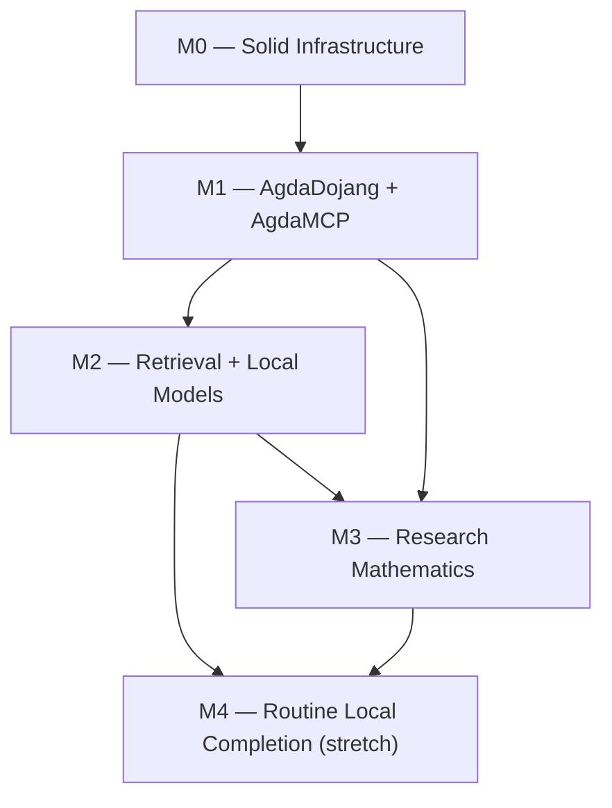

<!--
File: docs/GITHUB_PROJECT.md

The living project plan for agda-native-air, in the format of the
williamdemeo/github-project template.

This file is partially generated by that template's engine
(scripts/gh_project_update.py in a github-project checkout; see the
`project-*` targets in this repository's Makefile).  Manual prose —
everything outside the marked regions: summary, milestone descriptions,
exit criteria, dependency graph, the field-driven-work section — is
hand-edited.  Issue listings between

    BEGIN GENERATED: milestone-N
    ...
    END GENERATED: milestone-N

markers are regenerated from GitHub state by `make project-update`;
edits inside those regions are overwritten on the next update.
Structure lives here; state (issue numbers, open/closed, assignees)
lives on GitHub.

This file supersedes docs/roadmap.md, the frozen bootstrap plan from
which the original milestones and [MN-k] issues were populated.
-->

# agda-native-air — GitHub Project Roadmap

**Project Title**:  agda-native-air — an Agda-native AI research environment

**Repository**:  `formalverification/agda-native-air`

---

## Summary

Build the missing interaction layer between frontier AI models and the Agda proof assistant.  The system has three core components — `agda-dojang` (interaction), `agda-mcp` (MCP bridge), and `agda-strux` (structured corpus extraction) — plus an optional local-model layer for specialized tasks.  The goal is an environment where any sufficiently capable LLM can reason effectively with Agda.

---

## Labels

Topic labels used by the issues in this repository.

- `agda-dojang` (0075ca) — AgdaDojang interaction layer.
- `agda-mcp` (0075ca) — agda-mcp server.
- `agda-strux` (0075ca) — agda-strux extraction.
- `eval` (0075ca) — Evaluation and benchmarks.
- `retrieval` (5319e7) — Retrieval and search.
- `local-models` (5319e7) — Local specialized models.
- `research` (5319e7) — Research mathematics.
- `docs` (0e8a16) — Documentation.
- `ci` (fbca04) — Continuous integration.
- `infrastructure` (fbca04) — Build system and tooling.
- `migration` (d93f0b) — Migration from agda-ai-prover.
- `cleanup` (d93f0b) — Code and doc cleanup.
- `paper` (c5def5) — Publication targets.
- `chore` (e4e669) — Housekeeping; no user-visible change.
- `meta` (ededed) — Project meta / process.
- `reproducibility` (1d76db) — Reproducibility and dev workflow.
- `bug` (d73a4a) — Something isn't working.
- `enhancement` (a2eeef) — New feature or request.
- `good first issue` (7057ff) — Good for newcomers.

---

## Milestones

### Milestone 0 — Solid Infrastructure

**Description:**

Complete the migration from `agda-ai-prover` to `agda-native-air`.  Stabilize extraction, evaluation, CI, and documentation so that a new collaborator can reproduce the full workflow without tribal knowledge.

**Exit criterion:**

`clone → nix develop → tests → extraction → eval` is documented, reproducible, and passes CI.

---

### Milestone 1 — AgdaDojang + AgdaMCP + First End-to-End Proofs

**Description:**

Build the `agda-mcp` server, connect a frontier coding agent (Claude Code / Codex CLI) to Agda, and get real proofs type-checking through the MCP interface.  Produce a baseline benchmark and a tool paper draft.

**Exit criterion:**

A frontier agent can solve a nontrivial benchmark slice through the `agda-mcp` interface with reproducible reports.

---

### Milestone 2 — Retrieval Layer + Local Models

**Description:**

Add structure-aware retrieval to `agda-mcp` (type-based search, dependency graph navigation, neural premise selection).  Train narrow local models for premise selection, type-aware embeddings, and proof-term ranking.

**Exit criterion:**

Retrieval and ranking measurably improve the baseline benchmark from Milestone 1.

---

### Milestone 3 — Research Mathematics & Counterexample Workflows

**Description:**

Use the system for real mathematics — extend `agda-algebras` with AI assistance, explore FLRP-relevant formalizations, and integrate counterexample search tools.

**Exit criterion:**

At least one credible AI-assisted formalization case study exists beyond fixture demos.

---

### Milestone 4 — Routine Local Proof Completion (Stretch)

**Description:**

Train a local 7B model (QLoRA on Jetson) that handles routine proof obligations without calling the frontier model.  This becomes viable once Milestones 1–3 generate enough training data.

**Exit criterion:**

A local routine-completion model is useful enough to justify its maintenance cost.

---

### Milestone dependencies

Hand-authored; update never touches it.



---

## Field-driven work outside the milestone plan

Not all work fits the `[MN-k]` planning grid.  Issues filed in response to field experience carry no `[MN-k]` identifier, so the engine cannot render them into the generated regions below; they are tracked directly on GitHub and summarized here by their tracking issues.

+  The agda-mcp field-test hardening wave, tracked by [#68](https://github.com/formalverification/agda-native-air/issues/68): trust fixes (#69–#73), reach (#74–#77), ergonomics (#78, #79), the path-resolution and missing-file fix the #83 field test surfaced (#101), and its measurement and publication companions (#83, #85, #86).  See `docs/agda-mcp-improvements-summary.md` for an executive summary and `docs/feedback/flrp-agda-mcp-improvements.md` for the field report that motivated it.
+  In-place checking of library-embedded modules (#66, #67), an earlier field-driven fix in the same spirit.
+  Agda-Nix library management follow-ons (#54, #55) and the `makeOverlay` optimization (#43).

---

## Issues

Each issue below carries its milestone, labels, and body, mirrored from GitHub.  The `[MN-k]` ID in each heading is the join key the engine uses; the `(#N)` suffix is the GitHub issue number.  Regions are regenerated by `make project-update`; issues without a `[MN-k]` prefix are listed in the section above instead.

## Milestone 0 — Solid Infrastructure

<!-- BEGIN GENERATED: milestone-0 -->

### Issue M0-1: Complete migration cleanup — move non-core work to `experiments/` (#1, closed)

**Labels:** `migration`, `cleanup`

**Assignees:** @williamdemeo

#### Description

Move non-core files from the migration into `experiments/` or `experiments/archive/`
to keep the top-level repo focused on the three primary components (agda-dojang,
agda-strux, agda-mcp).

#### Tasks

- [x] Move legacy ML pipeline training scripts (not used by current smoke tests) to
      `experiments/archive/ml-pipeline/`
- [x] Move older policy backends to `experiments/archive/`
- [x] Move researchy derived-view experiments to `experiments/`
- [x] Move older roadmap material about conjecture generation to `experiments/archive/`
- [x] Verify CI still passes after moves
- [x] Update any remaining cross-references in docs

#### Acceptance criteria

- [x] `experiments/` directory exists with a README explaining its contents
- [x] Top-level directory layout matches `docs/public-history.md` §6
- [x] CI passes; no broken imports or Make targets

---

### Issue M0-2: Verify and document the `clone → nix develop → test → eval` workflow (#2, closed)

**Labels:** `docs`, `good first issue`, `reproducibility`

**Assignees:** @williamdemeo

#### Description

A new collaborator should be able to follow a single document and reproduce the full
extraction + evaluation story.  Currently `docs/HowToRun.md` exists but may have
stale references from the migration.

#### Tasks

- [x] Walk through `docs/HowToRun.md` on a clean checkout and fix any errors
- [x] Verify `nix develop` provides all required tools (Agda, GHC, sbt, Python)
- [x] Verify `make backend-test` (agda-strux Haskell tests) passes
- [x] Verify `make eval-proof-completion-smoke` runs end-to-end
- [ ] Verify extraction path: document current status clearly (working / WIP / known issues)
- [ ] Add a "Quick Start" section at the top of HowToRun.md with ≤ 5 commands

#### Acceptance criteria

- [ ] A reviewer can follow the doc from scratch without asking for help
- [ ] Each Make target mentioned in docs either works or has a clear status note

---

### Issue M0-3: Stabilize CI — add smoke target and ensure all jobs are green (#3, closed)

**Labels:** `ci`, `infrastructure`

**Assignees:** @williamdemeo

#### Description

Ensure the CI workflow (`.github/workflows/`) covers the four core test lanes:
Scala proof-parser, Scala ETL, Python ml-pipeline, and Haskell backend.  Add a
top-level smoke target that exercises the minimum end-to-end path.

#### Tasks

- [x] Audit current CI workflow against the four test jobs
- [x] Fix any failures or stale references from the migration
- [x] Add `make ci-smoke` (or equivalent) that runs the minimal suite locally
- [x] Ensure CI is time-bounded (< 15 min total)
- [x] Add CI badge to README.md

#### Acceptance criteria

- [x] CI passes on `main` with all four lanes green
- [x] `make ci-smoke` exists and passes locally
- [x] CI badge appears in README

---

### Issue M0-4: Remove stale references and update docs for `agda-native-air` branding (#4, closed)

**Labels:** `docs`, `cleanup`

**Assignees:** @williamdemeo, @hyeyoungshin, @Copilot

## Description

Scrub all docs, Makefiles, and source comments for residual `agda-ai-prover`,
`AgdaJang`, `agda-jang`, `FastAPI model server`, and old issue numbers.  Replace
with `agda-native-air`, `AgdaDojang`, `agda-dojang`, `agda-mcp` as appropriate.

Docs relevant to this issue:

- [Section 5 of PLAN doc](https://github.com/formalverification/agda-native-air/blob/main/docs/PLAN.md#5-current-issue-map-what-carries-forward)
- [public-history.md doc](https://github.com/formalverification/agda-native-air/blob/main/docs/public-history.md)

### Tasks

- [ ] `grep -r "agda-ai-prover\|agda-jang\|AgdaJang\|FastAPI" --include="*.md" --include="*.scala" --include="*.py" --include="*.hs" --include="Makefile"`
- [ ] Fix all occurrences (rename or remove as appropriate)
- [ ] Remove or update old issue references (e.g., `#23`, `#65` from the old repo)
- [ ] Ensure `docs/representation.md` is current
- [ ] Remove FastAPI-first framing from any surviving docs

### Acceptance criteria

- [ ] `grep -r "agda-ai-prover\|agda-jang\b\|AgdaJang\b"` returns zero results (outside `docs/public-history.md` and `CHANGELOG`)
- [ ] No doc references to issue numbers from the old repo without context

---

### Issue M0-5: Preserve and verify deterministic fixture-based proof completion (#5, closed)

**Labels:** `agda-dojang`, `eval`, `infrastructure`

**Assignees:** @williamdemeo

#### Description

The evaluator + fixture suite from the old repo is a critical asset.  Verify that
the deterministic proof-completion pipeline still works end-to-end after migration.

#### Tasks

- [x] Verify `make eval-proof-completion-smoke` passes
- [x] Verify `make eval-proof-completion` passes (if fixtures are present)
- [x] Ensure fixture files exist under `data/fixtures/` (or equivalent)
- [x] Confirm evaluation report schema is documented
- [x] Add a brief section to `docs/HowToRun.md` explaining how to run the evaluator

#### Acceptance criteria

- [x] `make eval-proof-completion-smoke` passes deterministically (same output on repeated runs)
- [x] At least one fixture hole is solved (typechecks) in the smoke run
- [x] Fixtures and their gold solutions are committed and documented

---

### Issue M0-6: Write `docs/architecture.md` — document the four-layer system (#6, closed)

**Labels:** `docs`

**Assignees:** @hyeyoungshin

# Description

Create a standalone architecture document that explains the three-layer system (agda-dojang, agda-mcp, agda-strux) with the ASCII diagram from PLAN.md, component roles, data flow, and how local models fit in.

## Tasks

- [x] Create `docs/architecture.md`
- [x] Include the system architecture diagram from [§2 of `docs/PLAN.md`](https://github.com/formalverification/agda-native-air/blob/main/docs/PLAN.md#2-architecture)
- [ ] Document each layer's role, inputs, outputs, and current status
- [ ] Explain the "works without local models" design property
- [ ] Link to MANIFESTO.md for vision and PLAN.md for roadmap
- [ ] Link from README.md

## Acceptance criteria

- [ ] `docs/architecture.md` exists, is linked from README
- [ ] A newcomer can read it and understand how the pieces fit together

---

### Issue M0-7: Stub `agda-mcp/` directory with README and roadmap (#7, closed)

**Labels:** `agda-mcp`, `docs`

**Assignees:** @williamdemeo

#### Description

Create the `agda-mcp/` directory structure with a README that describes the planned
MCP server, its tool surface, and how it wraps `agda-dojang`.  This gives the MCP
work a home before implementation begins in Milestone 1.

#### Tasks

- [ ] Create `agda-mcp/README.md`
- [ ] Document the planned tool surface: `get-goal`, `fill-hole`, `check-file`,
      `search-by-name`, `search-by-type`, `get-dependencies`, `get-diagnostics`
- [ ] Reference the MCP protocol specification
- [ ] Note language choice (Haskell, wrapping agda-dojang) and rationale
- [ ] Include a "Status: not yet implemented" banner

#### Acceptance criteria

- [ ] `agda-mcp/README.md` exists and is referenced from `docs/architecture.md`
- [ ] Planned tool surface is enumerated with brief descriptions

---

### Issue M0-8: Seed labels and issue templates for the repo (#8, closed)

**Labels:** `good first issue`, `meta`

**Assignees:** @hyeyoungshin

#### Description

Set up standard GitHub infrastructure: issue labels, issue templates, and a
CODEOWNERS file (optional).

#### Tasks

- [x] Create labels: `agda-dojang`, `agda-mcp`, `agda-strux`, `eval`, `docs`, `ci`,
      `infrastructure`, `retrieval`, `local-models`, `research`, `good first issue`,
      `migration`, `cleanup`, `paper`
- [x] Create issue template for bug reports
- [x] Create issue template for feature requests (with milestone field)
- [x] Optionally add `.github/CODEOWNERS`

#### Acceptance criteria

- [x] Labels exist on the repo
- [x] At least one issue template is committed

---

### Issue M0-9: Move Haskell CI (agda-strux tests) to Nix + Cachix (#47, closed)

**Labels:** `ci`, `infrastructure`

## Description

The `haskell-backend-jsonl` CI job currently uses `haskell-actions/setup` with `actions/cache` for the cabal store.  In practice the cache rarely hits (the key references files that may not exist, and jobs get cancelled by `cancel-in-progress` before the cache is saved), so every run cold-builds Agda-as-a-library from source — taking 20+ minutes and frequently timing out.

The Agda proof-completion smoke job (`agda-dojang-eval`) already uses `cachix/install-nix-action` + `cachix/cachix-action` and completes in ~2–3 minutes on a warm cache.  We should do the same for the Haskell backend tests.

### Motivation

+  Cold Haskell builds take 20–30 min (Agda-as-a-library is enormous).
+  The cabal cache is fragile: key mismatches, cancellation before save, no cross-job sharing.
+  Nix + Cachix gives us hermetic builds and a shared binary cache that survives across PRs, branches, and contributors.
+  Consistency: all heavyweight CI jobs would use the same caching strategy.

### Tasks

- [ ] Replace `haskell-actions/setup` + `actions/cache` with `cachix/install-nix-action` + `cachix/cachix-action` in the `haskell-backend-jsonl` job.
- [ ] Run `make backend-test` inside `nix develop .#backend` (same as local).
- [ ] Verify the Cachix `formalverification` cache is populated with the GHC 9.8.2 + Agda 2.8.0 store paths after the first successful run.
- [ ] Confirm warm-cache runtime is < 5 minutes.
- [ ] Consider doing the same for a future `agda-mcp` CI job (GHC 9.10.3).

### Acceptance criteria

- [ ] `haskell-backend-jsonl` uses Nix + Cachix and passes.
- [ ] Warm-cache runtime ≤ 5 minutes.
- [ ] No regression in test coverage (same `make backend-test` target).

### Notes

The `agda-dojang-eval` job in `ci.yml` is a good template — it already has the Nix install, Cachix setup, and `nix develop` invocation pattern.

---

### Issue M0-10: Infra: Extensible Agda library configuration in Nix dev shells (#51, closed)

**Labels:** `agda-dojang`, `infrastructure`, `reproducibility`

**Assignees:** @williamdemeo

## Problem

The Nix dev shells use `agda.withPackages` to provide Agda with stdlib pre-registered.  This creates a wrapper binary that bakes in `--library-file /nix/store/.../libraries`, which points only at stdlib.

The shell hook writes a *separate* repo-local libraries file at `$AGDA_DIR/libraries` that includes both stdlib and `agda-dojang`, but the wrapper's baked-in flag takes precedence.  Consequently:

+  Bare `agda Foo.agda` at the CLI ignores the repo-local config and fails with `Library 'agda-dojang' not found` whenever the `defaults` file lists `agda-dojang`.
+  External libraries like `agda-algebras` cannot be registered at all through the Nix shell without manual flag-passing.
+  The existing `eval_fixtures.py` evaluator works around this by passing `--no-default-libraries --library-file ...` explicitly, but this workaround is invisible and fragile.

This means the basic experience of `nix develop` followed by `agda some-file.agda` is broken for any file that depends on agda-dojang or external libraries.

---

## Desired Behavior

After entering any Agda-equipped Nix shell (`default`, `backend`, `all`):

1.  `agda SomeFile.agda` **just works** for files that import from `standard-library`, `agda-dojang`, or any registered external library.
2.  External libraries (agda-algebras, agda-categories, TypeTopology, etc.) can be registered via environment variables, with clear shell-hook messages indicating what's available.
3.  The configuration is transparent and debuggable — users can see exactly which libraries are registered and where.

---

## Proposed Solution

1. #52 
2. #53
3. #54 
4. #55 

---

## Cost Assessment

| Phase | Effort | Risk | Benefit |
|---|---|---|---|
| 1. Shell function | ~15 min | Near-zero | Fixes the broken `agda` CLI experience |
| 2. Env-var registration | ~1 hour | Low | Makes external libs discoverable and easy |
| 3. Nix-managed external libs | ~3 hours | Medium | Full reproducibility for collaborators |
| 4. Interactive selection | ~1 day | Low | Nice UX, probably overkill for now |

---

## Plan

We should implement Phases 1 and 2 immediately (they're tiny and have immediate payoff for the M1-5 benchmark work).  We might defer Phase 3 until a collaborator needs reproducible agda-algebras access without a local clone.  We'll should probably skip Phase 4 unless/until the project grows beyond 3–4 external libraries.

---

## Acceptance Criteria

- [ ] `nix develop` followed by `agda data/agda/ValidateImports.agda` works
- [ ] Setting `AGDA_ALGEBRAS_SRC` and re-entering the shell registers the library
- [ ] Shell hook prints which Agda libraries are registered
- [ ] `make eval-benchmark-gold` uses the correct library configuration
- [ ] Documented in `docs/HowToRun.md`

---

### Issue M0-10a: Agda-Nix Phase 1: Shell function override (quick, low-risk) (#52, closed)

**Labels:** `agda-dojang`, `infrastructure`, `reproducibility`

**Assignees:** @williamdemeo

Add a shell function in the hook that shadows the Nix wrapper:

```bash
agda() {
  command agda --no-default-libraries \
               --library-file "$AGDA_DIR/libraries" \
               "$@"
}
export -f agda
```

This is transparent (just adds flags), doesn't affect the Nix wrapper itself, and makes `agda Foo.agda` use the repo-local libraries file.

---

### Issue M0-10b: Agda-Nix Phase 2: Optional external library registration (#53, closed)

**Labels:** `agda-dojang`, `infrastructure`, `reproducibility`

**Assignees:** @williamdemeo

Extend the shell hook to detect environment variables for external libraries and register them automatically:

```bash
# Optional libraries — set these in your shell profile or .envrc
# AGDA_ALGEBRAS_SRC=~/git/ualib/agda-algebras/master/src
# AGDA_CATEGORIES_SRC=~/git/agda-categories/src
# AGDA_TYPETOPOLOGY_SRC=~/git/TypeTopology/source

for var in AGDA_ALGEBRAS_SRC AGDA_CATEGORIES_SRC AGDA_TYPETOPOLOGY_SRC; do
  src="${!var:-}"
  if [ -n "$src" ]; then
    # Walk up from src/ to find the .agda-lib file
    lib_dir="$(dirname "$src")"
    lib_file="$(find "$lib_dir" -maxdepth 1 -name '*.agda-lib' | head -1)"
    if [ -n "$lib_file" ]; then
      echo "$lib_file" >> "$AGDA_DIR/libraries"
      echo "[agda] registered $(basename "$lib_file" .agda-lib) from $lib_file"
    else
      echo "[agda] WARN: $var set but no .agda-lib found in $lib_dir"
    fi
  fi
done
```

The shell hook already prints a summary of available tools; extend it to list registered Agda libraries:

```
✅ agda-native-air (CPU dev shell)
   Agda : Agda version 2.8.0
   Agda libraries:
     ✅ standard-library (Nix-managed)
     ✅ agda-dojang (repo-local)
     ✅ agda-algebras (~/git/ualib/agda-algebras/master)
     ⚠️  agda-categories: set AGDA_CATEGORIES_SRC to enable
```

---

### Issue M0-11: Pre-public cleanup: remove legacy `agda-ai-prover` remnants (#49, closed)

**Labels:** `infrastructure`, `cleanup`

**Assignees:** @williamdemeo

## Summary

Before making the repository public, remove files and directories that were carried over from the `agda-ai-prover` project and are no longer part of the active `agda-native-air` architecture.  All deprecated code has already been preserved in
`experiments/archive/`, so removals from the active tree are safe.

The goal is to bring the repository layout into alignment with `docs/public-history.md §6` and `README.md`, while preserving every component that is still exercised by active `Makefile` targets or CI.

---

## What stays (and why)

These directories are **active** and must not be removed:

+  **`strux-driver/`** — Scala orchestration layer that drives the `agda-strux` Haskell backend.  `AgdaJsonlDriver.scala` handles module discovery, parallel/resumable execution, JSONL validation, and manifest generation.  Used by `make extract-lib`, `make extract-lib-smoke`, `make test` (aliased to `test-strux-driver`), and `make test-integration`.

+  **`ml-pipeline/`** — Scala ETL programs (`BuildProofCompletionDataset.scala`, `PreprocessAgda.scala`) and active Python tooling (`filter_jsonl.py`, `train_retrieval.py`).  Used by `make etl-*`, `make train-retrieval-smoke`, `make eval-proof-completion-smoke-retrieval`, and `make filter`.

+  **`experiments/archive/`** — Intentional archive of deprecated code; kept for research continuity.

---

## Items to remove

### 1. `target/` (top-level)

**Action: REMOVE entirely.**

Stale sbt global build output directory, left over from when `build.sbt` lived at the project root.  Contains only `global-logging/` and `task-temp-directory/`.  Add `target/` to `.gitignore` if not already present.

### 2. `scratch/`

**Action: REMOVE entirely.**

Contains:  
- `agda-ai-prover-ALL_ISSUES.txt` — dump of old issue tracker
- `agda-ai-prover-PROJECTS.txt` — dump of old GitHub project boards
- `proposed-starting-issues.md` — early planning notes

Superseded by `docs/roadmap.md` and the current GitHub issue tracker.

### 3. `ml-pipeline/` — selective cleanup of deprecated Python files

The `ml-pipeline/README.md` already marks these with footnotes and strikethrough.  The deprecated files have copies in `experiments/archive/ml-pipeline/` and can be deleted from the active tree.

**Action: REMOVE the following files from `ml-pipeline/`:**

- `ml-pipeline/python/model/train.py` — legacy MLP trainer
- `ml-pipeline/python/model/batch_infer.py` — legacy MLP batch inference
- `ml-pipeline/python/model/export_onnx.py` — ONNX export
- `ml-pipeline/python/model/export_script.py` — TorchScript export
- `ml-pipeline/python/model/build_finetune_dataset.py` — instruction-tuning dataset builder
- `ml-pipeline/python/tests/test_main.py` — tests for archived FastAPI app
- `ml-pipeline/python/tests/test_dataset_pipeline.py` — tests for archived finetune dataset builder
- `ml-pipeline/Dockerfile` — Docker image for archived FastAPI serving (if present at top level; already archived)
- `ml-pipeline/Makefile` — deprecated sub-Makefile (already marked deprecated in its own header; all its targets drive archived code)

**Action: KEEP the following (active):**

- `ml-pipeline/build.sbt`, `ml-pipeline/project/` — Scala build config
- `ml-pipeline/etl/` — active ETL programs (`BuildProofCompletionDataset`, `PreprocessAgda`, `PreprocessAgdaSchema`, test resources)
- `ml-pipeline/python/conftest.py` — pytest config
- `ml-pipeline/python/requirements.txt` — dependencies
- `ml-pipeline/python/model/filter_jsonl.py` — active JSONL filter
- `ml-pipeline/python/model/train_retrieval.py` — active retrieval trainer
- `ml-pipeline/python/scripts/inspect_runtime.py` — runtime diagnostic
- `ml-pipeline/python/tests/test_train_retrieval.py` — active retrieval tests
- `ml-pipeline/scripts/run_etl.sh` — ETL runner (verify still used; if dead, remove)
- `ml-pipeline/README.md` — update footnotes to note deletions

### 4. `strux-driver/` — clean build artifacts only

**Action: REMOVE build artifacts, KEEP source.**

- Remove `strux-driver/target/` — sbt build output (add to `.gitignore`)
- Remove `strux-driver/output/theorems.jsonl` — sample output that shouldn't be committed (add `strux-driver/output/` to `.gitignore`)
- Keep everything in `src/`, `build.sbt`, `project/`, `Makefile`, `README.md`

### 5. `configs/` — evaluate and relocate or remove

Contains:  
- `agda-algebras.yaml` — extraction configuration for agda-algebras

**Action: EVALUATE.** If this config is referenced by active extraction targets (`make extract-lib` or `AgdaJsonlDriver`), relocate it to a more discoverable location (e.g., `strux-driver/configs/` or `data/configs/`).  If unreferenced, remove.

- `log4j2.properties` — Spark logging config.  Likely still needed by `strux-driver`'s Spark runner.  If so, relocate alongside the driver; otherwise remove.

### 6. `scripts/` — remove legacy shell scripts

**Action: REMOVE the following:**

- `scripts/run-sbt.sh` — sbt wrapper for the legacy pipeline
- `scripts/run-server.sh` — FastAPI server launcher (legacy)
- `scripts/setup_gpu_venv.sh` — Jetson GPU venv setup (premature; M4 at earliest)
- `scripts/pycuda.sh` — CUDA setup script (premature; M4 at earliest)

**Action: KEEP the following (active):**

- `scripts/python/agda_lib_metadata.py` — actively used by `make metadata`
- `scripts/python/gh_project_populate.py` — roadmap tooling
- `scripts/python/doc_check.py` + `doc_check_guide.md` — documentation linting
- `scripts/python/utils/` — shared utilities
- `scripts/README.md`

### 7. Committed build artifacts in `data/agda/`

**Action: REMOVE `.agdai` files; add `*.agdai` to `.gitignore`.**

- `data/agda/agda-example.agdai`
- `data/agda/Empty.agdai`
- `data/agda/Example.agdai`

These are Agda interface files (compiled caches) that should never be committed.

---

## Makefile cleanup

After the file deletions, audit the top-level Makefile for any remaining references to deleted files.  The already-commented-out `LEGACY` blocks (the old `train` and `finetune-dataset` targets) should be removed entirely rather than left as comments.  All uncommented targets should still work.

Specifically:  
- Remove the commented-out `train` target block (lines marked `LEGACY — archived`)
- Remove the commented-out `finetune-dataset` target block (same marker)
- Verify `make help` output contains no references to deleted files
- Verify all listed targets still work

---

## `ml-pipeline/README.md` update

After deletions, update the README:
- Remove the deprecated file listings (or replace with a note pointing at `experiments/archive/ml-pipeline/`)
- Remove or simplify the footnotes about archived files
- Ensure the "Directory Structure" section reflects only what remains

---

## Tasks

- [ ] Remove `target/` (top-level); add to `.gitignore`
- [ ] Remove `scratch/`
- [ ] Remove deprecated Python files from `ml-pipeline/python/model/` (5 files)
- [ ] Remove deprecated test files from `ml-pipeline/python/tests/` (2 files)
- [ ] Remove `ml-pipeline/Dockerfile` and `ml-pipeline/Makefile` if present at top level
- [ ] Remove `strux-driver/target/`; add to `.gitignore`
- [ ] Remove `strux-driver/output/theorems.jsonl`; add `strux-driver/output/` to `.gitignore`
- [ ] Evaluate `configs/` — relocate or remove each file
- [ ] Remove legacy scripts: `run-sbt.sh`, `run-server.sh`, `setup_gpu_venv.sh`, `pycuda.sh`
- [ ] Remove `.agdai` files from `data/agda/`; add `*.agdai` to `.gitignore`
- [ ] Clean commented-out `LEGACY` target blocks from top-level Makefile
- [ ] Update `ml-pipeline/README.md` to reflect remaining active files only
- [ ] Verify `make help` output is clean
- [ ] Verify `make ci-smoke` still passes
- [ ] Verify `make test` still passes
- [ ] Verify `make train-retrieval-smoke` still passes

## Acceptance Criteria

- [ ] No deleted file is referenced by any uncommented Makefile target
- [ ] All active Makefile targets pass: `test`, `etl-proof-completion-smoke`, `train-retrieval-smoke`, `eval-proof-completion-smoke`
- [ ] `*.agdai` and build output directories are in `.gitignore`
- [ ] `ml-pipeline/README.md` documents only active files
- [ ] `scratch/` and top-level `target/` no longer exist
- [ ] `tree -L 2` shows a cleaner layout with no dead-code directories

## Non-Goals

- Refactoring the Makefile beyond removing dead targets and legacy comment blocks
- Rearchitecting the extraction or ETL pipeline
- Removing `experiments/archive/` (intentionally preserved)
- Touching any active Scala, Python, or Haskell source code

<!-- END GENERATED: milestone-0 -->

---

## Milestone 1 — AgdaDojang + AgdaMCP + First End-to-End Proofs

<!-- BEGIN GENERATED: milestone-1 -->

### Issue M1-1: Stabilize AgdaDojang — tighten tests and document the action space (#9, closed)

**Labels:** `agda-dojang`, `infrastructure`

**Assignees:** @williamdemeo

#### Description

Before building the MCP layer, ensure AgdaDojang's core loop (goal inspection →
candidate proposal → typecheck feedback) is solid, well-tested, and documented.

Carries forward the spirit of old issues #6 (tests) and #20 (tactic vocabulary),
reframed for the new architecture.

#### Tasks

- [ ] Add regression tests covering: fixture loading, goal/context extraction,
      candidate proposal, typecheck pass/fail
- [ ] Document the action space (refine, apply, intro, etc.) in `agda-dojang/README.md`
- [ ] Add at least 3 fixture Agda files with holes of varying difficulty
- [ ] Ensure all tests pass in CI with bounded runtime
- [ ] Verify the bridge/evaluator deterministic behavior is preserved

#### Acceptance criteria

- [ ] `make test-agda-dojang` (or equivalent) runs ≥ 5 tests and passes
- [ ] Action space is documented with examples
- [ ] At least one fixture hole is solved by the scripted policy backend

---

### Issue M1-2: Implement `agda-mcp` server — core proof-state tools (#10, closed)

**Labels:** `agda-dojang`, `agda-mcp`

**Assignees:** @williamdemeo

## Description

Implement the `agda-mcp` MCP server as a thin wrapper over AgdaDojang.  The first version exposes only the proof-state tools; search/retrieval tools come in M2.

### Planned tool surface (v0)

- `get-goal`: inspect the type of a hole and its local context.
- `fill-hole`: propose a candidate term and get typecheck feedback.
- `check-file`: load/reload a file and get all diagnostics.
- `get-diagnostics`: retrieve error/success rates and candidate feedback.

### Tasks

- [ ] Choose MCP server framework (e.g., `mcp` Haskell library, or a thin HTTP/stdio bridge).
- [ ] Implement the four core tools listed above.
- [ ] Define a stable JSON schema for requests and responses.
- [ ] Add integration tests: start server, send tool calls, verify responses.
- [ ] Document how to run the server locally.

### Acceptance criteria

- [ ] `agda-mcp` server starts and responds to tool calls.
- [ ] All four core tools return well-formed JSON responses.
- [ ] At least one hole is filled successfully via MCP tool calls in a test.
- [ ] Server is documented in `agda-mcp/README.md`.

---

### Issue M1-3: Implement `agda-mcp` search tools — name and type search (#11, closed)

**Labels:** `agda-mcp`, `agda-strux`, `retrieval`

**Assignees:** @williamdemeo

## Description

Add search/retrieval tools to `agda-mcp` that allow the agent to find relevant definitions from the corpus.  This is a basic version; neural premise selection comes in M2.

### Planned tools

- `search-by-name`: find definitions matching a name pattern (substring/regex).
- `search-by-type`: find definitions with compatible type signatures (exact or approximate match).
- `get-dependencies`: retrieve the dependency neighborhood of a definition.

### Tasks

- [ ] Build an in-memory index from `agda-strux` JSONL output.
- [ ] Implement `search-by-name` with substring matching.
- [ ] Implement `search-by-type` with at least string-level matching (structural matching is stretch).
- [ ] Implement `get-dependencies` using the `dependencies` field from JSONL.
- [ ] Add integration tests with the corpus index.

### Acceptance criteria

- [ ] All three tools return relevant results on `agda-algebras` fixtures.
- [ ] Agent can discover relevant lemmas for a proof goal via search tools.

---

### Issue M1-4: Frontier agent integration — Claude Code + agda-mcp end-to-end demo (#12, closed)

**Labels:** `agda-mcp`, `eval`

**Assignees:** @williamdemeo, @hyeyoungshin

## Description

Demonstrate a frontier coding agent (Claude Code or Codex CLI) using `agda-mcp` to solve holes in fixture modules and a small `agda-algebras` slice.  Document what works, what doesn't, and common failure modes.

---

### Tasks

- [x] Configure Claude Code (or equivalent) to connect to the `agda-mcp` server.
- [x] Run the agent on fixture modules with known solutions.
- [ ] ~Run the agent on a small `agda-algebras` slice (5–10 proof obligations).~
    *Deferred*. Ran on `Fixture01.agda` (simple) and `FixtureStdlibBooleanAlgebra.agda` (moderate, stdlib Boolean algebra) instead; `agda-algebras` slice planned for M1-5.
- [x] Record: success/failure, number of iterations, wall-clock time, failure categories.
- [x] Write up findings in ~`docs/` or~ a `reports/` directory.
- [x] Document the agent configuration and setup steps.

---

### Acceptance criteria

- [x] At least one non-trivial proof obligation is solved end-to-end by the agent.
- [x] A reproducible report exists documenting success rate and failure modes.
- [x] Setup instructions exist for others to replicate the demo.

---

### Progress notes

**2026-04-03**: First successful end-to-end demo.  Claude Code (Sonnet 4.6) connected to agda-mcp via MCP and solved all 3 holes in `Fixture01.agda` (`x`, `tt`, `refl`) using iterative get_goal/fill_hole.  Notably, the agent deduced concrete goal types (`⊤`, `x ≡ x`) from `fill_hole` error messages when `get_goal` returned unresolved metas.

---

See PR #45 for details.

---

### Issue M1-5: Curate baseline benchmark — 20 to 50 proof obligations from `agda-algebras` + `agda-stdlib` (#13, closed)

**Labels:** `agda-strux`, `eval`

**Assignees:** @williamdemeo, @hyeyoungshin

## Description

Curate a benchmark suite of 20 to 50 proof obligations from `agda-stdlib` and `agda-algebras` with known solutions.  These serve as the standard evaluation set for all subsequent experiments.

### Tasks

- [ ] Select proof obligations of varying difficulty (easy routine → moderate algebraic reasoning).
- [ ] Ensure each obligation has: stable module path, hole identifier, gold solution.
- [ ] Commit fixtures under `data/benchmarks/agda-stdlib-v0/` and `data/benchmarks/agda-algebras-v0/`.
- [ ] Create a benchmark runner that scores: success rate, iterations, wall-clock time.
- [ ] Add `make eval-benchmark` target.
- [ ] Document selection criteria and difficulty distribution.

### Acceptance criteria

- [ ] ≥ 20 benchmark obligations are committed with gold solutions.
- [ ] `make eval-benchmark` runs deterministically and produces a JSON report.
- [ ] Benchmark includes obligations of at least 3 difficulty levels.

---

### Issue M1-6: Tool paper draft: "AgdaDojang / AgdaMCP: An Agda-Native Environment for AI-Assisted Proof Development" (#14)

**Labels:** `docs`, `paper`

**Assignees:** @williamdemeo, @hyeyoungshin

## Description

Write the first draft of a tool paper describing AgdaDojang and AgdaMCP, the architecture, the benchmark results, and positioning relative to LeanDojo and Numina-Lean-Agent.

### Tasks

- [ ] Draft paper outline (intro, architecture, implementation, evaluation, related work, conclusion).
- [ ] Write architecture section referencing MANIFESTO and PLAN.
- [ ] Include benchmark results from M1-5.
- [ ] Include qualitative analysis from M1-4 (what works, what fails, why).
- [ ] Position relative to LeanDojo, Numina-Lean-Agent, and KMB (Agda2Train + QUILL).
- [ ] Identify target venue (AITP, AIM, TYPES, ICFP, CAV, or workshop).

### Acceptance criteria

- [ ] A complete draft exists (≥ 8 pages) in `papers/tool-paper/`.
- [ ] Paper includes quantitative evaluation and architecture diagram.
- [ ] Related work section covers at least 5 comparable systems.

<!-- END GENERATED: milestone-1 -->

---

## Milestone 2 — Retrieval Layer + Local Models

<!-- BEGIN GENERATED: milestone-2 -->

### Issue M2-1: Emit `ports` + `wires` from agda-strux for knowledge-graph view (#15)

**Labels:** `agda-strux`, `retrieval`

#### Description

Add optional fields `ports`, `refsFromBody`, and `wires` to the canonical JSONL
output.  These enable graph-based retrieval, curriculum heuristics, and structured
training tasks.

Carries forward old issue #61.

#### Tasks

- [ ] Implement `ports` extraction by peeling top-level Π-binders from `typeAst`
- [ ] Implement `refsFromBody` as heuristic identifier extraction from `body`
- [ ] Implement `wires = dedupe(dependencies ∪ refsFromBody)`
- [ ] Add fixture module with binders and where-lemma references
- [ ] Add regression tests asserting non-empty ports and correct wires
- [ ] Ensure backward compatibility (new fields are optional)

#### Acceptance criteria

- [ ] `ports`, `refsFromBody`, `wires` appear in extraction output for relevant definitions
- [ ] Existing required fields are unchanged
- [ ] Tests pass; fixtures committed

---

### Issue M2-2: Build corpus index and graph from `agda-strux` output (#16)

**Labels:** `agda-strux`, `retrieval`

#### Description

Build an offline index from the JSONL corpus that supports fast lookup by name, type
signature, and graph neighborhood.  This index is loaded by `agda-mcp` at startup.

#### Tasks

- [ ] Design index data structures (inverted index for names/types, adjacency list for wires)
- [ ] Implement index builder as a Make target: `make build-corpus-index`
- [ ] Serialize the index to a binary format for fast loading
- [ ] Add graph statistics output: SCCs, fan-in/fan-out, connected components
- [ ] Document the index schema and query capabilities

#### Acceptance criteria

- [ ] `make build-corpus-index` produces an index from `agda-algebras` JSONL
- [ ] Index supports name search, type search, and k-hop neighborhood queries
- [ ] Graph statistics are reported (number of nodes, edges, SCCs)

---

### Issue M2-3: Add retrieval tools to `agda-mcp` — corpus-backed search (#17)

**Labels:** `agda-mcp`, `retrieval`

#### Description

Upgrade the M1-3 search tools to use the offline corpus index.  Add `dependency-neighbors`
and improve `search-by-type` with structural matching.

#### Tasks

- [ ] Load corpus index at `agda-mcp` startup
- [ ] Upgrade `search-by-name` to use inverted index (faster than substring scan)
- [ ] Upgrade `search-by-type` to support structural matching via `typeAst`
- [ ] Add `dependency-neighbors`: given a definition, return k-hop neighborhood from the graph
- [ ] Benchmark query latency on `agda-algebras` corpus

#### Acceptance criteria

- [ ] Search tools return results in < 100ms on `agda-algebras` corpus
- [ ] `dependency-neighbors` returns structurally relevant results
- [ ] Agent integration demo (M1-4 style) shows improved success with better retrieval

---

### Issue M2-4: Train type-aware embedding model for semantic search (#18)

**Labels:** `retrieval`, `local-models`

#### Description

Train a small encoder (~100M–400M parameters) on (type, relevant-lemma) pairs from
the corpus.  The resulting embeddings power approximate nearest-neighbor search in
`agda-mcp`.

#### Tasks

- [ ] Generate training pairs from the dependency graph and proof bodies
- [ ] Implement training script (sentence-transformer variant, PyTorch)
- [ ] Train on `agda-algebras` + stdlib subset
- [ ] Evaluate: retrieval recall@k on held-out definitions
- [ ] Export model for inference (ONNX or TorchScript for Jetson compatibility)
- [ ] Integrate into `agda-mcp` as optional embedding-based search

#### Acceptance criteria

- [ ] Model achieves measurably better recall@10 than TF-IDF baseline on held-out set
- [ ] Model size fits in Jetson AGX Orin memory with room for other models
- [ ] Integration with `agda-mcp` is optional (server works without the model)

---

### Issue M2-5: Train or integrate premise selection model (QUILL-like) (#19)

**Labels:** `retrieval`, `local-models`, `research`

#### Description

Train (or integrate) a premise selection model that, given a goal type, ranks which
library lemmas are most likely useful.  This is a key opportunity for collaboration
with Kogkalidis/Melkonian.

#### Tasks

- [ ] Evaluate feasibility of using QUILL directly (check code availability, compatibility)
- [ ] If QUILL is not directly usable: train a simpler ranker (classifier on type pairs)
- [ ] Generate premise-selection training data from the corpus (goal → used lemmas)
- [ ] Evaluate on held-out proof obligations from the M1-5 benchmark
- [ ] Integrate as optional `premise-select` tool in `agda-mcp`
- [ ] Document collaboration opportunities with KMB in the README

#### Acceptance criteria

- [ ] Premise selection model exists and returns ranked lemma lists
- [ ] Model improves benchmark success rate when used as retrieval backend
- [ ] Integration path with QUILL is documented (even if not yet implemented)

---

### Issue M2-6: Train proof-term ranker — cheap filter before Agda invocations (#20)

**Labels:** `local-models`

#### Description

Train a small classifier (1B–3B) that predicts whether a candidate proof term will
typecheck, without actually invoking Agda.  This reduces expensive Agda calls during
the propose-check-refine loop.

#### Tasks

- [ ] Collect training data: (goal, context, candidate, did_it_typecheck) pairs from M1 runs
- [ ] Implement a binary classifier (fine-tuned small LM or simple MLP on embeddings)
- [ ] Evaluate: precision/recall on held-out candidates
- [ ] Integrate into the propose-check loop as an optional pre-filter
- [ ] Measure end-to-end speedup (fewer Agda invocations per solved proof)

#### Acceptance criteria

- [ ] Ranker achieves > 70% precision at 80% recall on held-out candidates
- [ ] Integration reduces average Agda invocations per proof by a measurable amount
- [ ] Works on Jetson AGX Orin 64GB

---

### Issue M2-7: Comparative retrieval evaluation — text vs. type vs. neural (#21)

**Labels:** `eval`, `retrieval`, `paper`

#### Description

Run a systematic comparison of retrieval strategies on the M1-5 benchmark:
text-based (TF-IDF), type-based (structural matching), and neural premise selection.
Measure impact on proof completion success rate.

#### Tasks

- [ ] Define evaluation protocol: for each benchmark obligation, measure retrieval
      recall@k and downstream proof success
- [ ] Run benchmark with each retrieval strategy independently
- [ ] Run benchmark with hybrid strategies (combine scores)
- [ ] Analyze results: which strategy helps which difficulty level?
- [ ] Write up results for the empirical paper

#### Acceptance criteria

- [ ] All three strategies are evaluated on the same benchmark
- [ ] Results table shows per-strategy success rate and retrieval metrics
- [ ] Statistical analysis includes confidence intervals or significance tests

---

### Issue M2-8: Empirical paper draft — "Structure-Aware Retrieval for AI-Assisted Proof Development in Agda" (#22)

**Labels:** `research`, `paper`

#### Description

Write the empirical paper comparing retrieval strategies for AI-assisted Agda proof
development.  This is the second publication target.

#### Tasks

- [ ] Draft paper outline
- [ ] Include M2-7 comparative evaluation results
- [ ] Discuss the role of proof terms as retrieval signals (Hypothesis H1)
- [ ] Position relative to Lean retrieval work (ReProver, LeanDojo search)
- [ ] Discuss KMB collaboration and QUILL integration
- [ ] Identify target venue

#### Acceptance criteria

- [ ] Complete draft in `papers/retrieval-paper/`
- [ ] Paper includes quantitative comparison of ≥ 3 retrieval strategies

<!-- END GENERATED: milestone-2 -->

---

## Milestone 3 — Research Mathematics & Counterexample Workflows

<!-- BEGIN GENERATED: milestone-3 -->

### Issue M3-1: AI-assisted extension of `agda-algebras` — case study (#23)

**Labels:** `eval`, `research`

#### Description

Use the full system (agda-mcp + retrieval + frontier agent) to formalize and
streamline results in universal algebra.  Focus on areas relevant to the FLRP
or the active mathematical agenda.

#### Tasks

- [ ] Identify 3–5 candidate results for AI-assisted formalization
- [ ] Attempt each with the agent, recording the full interaction
- [ ] Document: what the agent did well, where it struggled, human intervention needed
- [ ] Commit successful formalizations to `agda-algebras` (or a fork)
- [ ] Write up the experience as a case study

#### Acceptance criteria

- [ ] At least 2 non-trivial results are formalized with AI assistance
- [ ] Detailed interaction logs exist for each attempt
- [ ] Case study document explains the process and lessons learned

---

### Issue M3-2: Counterexample search hooks — integrate GAP / Mace4 / SMT as MCP tools (#24)

**Labels:** `agda-mcp`, `research`

#### Description

Add optional MCP tools for searching for finite countermodels using external tools
(GAP for group-theoretic computations, Mace4 for finite model search, or SMT solvers).

#### Tasks

- [ ] Survey available counterexample tools and their API/CLI interfaces
- [ ] Implement at least one as an MCP tool (e.g., `search-countermodel`)
- [ ] Define the input format: translate Agda goal types into tool-compatible queries
- [ ] Test on known conjectures with known counterexamples
- [ ] Document limitations and supported fragment

#### Acceptance criteria

- [ ] At least one counterexample tool is callable via `agda-mcp`
- [ ] Tool successfully finds a counterexample for a known false conjecture

---

### Issue M3-3: Conjecture exploration workflow — experimental (#25)

**Labels:** `research`

#### Description

Given a set of formalized results, use the agent to suggest plausible extensions
(conjectures) and attempt to prove or refute them.  This is exploratory rather than
a core deliverable.

#### Tasks

- [ ] Define a small "conjecture suggestion" prompt template
- [ ] Run the agent on a cluster of related `agda-algebras` definitions
- [ ] Collect suggested conjectures (as Agda types)
- [ ] Attempt proof/refutation for each
- [ ] Categorize: proved / refuted / open / nonsensical
- [ ] Document the process and success rate

#### Acceptance criteria

- [ ] At least 10 conjectures are generated and attempted
- [ ] Results are documented with categories and analysis

---

### Issue M3-4: Mathematics paper or case-study writeup (#26)

**Labels:** `research`, `paper`

#### Description

Write a paper with AI-assisted formal proofs demonstrating the system on
research-level mathematics, and/or documenting what the system can and cannot do.

#### Tasks

- [ ] Incorporate M3-1 case study results
- [ ] Include any successful conjecture exploration results from M3-3
- [ ] Discuss the FLRP connection if relevant formalizations were attempted
- [ ] Position as a contribution to both AI-for-math and universal algebra communities
- [ ] Identify target venue (LICS, CSL, Algebra Universalis, or similar)

#### Acceptance criteria

- [ ] Complete draft exists in `papers/`
- [ ] Paper includes at least one formally verified result produced with AI assistance

<!-- END GENERATED: milestone-3 -->

---

## Milestone 4 — Routine Local Proof Completion (Stretch)

<!-- BEGIN GENERATED: milestone-4 -->

### Issue M4-1: Collect training data from successful proof completions (#27)

**Labels:** `eval`, `local-models`

#### Description

Aggregate successful proof completions from Milestones 1–3 into a training dataset
for the routine completion model.

#### Tasks

- [ ] Design the training record schema: (goal, context, successful_term, iterations, source)
- [ ] Write a collector that extracts records from evaluation logs and interaction traces
- [ ] Run collection over all M1–M3 benchmark and case-study data
- [ ] Report dataset statistics: size, difficulty distribution, domain coverage
- [ ] Store under `data/training/routine-completion/`

#### Acceptance criteria

- [ ] Training dataset has ≥ 200 successful completion examples
- [ ] Dataset is documented with schema and statistics

---

### Issue M4-2: Train routine proof completion model (7B, QLoRA on Jetson) (#28)

**Labels:** `local-models`

#### Description

Fine-tune a 7B LLM (QLoRA) on the collected training data.  The model should handle
predictable proof obligations (e.g., "this is a homomorphism proof — apply the
standard strategy") without calling the frontier model.

#### Tasks

- [ ] Select base model (CodeLlama-7B, DeepSeek-Coder-7B, or similar)
- [ ] Implement QLoRA training pipeline targeting Jetson AGX Orin 64GB
- [ ] Train on the M4-1 dataset
- [ ] Evaluate: success rate on routine subset of M1-5 benchmark
- [ ] Compare: local-only vs. frontier-only vs. hybrid modes
- [ ] Document model size, training time, inference latency

#### Acceptance criteria

- [ ] Model runs on Jetson AGX Orin with acceptable latency (< 30s per completion)
- [ ] Success rate on routine obligations is ≥ 50% (vs. baseline without the model)
- [ ] Comparison report exists for all three modes

---

### Issue M4-3: Integrate local model into agda-mcp as optional completion backend (#29)

**Labels:** `agda-mcp`, `local-models`

#### Description

Add a `local-complete` tool to `agda-mcp` that uses the M4-2 model for routine
completions.  The agent can choose between local and frontier completion based on
estimated difficulty.

#### Tasks

- [ ] Add inference endpoint for the local model (HTTP or in-process)
- [ ] Implement `local-complete` MCP tool
- [ ] Add difficulty estimation heuristic (e.g., based on goal complexity, type depth)
- [ ] Implement routing logic: try local first for "easy" goals, fall back to frontier
- [ ] Measure end-to-end performance of hybrid mode

#### Acceptance criteria

- [ ] `local-complete` tool works end-to-end via MCP
- [ ] Hybrid mode reduces frontier API calls by a measurable amount
- [ ] System still works if local model is unavailable (graceful fallback)

---

<!-- END GENERATED: milestone-4 -->
