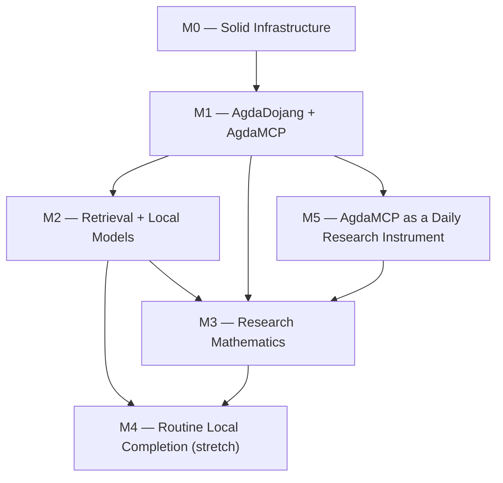

<!--
File: docs/GITHUB_PROJECT.md

The living project plan for agda-native-air, in the format of the
williamdemeo/github-project template.

This file is partially generated by that template's engine
(scripts/gh_project_update.py in a github-project checkout; see the
`project-*` targets in this repository's Makefile).  Manual prose —
everything outside the marked regions: summary, milestone descriptions,
exit criteria, dependency graph, the field-driven-work section — is
hand-edited.  Issue listings between

    BEGIN GENERATED: milestone-N
    ...
    END GENERATED: milestone-N

markers are regenerated from GitHub state by `make project-update`;
edits inside those regions are overwritten on the next update.
Structure lives here; state (issue numbers, open/closed, assignees)
lives on GitHub.

This file supersedes docs/roadmap.md, the frozen bootstrap plan from
which the original milestones and [MN-k] issues were populated.
-->

# agda-native-air — GitHub Project Roadmap

**Project Title**:  agda-native-air — an Agda-native AI research environment

**Repository**:  `formalverification/agda-native-air`

---

## Summary

Build the missing interaction layer between frontier AI models and the Agda proof assistant.  The system has three core components — `agda-dojang` (interaction), `agda-mcp` (MCP bridge), and `agda-strux` (structured corpus extraction) — plus an optional local-model layer for specialized tasks.  The goal is an environment where any sufficiently capable LLM can reason effectively with Agda.

---

## Labels

Topic labels used by the issues in this repository.

- `agda-dojang` (0075ca) — AgdaDojang interaction layer.
- `agda-mcp` (0075ca) — agda-mcp server.
- `agda-strux` (0075ca) — agda-strux extraction.
- `eval` (0075ca) — Evaluation and benchmarks.
- `retrieval` (5319e7) — Retrieval and search.
- `local-models` (5319e7) — Local specialized models.
- `research` (5319e7) — Research mathematics.
- `docs` (0e8a16) — Documentation.
- `ci` (fbca04) — Continuous integration.
- `infrastructure` (fbca04) — Build system and tooling.
- `migration` (d93f0b) — Migration from agda-ai-prover.
- `cleanup` (d93f0b) — Code and doc cleanup.
- `paper` (c5def5) — Publication targets.
- `chore` (e4e669) — Housekeeping; no user-visible change.
- `meta` (ededed) — Project meta / process.
- `reproducibility` (1d76db) — Reproducibility and dev workflow.
- `bug` (d73a4a) — Something isn't working.
- `enhancement` (a2eeef) — New feature or request.
- `good first issue` (7057ff) — Good for newcomers.

---

## Milestones

### Milestone 0 — Solid Infrastructure

**Description:**

Complete the migration from `agda-ai-prover` to `agda-native-air`.  Stabilize extraction, evaluation, CI, and documentation so that a new collaborator can reproduce the full workflow without tribal knowledge.

**Exit criterion:**

`clone → nix develop → tests → extraction → eval` is documented, reproducible, and passes CI.

---

### Milestone 1 — AgdaDojang + AgdaMCP + First End-to-End Proofs

**Description:**

Build the `agda-mcp` server, connect a frontier coding agent (Claude Code / Codex CLI) to Agda, and get real proofs type-checking through the MCP interface.  Produce a baseline benchmark and a tool paper draft.

**Exit criterion:**

A frontier agent can solve a nontrivial benchmark slice through the `agda-mcp` interface with reproducible reports.

---

### Milestone 2 — Retrieval Layer + Local Models

**Description:**

Add structure-aware retrieval to `agda-mcp` (type-based search, dependency graph navigation, neural premise selection).  Train narrow local models for premise selection, type-aware embeddings, and proof-term ranking.

**Exit criterion:**

Retrieval and ranking measurably improve the baseline benchmark from Milestone 1.

---

### Milestone 3 — Research Mathematics & Counterexample Workflows

**Description:**

Use the system for real mathematics — extend `agda-algebras` with AI assistance, explore FLRP-relevant formalizations, and integrate counterexample search tools.

**Exit criterion:**

At least one credible AI-assisted formalization case study exists beyond fixture demos.

---

### Milestone 4 — Routine Local Proof Completion (Stretch)

**Description:**

Train a local 7B model (QLoRA on Jetson) that handles routine proof obligations without calling the frontier model.  This becomes viable once Milestones 1–3 generate enough training data.

**Exit criterion:**

A local routine-completion model is useful enough to justify its maintenance cost.

---

### Milestone 5 — AgdaMCP as a Daily Research Instrument

**Description:**

Field-driven ergonomics and hardening of `agda-mcp`, so that real proof sessions (in `agda-algebras` and in the Cardano formal ledger specification) run their entire Agda loop through the server.  Every issue here comes from an entry in `docs/mcp-field-reports.md`; the first wave was tracked by #68 (closed 2026-09-08), and this milestone is its successor.

**Exit criterion:**

A real library session checks, profiles, registers, and fills through `agda-mcp` without falling back to the command line.

---

### Milestone dependencies

Hand-authored; update never touches it.



---

## Field-driven work outside the milestone plan

Not all work fits the `[MN-k]` planning grid.  Issues filed in response to field experience carry no `[MN-k]` identifier, so the engine cannot render them into the generated regions below; they are tracked directly on GitHub and summarized here by their tracking issues.

+  The agda-mcp field-test hardening wave, tracked by [#68](https://github.com/formalverification/agda-native-air/issues/68) and closed on 2026-09-08: trust fixes (#69–#73), reach (#74–#77) — including the live scope/type/definition queries and the persistent interaction lane they ride (#75) and get_goal re-sourced through that lane (#108) — ergonomics (#78, #79), the path-resolution and missing-file fix the #83 field test surfaced (#101), the module name `get_goal` reports (#100), and the ask-Agda audit that turned that fix's lesson into the server's stated rule (#106, with probe-backed follow-ups #114 and #115).  See `docs/agda-mcp/agda-mcp-improvements-summary.md` for an executive summary and `docs/feedback/flrp-agda-mcp-improvements.md` for the field report that motivated it.  Its successor is Milestone 5 below, whose issues carry `[M5-k]` identifiers and render in their own region; the wave's measurement and publication companions were slotted into Milestone 1 as [M1-7] (#83) and [M1-8] (#85) in the 2026-09-07 curation, and the tech report (#86) was folded into [M1-6] (#14).
+  Proof search on agda-mcp, tracked by [#113](https://github.com/formalverification/agda-native-air/issues/113), now [M2-9] and rendered in the Milestone 2 region: a native obligation-set search loop over the `fill_hole` / `get_goal` oracle, opened when #112 archived the dead v0.3 `search.py` so its four lessons survive as tests and types rather than history.  Its phases are closed: P0 — the conjunctive state model, the single-step harness over M1-5, and the oracle-vs-proposal timing split that settled the host-language fork — was [#119](https://github.com/formalverification/agda-native-air/issues/119); P1 — the beam loop with a fixed action space and the per-tier baseline every later phase has to beat — was [#122](https://github.com/formalverification/agda-native-air/issues/122); P2 — proposals from retrieval over pinned corpora behind the P1 proposer seam, with target exclusion and the labeled mechanism control — was [#123](https://github.com/formalverification/agda-native-air/issues/123) ([M2-10]); P3, proposals from a learned policy, was folded into [M2-5] (#19).  The design record is `docs/adr/0001-proof-search-on-agda-mcp.md`.
+  In-place checking of library-embedded modules (#66, #67), an earlier field-driven fix in the same spirit.
+  Agda-Nix library management follow-ons (#54, #55), flake shell-hygiene fixes (#96), and the `makeOverlay` optimization (#43).

---

## Issues

Each issue below carries its milestone, labels, and body, mirrored from GitHub.  The `[MN-k]` ID in each heading is the join key the engine uses; the `(#N)` suffix is the GitHub issue number.  Regions are regenerated by `make project-update`; issues without a `[MN-k]` prefix are listed in the section above instead.

## Milestone 0 — Solid Infrastructure

<!-- BEGIN GENERATED: milestone-0 -->

### Issue M0-1: Complete migration cleanup — move non-core work to `experiments/` (#1, closed)

**Labels:** `migration`, `cleanup`, `M0: migration + infrastructure`

**Assignees:** @williamdemeo

#### Description

Move non-core files from the migration into `experiments/` or `experiments/archive/`
to keep the top-level repo focused on the three primary components (agda-dojang,
agda-strux, agda-mcp).

#### Tasks

- [x] Move legacy ML pipeline training scripts (not used by current smoke tests) to
      `experiments/archive/ml-pipeline/`
- [x] Move older policy backends to `experiments/archive/`
- [x] Move researchy derived-view experiments to `experiments/`
- [x] Move older roadmap material about conjecture generation to `experiments/archive/`
- [x] Verify CI still passes after moves
- [x] Update any remaining cross-references in docs

#### Acceptance criteria

- [x] `experiments/` directory exists with a README explaining its contents
- [x] Top-level directory layout matches `docs/public-history.md` §6
- [x] CI passes; no broken imports or Make targets

---

### Issue M0-2: Verify and document the `clone → nix develop → test → eval` workflow (#2, closed)

**Labels:** `docs`, `reproducibility`, `M0: migration + infrastructure`

**Assignees:** @williamdemeo

#### Description

A new collaborator should be able to follow a single document and reproduce the full
extraction + evaluation story.  Currently `docs/HowToRun.md` exists but may have
stale references from the migration.

#### Tasks

- [x] Walk through `docs/HowToRun.md` on a clean checkout and fix any errors
- [x] Verify `nix develop` provides all required tools (Agda, GHC, sbt, Python)
- [x] Verify `make backend-test` (agda-strux Haskell tests) passes
- [x] Verify `make eval-proof-completion-smoke` runs end-to-end
- [ ] Verify extraction path: document current status clearly (working / WIP / known issues)
- [ ] Add a "Quick Start" section at the top of HowToRun.md with ≤ 5 commands

#### Acceptance criteria

- [ ] A reviewer can follow the doc from scratch without asking for help
- [ ] Each Make target mentioned in docs either works or has a clear status note

---

### Issue M0-3: Stabilize CI — add smoke target and ensure all jobs are green (#3, closed)

**Labels:** `ci`, `infrastructure`, `M0: migration + infrastructure`

**Assignees:** @williamdemeo

#### Description

Ensure the CI workflow (`.github/workflows/`) covers the four core test lanes:
Scala proof-parser, Scala ETL, Python ml-pipeline, and Haskell backend.  Add a
top-level smoke target that exercises the minimum end-to-end path.

#### Tasks

- [x] Audit current CI workflow against the four test jobs
- [x] Fix any failures or stale references from the migration
- [x] Add `make ci-smoke` (or equivalent) that runs the minimal suite locally
- [x] Ensure CI is time-bounded (< 15 min total)
- [x] Add CI badge to README.md

#### Acceptance criteria

- [x] CI passes on `main` with all four lanes green
- [x] `make ci-smoke` exists and passes locally
- [x] CI badge appears in README

---

### Issue M0-4: Remove stale references and update docs for `agda-native-air` branding (#4, closed)

**Labels:** `docs`, `cleanup`, `M0: migration + infrastructure`

**Assignees:** @williamdemeo, @hyeyoungshin, @Copilot

## Description

Scrub all docs, Makefiles, and source comments for residual `agda-ai-prover`,
`AgdaJang`, `agda-jang`, `FastAPI model server`, and old issue numbers.  Replace
with `agda-native-air`, `AgdaDojang`, `agda-dojang`, `agda-mcp` as appropriate.

Docs relevant to this issue:

- [Section 5 of PLAN doc](https://github.com/formalverification/agda-native-air/blob/main/docs/PLAN.md#5-current-issue-map-what-carries-forward)
- [public-history.md doc](https://github.com/formalverification/agda-native-air/blob/main/docs/public-history.md)

### Tasks

- [ ] `grep -r "agda-ai-prover\|agda-jang\|AgdaJang\|FastAPI" --include="*.md" --include="*.scala" --include="*.py" --include="*.hs" --include="Makefile"`
- [ ] Fix all occurrences (rename or remove as appropriate)
- [ ] Remove or update old issue references (e.g., `#23`, `#65` from the old repo)
- [ ] Ensure `docs/representation.md` is current
- [ ] Remove FastAPI-first framing from any surviving docs

### Acceptance criteria

- [ ] `grep -r "agda-ai-prover\|agda-jang\b\|AgdaJang\b"` returns zero results (outside `docs/public-history.md` and `CHANGELOG`)
- [ ] No doc references to issue numbers from the old repo without context

---

### Issue M0-5: Preserve and verify deterministic fixture-based proof completion (#5, closed)

**Labels:** `agda-dojang`, `eval`, `infrastructure`, `M0: migration + infrastructure`

**Assignees:** @williamdemeo

#### Description

The evaluator + fixture suite from the old repo is a critical asset.  Verify that
the deterministic proof-completion pipeline still works end-to-end after migration.

#### Tasks

- [x] Verify `make eval-proof-completion-smoke` passes
- [x] Verify `make eval-proof-completion` passes (if fixtures are present)
- [x] Ensure fixture files exist under `data/fixtures/` (or equivalent)
- [x] Confirm evaluation report schema is documented
- [x] Add a brief section to `docs/HowToRun.md` explaining how to run the evaluator

#### Acceptance criteria

- [x] `make eval-proof-completion-smoke` passes deterministically (same output on repeated runs)
- [x] At least one fixture hole is solved (typechecks) in the smoke run
- [x] Fixtures and their gold solutions are committed and documented

---

### Issue M0-6: Write `docs/architecture.md` — document the four-layer system (#6, closed)

**Labels:** `docs`, `M0: migration + infrastructure`

**Assignees:** @hyeyoungshin

# Description

Create a standalone architecture document that explains the three-layer system (agda-dojang, agda-mcp, agda-strux) with the ASCII diagram from PLAN.md, component roles, data flow, and how local models fit in.

## Tasks

- [x] Create `docs/architecture.md`
- [x] Include the system architecture diagram from [§2 of `docs/PLAN.md`](https://github.com/formalverification/agda-native-air/blob/main/docs/PLAN.md#2-architecture)
- [ ] Document each layer's role, inputs, outputs, and current status
- [ ] Explain the "works without local models" design property
- [ ] Link to MANIFESTO.md for vision and PLAN.md for roadmap
- [ ] Link from README.md

## Acceptance criteria

- [ ] `docs/architecture.md` exists, is linked from README
- [ ] A newcomer can read it and understand how the pieces fit together

---

### Issue M0-7: Stub `agda-mcp/` directory with README and roadmap (#7, closed)

**Labels:** `agda-mcp`, `docs`, `M0: migration + infrastructure`

**Assignees:** @williamdemeo

#### Description

Create the `agda-mcp/` directory structure with a README that describes the planned
MCP server, its tool surface, and how it wraps `agda-dojang`.  This gives the MCP
work a home before implementation begins in Milestone 1.

#### Tasks

- [ ] Create `agda-mcp/README.md`
- [ ] Document the planned tool surface: `get-goal`, `fill-hole`, `check-file`,
      `search-by-name`, `search-by-type`, `get-dependencies`, `get-diagnostics`
- [ ] Reference the MCP protocol specification
- [ ] Note language choice (Haskell, wrapping agda-dojang) and rationale
- [ ] Include a "Status: not yet implemented" banner

#### Acceptance criteria

- [ ] `agda-mcp/README.md` exists and is referenced from `docs/architecture.md`
- [ ] Planned tool surface is enumerated with brief descriptions

---

### Issue M0-8: Seed labels and issue templates for the repo (#8, closed)

**Labels:** `M0: migration + infrastructure`

**Assignees:** @hyeyoungshin

#### Description

Set up standard GitHub infrastructure: issue labels, issue templates, and a
CODEOWNERS file (optional).

#### Tasks

- [x] Create labels: `agda-dojang`, `agda-mcp`, `agda-strux`, `eval`, `docs`, `ci`,
      `infrastructure`, `retrieval`, `local-models`, `research`, `good first issue`,
      `migration`, `cleanup`, `paper`
- [x] Create issue template for bug reports
- [x] Create issue template for feature requests (with milestone field)
- [x] Optionally add `.github/CODEOWNERS`

#### Acceptance criteria

- [x] Labels exist on the repo
- [x] At least one issue template is committed

---

### Issue M0-9: Move Haskell CI (agda-strux tests) to Nix + Cachix (#47, closed)

**Labels:** `ci`, `infrastructure`, `M0: migration + infrastructure`

## Description

The `haskell-backend-jsonl` CI job currently uses `haskell-actions/setup` with `actions/cache` for the cabal store.  In practice the cache rarely hits (the key references files that may not exist, and jobs get cancelled by `cancel-in-progress` before the cache is saved), so every run cold-builds Agda-as-a-library from source — taking 20+ minutes and frequently timing out.

The Agda proof-completion smoke job (`agda-dojang-eval`) already uses `cachix/install-nix-action` + `cachix/cachix-action` and completes in ~2–3 minutes on a warm cache.  We should do the same for the Haskell backend tests.

### Motivation

+  Cold Haskell builds take 20–30 min (Agda-as-a-library is enormous).
+  The cabal cache is fragile: key mismatches, cancellation before save, no cross-job sharing.
+  Nix + Cachix gives us hermetic builds and a shared binary cache that survives across PRs, branches, and contributors.
+  Consistency: all heavyweight CI jobs would use the same caching strategy.

### Tasks

- [ ] Replace `haskell-actions/setup` + `actions/cache` with `cachix/install-nix-action` + `cachix/cachix-action` in the `haskell-backend-jsonl` job.
- [ ] Run `make backend-test` inside `nix develop .#backend` (same as local).
- [ ] Verify the Cachix `formalverification` cache is populated with the GHC 9.8.2 + Agda 2.8.0 store paths after the first successful run.
- [ ] Confirm warm-cache runtime is < 5 minutes.
- [ ] Consider doing the same for a future `agda-mcp` CI job (GHC 9.10.3).

### Acceptance criteria

- [ ] `haskell-backend-jsonl` uses Nix + Cachix and passes.
- [ ] Warm-cache runtime ≤ 5 minutes.
- [ ] No regression in test coverage (same `make backend-test` target).

### Notes

The `agda-dojang-eval` job in `ci.yml` is a good template — it already has the Nix install, Cachix setup, and `nix develop` invocation pattern.

---

### Issue M0-10: Infra: Extensible Agda library configuration in Nix dev shells (#51, closed)

**Labels:** `agda-dojang`, `infrastructure`, `reproducibility`, `M0: migration + infrastructure`

**Assignees:** @williamdemeo

## Problem

The Nix dev shells use `agda.withPackages` to provide Agda with stdlib pre-registered.  This creates a wrapper binary that bakes in `--library-file /nix/store/.../libraries`, which points only at stdlib.

The shell hook writes a *separate* repo-local libraries file at `$AGDA_DIR/libraries` that includes both stdlib and `agda-dojang`, but the wrapper's baked-in flag takes precedence.  Consequently:

+  Bare `agda Foo.agda` at the CLI ignores the repo-local config and fails with `Library 'agda-dojang' not found` whenever the `defaults` file lists `agda-dojang`.
+  External libraries like `agda-algebras` cannot be registered at all through the Nix shell without manual flag-passing.
+  The existing `eval_fixtures.py` evaluator works around this by passing `--no-default-libraries --library-file ...` explicitly, but this workaround is invisible and fragile.

This means the basic experience of `nix develop` followed by `agda some-file.agda` is broken for any file that depends on agda-dojang or external libraries.

---

## Desired Behavior

After entering any Agda-equipped Nix shell (`default`, `backend`, `all`):

1.  `agda SomeFile.agda` **just works** for files that import from `standard-library`, `agda-dojang`, or any registered external library.
2.  External libraries (agda-algebras, agda-categories, TypeTopology, etc.) can be registered via environment variables, with clear shell-hook messages indicating what's available.
3.  The configuration is transparent and debuggable — users can see exactly which libraries are registered and where.

---

## Proposed Solution

1. #52 
2. #53
3. #54 
4. #55 

---

## Cost Assessment

| Phase | Effort | Risk | Benefit |
|---|---|---|---|
| 1. Shell function | ~15 min | Near-zero | Fixes the broken `agda` CLI experience |
| 2. Env-var registration | ~1 hour | Low | Makes external libs discoverable and easy |
| 3. Nix-managed external libs | ~3 hours | Medium | Full reproducibility for collaborators |
| 4. Interactive selection | ~1 day | Low | Nice UX, probably overkill for now |

---

## Plan

We should implement Phases 1 and 2 immediately (they're tiny and have immediate payoff for the M1-5 benchmark work).  We might defer Phase 3 until a collaborator needs reproducible agda-algebras access without a local clone.  We'll should probably skip Phase 4 unless/until the project grows beyond 3–4 external libraries.

---

## Acceptance Criteria

- [ ] `nix develop` followed by `agda data/agda/ValidateImports.agda` works
- [ ] Setting `AGDA_ALGEBRAS_SRC` and re-entering the shell registers the library
- [ ] Shell hook prints which Agda libraries are registered
- [ ] `make eval-benchmark-gold` uses the correct library configuration
- [ ] Documented in `docs/HowToRun.md`

---

### Issue M0-10a: Agda-Nix Phase 1: Shell function override (quick, low-risk) (#52, closed)

**Labels:** `agda-dojang`, `infrastructure`, `reproducibility`

**Assignees:** @williamdemeo

Add a shell function in the hook that shadows the Nix wrapper:

```bash
agda() {
  command agda --no-default-libraries \
               --library-file "$AGDA_DIR/libraries" \
               "$@"
}
export -f agda
```

This is transparent (just adds flags), doesn't affect the Nix wrapper itself, and makes `agda Foo.agda` use the repo-local libraries file.

---

### Issue M0-10b: Agda-Nix Phase 2: Optional external library registration (#53, closed)

**Labels:** `agda-dojang`, `infrastructure`, `reproducibility`

**Assignees:** @williamdemeo

Extend the shell hook to detect environment variables for external libraries and register them automatically:

```bash
# Optional libraries — set these in your shell profile or .envrc
# AGDA_ALGEBRAS_SRC=~/git/ualib/agda-algebras/master/src
# AGDA_CATEGORIES_SRC=~/git/agda-categories/src
# AGDA_TYPETOPOLOGY_SRC=~/git/TypeTopology/source

for var in AGDA_ALGEBRAS_SRC AGDA_CATEGORIES_SRC AGDA_TYPETOPOLOGY_SRC; do
  src="${!var:-}"
  if [ -n "$src" ]; then
    # Walk up from src/ to find the .agda-lib file
    lib_dir="$(dirname "$src")"
    lib_file="$(find "$lib_dir" -maxdepth 1 -name '*.agda-lib' | head -1)"
    if [ -n "$lib_file" ]; then
      echo "$lib_file" >> "$AGDA_DIR/libraries"
      echo "[agda] registered $(basename "$lib_file" .agda-lib) from $lib_file"
    else
      echo "[agda] WARN: $var set but no .agda-lib found in $lib_dir"
    fi
  fi
done
```

The shell hook already prints a summary of available tools; extend it to list registered Agda libraries:

```
✅ agda-native-air (CPU dev shell)
   Agda : Agda version 2.8.0
   Agda libraries:
     ✅ standard-library (Nix-managed)
     ✅ agda-dojang (repo-local)
     ✅ agda-algebras (~/git/ualib/agda-algebras/master)
     ⚠️  agda-categories: set AGDA_CATEGORIES_SRC to enable
```

---

### Issue M0-11: Pre-public cleanup: remove legacy `agda-ai-prover` remnants (#49, closed)

**Labels:** `infrastructure`, `cleanup`, `M0: migration + infrastructure`

**Assignees:** @williamdemeo

## Summary

Before making the repository public, remove files and directories that were carried over from the `agda-ai-prover` project and are no longer part of the active `agda-native-air` architecture.  All deprecated code has already been preserved in
`experiments/archive/`, so removals from the active tree are safe.

The goal is to bring the repository layout into alignment with `docs/public-history.md §6` and `README.md`, while preserving every component that is still exercised by active `Makefile` targets or CI.

---

## What stays (and why)

These directories are **active** and must not be removed:

+  **`strux-driver/`** — Scala orchestration layer that drives the `agda-strux` Haskell backend.  `AgdaJsonlDriver.scala` handles module discovery, parallel/resumable execution, JSONL validation, and manifest generation.  Used by `make extract-lib`, `make extract-lib-smoke`, `make test` (aliased to `test-strux-driver`), and `make test-integration`.

+  **`ml-pipeline/`** — Scala ETL programs (`BuildProofCompletionDataset.scala`, `PreprocessAgda.scala`) and active Python tooling (`filter_jsonl.py`, `train_retrieval.py`).  Used by `make etl-*`, `make train-retrieval-smoke`, `make eval-proof-completion-smoke-retrieval`, and `make filter`.

+  **`experiments/archive/`** — Intentional archive of deprecated code; kept for research continuity.

---

## Items to remove

### 1. `target/` (top-level)

**Action: REMOVE entirely.**

Stale sbt global build output directory, left over from when `build.sbt` lived at the project root.  Contains only `global-logging/` and `task-temp-directory/`.  Add `target/` to `.gitignore` if not already present.

### 2. `scratch/`

**Action: REMOVE entirely.**

Contains:  
- `agda-ai-prover-ALL_ISSUES.txt` — dump of old issue tracker
- `agda-ai-prover-PROJECTS.txt` — dump of old GitHub project boards
- `proposed-starting-issues.md` — early planning notes

Superseded by `docs/roadmap.md` and the current GitHub issue tracker.

### 3. `ml-pipeline/` — selective cleanup of deprecated Python files

The `ml-pipeline/README.md` already marks these with footnotes and strikethrough.  The deprecated files have copies in `experiments/archive/ml-pipeline/` and can be deleted from the active tree.

**Action: REMOVE the following files from `ml-pipeline/`:**

- `ml-pipeline/python/model/train.py` — legacy MLP trainer
- `ml-pipeline/python/model/batch_infer.py` — legacy MLP batch inference
- `ml-pipeline/python/model/export_onnx.py` — ONNX export
- `ml-pipeline/python/model/export_script.py` — TorchScript export
- `ml-pipeline/python/model/build_finetune_dataset.py` — instruction-tuning dataset builder
- `ml-pipeline/python/tests/test_main.py` — tests for archived FastAPI app
- `ml-pipeline/python/tests/test_dataset_pipeline.py` — tests for archived finetune dataset builder
- `ml-pipeline/Dockerfile` — Docker image for archived FastAPI serving (if present at top level; already archived)
- `ml-pipeline/Makefile` — deprecated sub-Makefile (already marked deprecated in its own header; all its targets drive archived code)

**Action: KEEP the following (active):**

- `ml-pipeline/build.sbt`, `ml-pipeline/project/` — Scala build config
- `ml-pipeline/etl/` — active ETL programs (`BuildProofCompletionDataset`, `PreprocessAgda`, `PreprocessAgdaSchema`, test resources)
- `ml-pipeline/python/conftest.py` — pytest config
- `ml-pipeline/python/requirements.txt` — dependencies
- `ml-pipeline/python/model/filter_jsonl.py` — active JSONL filter
- `ml-pipeline/python/model/train_retrieval.py` — active retrieval trainer
- `ml-pipeline/python/scripts/inspect_runtime.py` — runtime diagnostic
- `ml-pipeline/python/tests/test_train_retrieval.py` — active retrieval tests
- `ml-pipeline/scripts/run_etl.sh` — ETL runner (verify still used; if dead, remove)
- `ml-pipeline/README.md` — update footnotes to note deletions

### 4. `strux-driver/` — clean build artifacts only

**Action: REMOVE build artifacts, KEEP source.**

- Remove `strux-driver/target/` — sbt build output (add to `.gitignore`)
- Remove `strux-driver/output/theorems.jsonl` — sample output that shouldn't be committed (add `strux-driver/output/` to `.gitignore`)
- Keep everything in `src/`, `build.sbt`, `project/`, `Makefile`, `README.md`

### 5. `configs/` — evaluate and relocate or remove

Contains:  
- `agda-algebras.yaml` — extraction configuration for agda-algebras

**Action: EVALUATE.** If this config is referenced by active extraction targets (`make extract-lib` or `AgdaJsonlDriver`), relocate it to a more discoverable location (e.g., `strux-driver/configs/` or `data/configs/`).  If unreferenced, remove.

- `log4j2.properties` — Spark logging config.  Likely still needed by `strux-driver`'s Spark runner.  If so, relocate alongside the driver; otherwise remove.

### 6. `scripts/` — remove legacy shell scripts

**Action: REMOVE the following:**

- `scripts/run-sbt.sh` — sbt wrapper for the legacy pipeline
- `scripts/run-server.sh` — FastAPI server launcher (legacy)
- `scripts/setup_gpu_venv.sh` — Jetson GPU venv setup (premature; M4 at earliest)
- `scripts/pycuda.sh` — CUDA setup script (premature; M4 at earliest)

**Action: KEEP the following (active):**

- `scripts/python/agda_lib_metadata.py` — actively used by `make metadata`
- `scripts/python/gh_project_populate.py` — roadmap tooling
- `scripts/python/doc_check.py` + `doc_check_guide.md` — documentation linting
- `scripts/python/utils/` — shared utilities
- `scripts/README.md`

### 7. Committed build artifacts in `data/agda/`

**Action: REMOVE `.agdai` files; add `*.agdai` to `.gitignore`.**

- `data/agda/agda-example.agdai`
- `data/agda/Empty.agdai`
- `data/agda/Example.agdai`

These are Agda interface files (compiled caches) that should never be committed.

---

## Makefile cleanup

After the file deletions, audit the top-level Makefile for any remaining references to deleted files.  The already-commented-out `LEGACY` blocks (the old `train` and `finetune-dataset` targets) should be removed entirely rather than left as comments.  All uncommented targets should still work.

Specifically:  
- Remove the commented-out `train` target block (lines marked `LEGACY — archived`)
- Remove the commented-out `finetune-dataset` target block (same marker)
- Verify `make help` output contains no references to deleted files
- Verify all listed targets still work

---

## `ml-pipeline/README.md` update

After deletions, update the README:
- Remove the deprecated file listings (or replace with a note pointing at `experiments/archive/ml-pipeline/`)
- Remove or simplify the footnotes about archived files
- Ensure the "Directory Structure" section reflects only what remains

---

## Tasks

- [ ] Remove `target/` (top-level); add to `.gitignore`
- [ ] Remove `scratch/`
- [ ] Remove deprecated Python files from `ml-pipeline/python/model/` (5 files)
- [ ] Remove deprecated test files from `ml-pipeline/python/tests/` (2 files)
- [ ] Remove `ml-pipeline/Dockerfile` and `ml-pipeline/Makefile` if present at top level
- [ ] Remove `strux-driver/target/`; add to `.gitignore`
- [ ] Remove `strux-driver/output/theorems.jsonl`; add `strux-driver/output/` to `.gitignore`
- [ ] Evaluate `configs/` — relocate or remove each file
- [ ] Remove legacy scripts: `run-sbt.sh`, `run-server.sh`, `setup_gpu_venv.sh`, `pycuda.sh`
- [ ] Remove `.agdai` files from `data/agda/`; add `*.agdai` to `.gitignore`
- [ ] Clean commented-out `LEGACY` target blocks from top-level Makefile
- [ ] Update `ml-pipeline/README.md` to reflect remaining active files only
- [ ] Verify `make help` output is clean
- [ ] Verify `make ci-smoke` still passes
- [ ] Verify `make test` still passes
- [ ] Verify `make train-retrieval-smoke` still passes

## Acceptance Criteria

- [ ] No deleted file is referenced by any uncommented Makefile target
- [ ] All active Makefile targets pass: `test`, `etl-proof-completion-smoke`, `train-retrieval-smoke`, `eval-proof-completion-smoke`
- [ ] `*.agdai` and build output directories are in `.gitignore`
- [ ] `ml-pipeline/README.md` documents only active files
- [ ] `scratch/` and top-level `target/` no longer exist
- [ ] `tree -L 2` shows a cleaner layout with no dead-code directories

## Non-Goals

- Refactoring the Makefile beyond removing dead targets and legacy comment blocks
- Rearchitecting the extraction or ETL pipeline
- Removing `experiments/archive/` (intentionally preserved)
- Touching any active Scala, Python, or Haskell source code

<!-- END GENERATED: milestone-0 -->

---

## Milestone 1 — AgdaDojang + AgdaMCP + First End-to-End Proofs

<!-- BEGIN GENERATED: milestone-1 -->

### Issue M1-1: Stabilize AgdaDojang — tighten tests and document the action space (#9, closed)

**Labels:** `agda-dojang`, `infrastructure`, `M1: agda-dojang/mcp`

**Assignees:** @williamdemeo

#### Description

Before building the MCP layer, ensure AgdaDojang's core loop (goal inspection →
candidate proposal → typecheck feedback) is solid, well-tested, and documented.

Carries forward the spirit of old issues #6 (tests) and #20 (tactic vocabulary),
reframed for the new architecture.

#### Tasks

- [ ] Add regression tests covering: fixture loading, goal/context extraction,
      candidate proposal, typecheck pass/fail
- [ ] Document the action space (refine, apply, intro, etc.) in `agda-dojang/README.md`
- [ ] Add at least 3 fixture Agda files with holes of varying difficulty
- [ ] Ensure all tests pass in CI with bounded runtime
- [ ] Verify the bridge/evaluator deterministic behavior is preserved

#### Acceptance criteria

- [ ] `make test-agda-dojang` (or equivalent) runs ≥ 5 tests and passes
- [ ] Action space is documented with examples
- [ ] At least one fixture hole is solved by the scripted policy backend

---

### Issue M1-2: Implement `agda-mcp` server — core proof-state tools (#10, closed)

**Labels:** `agda-dojang`, `agda-mcp`, `M1: agda-dojang/mcp`

**Assignees:** @williamdemeo

## Description

Implement the `agda-mcp` MCP server as a thin wrapper over AgdaDojang.  The first version exposes only the proof-state tools; search/retrieval tools come in M2.

### Planned tool surface (v0)

- `get-goal`: inspect the type of a hole and its local context.
- `fill-hole`: propose a candidate term and get typecheck feedback.
- `check-file`: load/reload a file and get all diagnostics.
- `get-diagnostics`: retrieve error/success rates and candidate feedback.

### Tasks

- [ ] Choose MCP server framework (e.g., `mcp` Haskell library, or a thin HTTP/stdio bridge).
- [ ] Implement the four core tools listed above.
- [ ] Define a stable JSON schema for requests and responses.
- [ ] Add integration tests: start server, send tool calls, verify responses.
- [ ] Document how to run the server locally.

### Acceptance criteria

- [ ] `agda-mcp` server starts and responds to tool calls.
- [ ] All four core tools return well-formed JSON responses.
- [ ] At least one hole is filled successfully via MCP tool calls in a test.
- [ ] Server is documented in `agda-mcp/README.md`.

---

### Issue M1-2b: makeOverlay: optimize overlay creation for large source trees (#43)

**Labels:** `enhancement`, `agda-mcp`, `M1: agda-dojang/mcp`

**Assignees:** @williamdemeo

Address [this comment](https://github.com/formalverification/agda-native-air/pull/38#discussion_r2970142632) on PR #38.

### Notes

We replaced hard links with copies to handle directories correctly. Copilot is now pointing out that copying is slow for large trees. This is true, but the alternatives (symlinks, selective copying) each have their own tradeoffs and are optimization work.

---

### Issue M1-3: Implement `agda-mcp` search tools — name and type search (#11, closed)

**Labels:** `agda-mcp`, `agda-strux`, `retrieval`, `M1: agda-dojang/mcp`

**Assignees:** @williamdemeo

## Description

Add search/retrieval tools to `agda-mcp` that allow the agent to find relevant definitions from the corpus.  This is a basic version; neural premise selection comes in M2.

### Planned tools

- `search-by-name`: find definitions matching a name pattern (substring/regex).
- `search-by-type`: find definitions with compatible type signatures (exact or approximate match).
- `get-dependencies`: retrieve the dependency neighborhood of a definition.

### Tasks

- [ ] Build an in-memory index from `agda-strux` JSONL output.
- [ ] Implement `search-by-name` with substring matching.
- [ ] Implement `search-by-type` with at least string-level matching (structural matching is stretch).
- [ ] Implement `get-dependencies` using the `dependencies` field from JSONL.
- [ ] Add integration tests with the corpus index.

### Acceptance criteria

- [ ] All three tools return relevant results on `agda-algebras` fixtures.
- [ ] Agent can discover relevant lemmas for a proof goal via search tools.

---

### Issue M1-4: Frontier agent integration — Claude Code + agda-mcp end-to-end demo (#12, closed)

**Labels:** `agda-mcp`, `eval`, `M1: agda-dojang/mcp`

**Assignees:** @williamdemeo, @hyeyoungshin

## Description

Demonstrate a frontier coding agent (Claude Code or Codex CLI) using `agda-mcp` to solve holes in fixture modules and a small `agda-algebras` slice.  Document what works, what doesn't, and common failure modes.

---

### Tasks

- [x] Configure Claude Code (or equivalent) to connect to the `agda-mcp` server.
- [x] Run the agent on fixture modules with known solutions.
- [ ] ~Run the agent on a small `agda-algebras` slice (5–10 proof obligations).~
    *Deferred*. Ran on `Fixture01.agda` (simple) and `FixtureStdlibBooleanAlgebra.agda` (moderate, stdlib Boolean algebra) instead; `agda-algebras` slice planned for M1-5.
- [x] Record: success/failure, number of iterations, wall-clock time, failure categories.
- [x] Write up findings in ~`docs/` or~ a `reports/` directory.
- [x] Document the agent configuration and setup steps.

---

### Acceptance criteria

- [x] At least one non-trivial proof obligation is solved end-to-end by the agent.
- [x] A reproducible report exists documenting success rate and failure modes.
- [x] Setup instructions exist for others to replicate the demo.

---

### Progress notes

**2026-04-03**: First successful end-to-end demo.  Claude Code (Sonnet 4.6) connected to agda-mcp via MCP and solved all 3 holes in `Fixture01.agda` (`x`, `tt`, `refl`) using iterative get_goal/fill_hole.  Notably, the agent deduced concrete goal types (`⊤`, `x ≡ x`) from `fill_hole` error messages when `get_goal` returned unresolved metas.

---

See PR #45 for details.

---

### Issue M1-5: Curate baseline benchmark: 20 to 50 proof obligations from `agda-algebras` + `agda-stdlib` (#13, closed)

**Labels:** `agda-strux`, `eval`, `M1: agda-dojang/mcp`

**Assignees:** @williamdemeo, @hyeyoungshin

## Description

Curate a benchmark suite of 20 to 50 proof obligations from `agda-stdlib` and `agda-algebras` with known solutions.  These serve as the standard evaluation set for all subsequent experiments.

### Tasks

- [ ] Select proof obligations of varying difficulty (easy routine → moderate algebraic reasoning).
- [ ] Ensure each obligation has: stable module path, hole identifier, gold solution.
- [ ] Commit fixtures under `data/benchmarks/agda-stdlib-v0/` and `data/benchmarks/agda-algebras-v0/`.
- [ ] Create a benchmark runner that scores: success rate, iterations, wall-clock time.
- [ ] Add `make eval-benchmark` target.
- [ ] Document selection criteria and difficulty distribution.

### Acceptance criteria

- [ ] ≥ 20 benchmark obligations are committed with gold solutions.
- [ ] `make eval-benchmark` runs deterministically and produces a JSON report.
- [ ] Benchmark includes obligations of at least 3 difficulty levels.

---

### Issue M1-6: Tool paper draft: "AgdaDojang / AgdaMCP: An Agda-Native Environment for AI-Assisted Proof Development" (#14)

**Labels:** `docs`, `paper`, `M1: agda-dojang/mcp`

**Assignees:** @williamdemeo, @hyeyoungshin

## Description

Write the first draft of a tool paper describing AgdaDojang and AgdaMCP, the architecture, the benchmark results, and positioning relative to LeanDojo and Numina-Lean-Agent.

### Tasks

- [ ] Draft paper outline (intro, architecture, implementation, evaluation, related work, conclusion).
- [ ] Write architecture section referencing MANIFESTO and PLAN.
- [ ] Include benchmark results from M1-5.
- [ ] Include qualitative analysis from M1-4 (what works, what fails, why).
- [ ] Position relative to LeanDojo, Numina-Lean-Agent, and KMB (Agda2Train + QUILL).
- [ ] Identify target venue (AITP, AIM, TYPES, ICFP, CAV, or workshop).

### Acceptance criteria

- [ ] A complete draft exists (≥ 8 pages) in `papers/tool-paper/`.
- [ ] Paper includes quantitative evaluation and architecture diagram.
- [ ] Related work section covers at least 5 comparable systems.

---

### Issue M1-7: agda-mcp measured re-run: agda-algebras session against hardened server (#83)

**Labels:** `agda-mcp`, `eval`, `M1: agda-dojang/mcp`

# Context

The field test that motivated the #68 hardening wave produced a hard baseline: a frontier agent formalized ~1200 lines of literate Agda in `ualib/agda-algebras` with agda-mcp loaded and made **zero** MCP calls ([`docs/feedback/flrp-agda-mcp-improvements.md`](https://github.com/formalverification/agda-native-air/blob/main/docs/feedback/flrp-agda-mcp-improvements.md) § 0).  The P0 trust fixes (#69 via PR #81, then #70, #71, #73) exist to change that decision; this issue is the experiment that checks whether they did.

# Method

+  After the P0 sub-issues of #68 land, replay a comparable real development task — an open FLRP work package in `ualib/agda-algebras` — with the hardened server configured exactly as in the baseline session (the same `.mcp.json` shape: `run-server.sh`, `--agda-flags` including `-l agda-algebras`, per-worktree `AGDA_ALGEBRAS_ROOT`).
+  Use a fresh agent session with no prior knowledge of the server's internals, so adoption reflects the tool surface and the descriptions' stated contract rather than session memory.
+  Record per-tool MCP call counts, iterations to a green strict gate, wall-clock, and 3–5 verbatim transcript moments where the agent chose the server over the shell or vice versa.

# Deliverables

+  A short results section under `docs/reports/` with the before/after numbers and an honest reading of them; a partial result — e.g. `get_goal` adopted while `fill_hole` still loses to whole-module checks — is a valid and reportable outcome.
+  Archived transcripts under `reports/` (following the `reports/m1-4/` convention) for reuse in documentation and demos.

# Relations

+  This is the evaluation instance of #23 (M3-1) and the acceptance measurement for the #68 wave (its "the next real literate-repo session reaches for the MCP" criterion).
+  Sequencing: blocked on PR #81 and on #70, #71, #73; #75 is optional but raises the ceiling on what the server can win.

---

### Issue M1-8: demo page: animated agda-mcp session replay and corpus search (GitHub Pages) (#85)

**Labels:** `agda-mcp`, `M1: agda-dojang/mcp`

# Context

The repository's demos currently live in transcripts (`reports/m1-4/`) and READMEs.  A static demo page makes the agent ↔ server interaction legible in seconds, which serves documentation and outreach alike.

# Work

+  A GitHub Pages site for the repository with animated, JSON-driven replay players; all content is generated from real, checked-in artifacts — no mocked exchanges and no backend.
+  Replay 1: an agda-mcp session (from the measured re-run, #83), rendering the JSON-RPC exchange as an agent ↔ server conversation with tool calls, verdicts, and the resulting Agda.
+  Replay 2: agda-strux extraction and corpus search (from #84) — a definition goes in, JSONL comes out, `search_by_type` answers a query.
+  Optional replay 3: a benchmark run over an M1-5 fixture.
+  Reuse the animated demo-player pattern already built for williamdemeo.github.io rather than writing a second player; style reference for the page as a whole: the [Lean-blaster demo page](https://input-output-hk.github.io/Lean-blaster/) (style, not content).

# Scope discipline

+  Ship replay 1 first — the page is already useful with a single replay; treat replays 2–3 as follow-ups.

# Relations

+  Depends on artifacts from #83 (session transcripts) and #84 (corpus and search sessions).

---

### Issue M1-9: ADR 0002: the agda-mcp design record, plus a docs/ reorganization (#148, closed)

**Labels:** `docs`, `M1: agda-dojang/mcp`

## Description

The `docs/adr/` directory holds one record (0001, proof search) while the agda-mcp server, the repository's most design-decision-dense component, has its decisions scattered across four top-level notes, two feedback documents, a field-report log, and the #68 issue tree.

A reader (including the [M1-6] tool paper's author) has no single document stating what was decided, why, and with what evidence. At the same time, `docs/` has grown to ~20 top-level files with overlapping roles.

This issue delivers both halves in one PR: the ADR, and a reorganization that gives every document one home.

### Part 1: `docs/adr/0002-agda-mcp.md`

A clear, concise design record in the shape 0001 established (context; decisions, each with status and the evidence that earned it; a decision-log table; references).  The decisions to collect, with their primary sources as the following.

+ **The two-lane architecture**: a batch lane that runs the real `agda` per check, and a persistent `--interaction-json` lane for live scope/type/definition/goal queries; which tools ride which lane and why (`docs/agda-mcp-interaction-lane.md`; [#75](https://github.com/formalverification/agda-native-air/issues/75), [#108](https://github.com/formalverification/agda-native-air/issues/108)).

+ **The verdict discipline**: success derived from the exit code, never from message text; the `verdict` + equivalent-`command` echo in every response; masked-failure detection ([#69](https://github.com/formalverification/agda-native-air/issues/69), [#72](https://github.com/formalverification/agda-native-air/issues/72)).

+ **Ask Agda, don't re-derive**: the audited rule that every answer the server could compute from source text is instead sourced from the checker where one exists (`docs/agda-mcp-ask-agda-audit.md`; [#106](https://github.com/formalverification/agda-native-air/issues/106), with [#114](https://github.com/formalverification/agda-native-air/issues/114)/[#115](https://github.com/formalverification/agda-native-air/issues/115) as its probe-backed follow-ups).

+ **Project resolution and transparency**: nearest-`.agda-lib` root discovery, and the `project` echo (root, includePaths, selectedLibraries) that makes cross-worktree resolution verifiable at a glance ([#76](https://github.com/formalverification/agda-native-air/issues/76), [#101](https://github.com/formalverification/agda-native-air/issues/101); repeatedly cited as the decisive affordance in `docs/mcp-field-reports.md`).

+ **Structured diagnostics**: codes, precise ranges, `involved` payloads (metaTypes, candidates), root-cause ordering ([#74](https://github.com/formalverification/agda-native-air/issues/74)).

+ **The hole model**: real interaction points rather than the literal `{!!}` token; literate code-region awareness; stable hole handles ([#71](https://github.com/formalverification/agda-native-air/issues/71), [#73](https://github.com/formalverification/agda-native-air/issues/73), [#79](https://github.com/formalverification/agda-native-air/issues/79)).

+ **Evidence-channel honesty**: `checkedFromSource` with muted-channel detection ([#114](https://github.com/formalverification/agda-native-air/issues/114)); unsolved-meta enrichment from a warm lane's stored load ([#115](https://github.com/formalverification/agda-native-air/issues/115)).

+ **Enforced timeouts with timing and cache visibility** ([#77](https://github.com/formalverification/agda-native-air/issues/77)), and the self-backgrounding of long checks the field reports praise.

+ **Corpus tools**: `--corpus` loading and `search_by_name` / `search_by_type` / `get_dependencies` ([M1-3]; the [M2-3] design map in the [#17](https://github.com/formalverification/agda-native-air/issues/17) comments is the forward pointer, not part of this record).

+ **Environment and registration**: the shell-wrapper-vs-server distinction, `AGDA_DIR`/`agda/libraries` registration, per-worktree `${PWD}` anchoring (`docs/agda-mcp-environment.md`; [M5-4] is the open follow-up).

The ADR states decisions and evidence; it does not restate the source documents, which remain the deep record and are linked per decision.

### Part 2: organize `docs/`

+  Create `docs/agda-mcp/` and move the four server notes into it (`interaction-lane`, `ask-agda-audit`, `environment`, `improvements-summary`), leaving names otherwise unchanged.
+  **`mcp-field-reports.md` is a special case**: the agda-algebras `CLAUDE.md` standing instruction tells sessions in *that* repository to append to it by path.  Either leave it at its current path, or move it and update the referencing instruction in the claude-tooling repository in the same change — the issue is agnostic, the PR must not break the append workflow.
+  Add a short `docs/README.md` index: what lives where (adr/ for design records, agda-mcp/ for the server's deep notes, benchmarks/, corpora/, feedback/ for imported consumer-side documents, notes/ for working notes), and a suggested reading order for a new collaborator.
+  Flag-but-do-not-resolve overlaps that need William's judgment: `roadmap.md` vs `PLAN.md` vs `GITHUB_PROJECT.md`, and `WORKFLOW.md` vs `WORKFLOW-Cheatsheet.md` — the PR lists the overlap in its description rather than deleting anything.
+  Mechanics: `git mv` in a commit separate from any content edits; update every reference (grep the whole repository — other docs, `README.md`, `Makefile`, `.github/`, CLAUDE.md and skills in claude-tooling); a link-check pass over `docs/` before the PR.

### Boundaries

+ `docs/GITHUB_PROJECT.md` is engine-generated in its marked regions — do not touch it here (its regeneration after the 2026-09-07 issue-curation pass is a separate, pending task gated on PR [#130](https://github.com/formalverification/agda-native-air/pull/130)).

+ ADR 0001 keeps its number and content (PRs [#130](https://github.com/formalverification/agda-native-air/pull/130)/[#132](https://github.com/formalverification/agda-native-air/pull/132) have pending edits to it).

+ `representation.md` and `policy_contract.md` are contract documents referenced from code and cards; leave in place unless every reference moves in the same commit.

### Acceptance

`docs/adr/0002-agda-mcp.md` exists in 0001's format with every decision above sourced; the moved files' references all resolve; `docs/README.md` indexes the directory; CI green; the PR description lists anything flagged for William rather than resolved unilaterally.

---

### Issue M1-10: agent-in-the-loop evaluation: a frontier model driving agda-mcp over the 43 obligations, per tier and stratum (#154)

**Labels:** `agda-mcp`, `eval`, `M1: agda-dojang/mcp`

## Context

Milestone 1's exit criterion reads: a frontier agent can solve a nontrivial benchmark slice through the `agda-mcp` interface with reproducible reports.  Every number the project has published so far comes from the deterministic loop of [#113]: the fixed action space (8/43), retrieval under target exclusion (9/43 with `idf-unfold`, [#152], in review), and the haystack tier (6/12, [#150], in review).  There is no number for what an agent does with the same oracle on the same obligations, and the field evidence about agents ([#83], `docs/mcp-field-reports.md`) comes from open-ended library work, not from the benchmark.  This issue is the missing measurement: the benchmark, the server, a fixed prompt, a fixed budget, and a frontier model as both proposer and search.

## Protocol

Fixed before the first run; any deviation is a new run id.

+  **Subject**.  One fresh, non-interactive `claude -p` session per obligation: no memory, no project instructions, no skills, no repository access beyond a staged working copy of the single obligation file.  Tools: the `agda-mcp` server (all thirteen tools, the corpus of the row's library loaded) plus reading and editing that one file; no shell.  The gold directory is not on disk in the subject's view.  The isolation is verified from a transcript, not assumed: the [#83] run 1 lesson is that a client may present MCP tools as deferred names without their descriptions, so the run book checks that the tool definitions reach the model.
+  **Prompt**.  One fixed system prompt and one fixed user prompt naming the file and the hole and stating the rules: fill the hole; the module header, the original imports, and the type signature stay as they are; the clauses of the definition may be restructured; no postulates, no termination or positivity pragmas, no `trustMe`, no new holes.  Both prompts are committed with the harness.
+  **Budget**.  A turn cap and a wall cap per obligation, stated in the report (proposal: 30 turns, 15 minutes), and a cost cap per obligation.  A probe is not an agent's unit, so the report carries turns, tool calls per tool, wall, and tokens per obligation.
+  **Judge**.  The verifier the golds pass (`EvalBenchmark`'s invocation, exit-code verdict) on the subject's final file, and three further gates: statement preservation (module header, original import lines, and the type signature byte-identical to the obligation; extra imports allowed and logged), an escape-hatch scan (or `--safe`, if all 43 golds pass under it), and zero remaining holes.  A file that fails any gate is unsolved with the gate named.
+  **Restatement column**.  An agent that names the library's own lemma for the statement it was asked to prove has looked the answer up; the loop calls this target exclusion.  A solve whose final file mentions the row's original (`module` and `hole` on stdlib rows, the `restates:` tag on agda-algebras rows) is reported as *restated*, in its own column, never as solved.
+  **Report**.  Solve counts per library and tier and per stratum (`agda-stdlib`, `agda-algebras/using`, `agda-algebras/wholesale`, and `agda-stdlib/haystack` once [#150] merges), in the shape of the loop's `report.json` (`perTier`, `perStratum`, one outcome per obligation) so the two instruments are read side by side; per-tool MCP call counts over the run; transcripts archived under the run directory; three to five verbatim transcript moments.
+  **Arms**.  At least two models, a frontier one and a cheaper one, each once over all 43; a second seed of the frontier arm if the budget allows, so run-to-run variance is stated rather than assumed.

## What the result means, stated in advance

+  The stdlib tier's obligations restate standard-library lemmas that are in every model's training data, and their `using` lists hand the agent the key lemmas; a high score there is memory plus composition.  The agda-algebras `wholesale` stratum and the haystack tier are the rows where the agent has to find a needle with the tools; those rows measure the instrument.
+  The loop numbers are the comparison, under the same verifier: fixed space 8/43, retrieval 9/43.  An agent that beats them says how much reasoning adds over search at this scale; one that does not says what the tools are missing, which is Milestone 5's input.
+  The per-tool call counts are a result on their own: which of the thirteen tools an agent reaches for when the task is one hole and nothing else.

## Acceptance

+  A harness with a Make target and tests: the judge's gates pinned on fixtures (a preserved statement passes; a weakened statement, a postulate, a restatement, and a leftover hole each fail with the right name), the fixed prompts committed, the run protocol written down beside them.
+  At least two arms run over all 43 obligations and reported here per tier and stratum with the ledger; transcripts archived under `reports/`.
+  The comparison recorded in `docs/adr/0001-proof-search-on-agda-mcp.md` and the status section of `README.md` updated.

Related: [#83] is the field measurement this complements; [#113] carries the loop record; [#21] drafted the retrieval protocol; [#85] wants a session replay for the demo page, and a solved transcript from this run is that artifact.

[#21]: https://github.com/formalverification/agda-native-air/issues/21
[#83]: https://github.com/formalverification/agda-native-air/issues/83
[#85]: https://github.com/formalverification/agda-native-air/issues/85
[#113]: https://github.com/formalverification/agda-native-air/issues/113
[#150]: https://github.com/formalverification/agda-native-air/pull/150
[#152]: https://github.com/formalverification/agda-native-air/pull/152

<!-- END GENERATED: milestone-1 -->

---

## Milestone 2 — Retrieval Layer + Local Models

<!-- BEGIN GENERATED: milestone-2 -->

### Issue M2-1: Emit `ports` + `wires` from agda-strux for knowledge-graph view (#15)

**Labels:** `agda-strux`, `retrieval`, `M2: retrieval + local models`

#### Description

Add optional fields `ports`, `refsFromBody`, and `wires` to the canonical JSONL
output.  These enable graph-based retrieval, curriculum heuristics, and structured
training tasks.

Carries forward old issue #61.

#### Tasks

- [ ] Implement `ports` extraction by peeling top-level Π-binders from `typeAst`
- [ ] Implement `refsFromBody` as heuristic identifier extraction from `body`
- [ ] Implement `wires = dedupe(dependencies ∪ refsFromBody)`
- [ ] Add fixture module with binders and where-lemma references
- [ ] Add regression tests asserting non-empty ports and correct wires
- [ ] Ensure backward compatibility (new fields are optional)

#### Acceptance criteria

- [ ] `ports`, `refsFromBody`, `wires` appear in extraction output for relevant definitions
- [ ] Existing required fields are unchanged
- [ ] Tests pass; fixtures committed

---

### Issue M2-2: Build corpus index and graph from `agda-strux` output (#16)

**Labels:** `agda-strux`, `retrieval`, `M2: retrieval + local models`

#### Description

Build an offline index from the JSONL corpus that supports fast lookup by name, type
signature, and graph neighborhood.  This index is loaded by `agda-mcp` at startup.

#### Tasks

- [ ] Design index data structures (inverted index for names/types, adjacency list for wires)
- [ ] Implement index builder as a Make target: `make build-corpus-index`
- [ ] Serialize the index to a binary format for fast loading
- [ ] Add graph statistics output: SCCs, fan-in/fan-out, connected components
- [ ] Document the index schema and query capabilities

#### Acceptance criteria

- [ ] `make build-corpus-index` produces an index from `agda-algebras` JSONL
- [ ] Index supports name search, type search, and k-hop neighborhood queries
- [ ] Graph statistics are reported (number of nodes, edges, SCCs)

---

### Issue M2-3: Add retrieval tools to agda-mcp: corpus-backed search (#17)

**Labels:** `agda-mcp`, `retrieval`, `M2: retrieval + local models`

## Description

Upgrade the M1-3 search tools to use the offline corpus index.  Add `dependency-neighbors` and improve `search-by-type` with structural matching.

### Tasks

- [ ] Load corpus index at `agda-mcp` startup
- [ ] Upgrade `search-by-name` to use inverted index (faster than substring scan)
- [ ] Upgrade `search-by-type` to support structural matching via `typeAst`
- [ ] Add `dependency-neighbors`: given a definition, return k-hop neighborhood from the graph
- [ ] Benchmark query latency on `agda-algebras` corpus

### Acceptance criteria

- [ ] Search tools return results in < 100ms on `agda-algebras` corpus
- [ ] `dependency-neighbors` returns structurally relevant results
- [ ] Agent integration demo (M1-4 style) shows improved success with better retrieval

---

### Issue M2-4: Train type-aware embedding model for semantic search (#18)

**Labels:** `retrieval`, `local-models`, `M2: retrieval + local models`

#### Description

Train a small encoder (~100M–400M parameters) on (type, relevant-lemma) pairs from
the corpus.  The resulting embeddings power approximate nearest-neighbor search in
`agda-mcp`.

#### Tasks

- [ ] Generate training pairs from the dependency graph and proof bodies
- [ ] Implement training script (sentence-transformer variant, PyTorch)
- [ ] Train on `agda-algebras` + stdlib subset
- [ ] Evaluate: retrieval recall@k on held-out definitions
- [ ] Export model for inference (ONNX or TorchScript for Jetson compatibility)
- [ ] Integrate into `agda-mcp` as optional embedding-based search

#### Acceptance criteria

- [ ] Model achieves measurably better recall@10 than TF-IDF baseline on held-out set
- [ ] Model size fits in Jetson AGX Orin memory with room for other models
- [ ] Integration with `agda-mcp` is optional (server works without the model)

---

### Issue M2-5: Train or integrate premise selection model (QUILL-like) (#19)

**Labels:** `retrieval`, `local-models`, `research`, `M2: retrieval + local models`

#### Description

Train (or integrate) a premise selection model that, given a goal type, ranks which library lemmas are most likely useful.  This is a key opportunity for collaboration with Kogkalidis/Melkonian.

#### Tasks

- [ ] Evaluate feasibility of using QUILL directly (check code availability, compatibility)
- [ ] If QUILL is not directly usable: train a simpler ranker (classifier on type pairs)
- [ ] Generate premise-selection training data from the corpus (goal → used lemmas)
- [ ] Evaluate on held-out proof obligations from the M1-5 benchmark
- [ ] Integrate as optional `premise-select` tool in `agda-mcp`
- [ ] Document collaboration opportunities with KMB in the README

#### Acceptance criteria

- [ ] Premise selection model exists and returns ranked lemma lists
- [ ] Model improves benchmark success rate when used as retrieval backend
- [ ] Integration path with QUILL is documented (even if not yet implemented)

---

### Issue M2-6: Train proof-term ranker: cheap filter before Agda invocations (#20)

**Labels:** `local-models`, `M2: retrieval + local models`

## Description

Train a small classifier (1B–3B) that predicts whether a candidate proof term will typecheck, without actually invoking Agda.  This reduces expensive Agda calls during the propose-check-refine loop.

### Tasks

- [ ] Collect training data: (goal, context, candidate, did_it_typecheck) pairs from M1 runs
- [ ] Implement a binary classifier (fine-tuned small LM or simple MLP on embeddings)
- [ ] Evaluate: precision/recall on held-out candidates
- [ ] Integrate into the propose-check loop as an optional pre-filter
- [ ] Measure end-to-end speedup (fewer Agda invocations per solved proof)

### Acceptance criteria

- [ ] Ranker achieves > 70% precision at 80% recall on held-out candidates
- [ ] Integration reduces average Agda invocations per proof by a measurable amount
- [ ] Works on Jetson AGX Orin 64GB

---

### Issue M2-7: Comparative retrieval evaluation: text vs. type vs. neural (#21)

**Labels:** `eval`, `retrieval`, `paper`, `M2: retrieval + local models`

## Description

Run a systematic comparison of retrieval strategies on the M1-5 benchmark: text-based (TF-IDF), type-based (structural matching), and neural premise selection. Measure impact on proof completion success rate.

### Tasks

- [ ] Define evaluation protocol: for each benchmark obligation, measure retrieval recall@k and downstream proof success
- [ ] Run benchmark with each retrieval strategy independently
- [ ] Run benchmark with hybrid strategies (combine scores)
- [ ] Analyze results: which strategy helps which difficulty level?
- [ ] Write up results for the empirical paper

### Acceptance criteria

- [ ] All three strategies are evaluated on the same benchmark
- [ ] Results table shows per-strategy success rate and retrieval metrics
- [ ] Statistical analysis includes confidence intervals or significance tests

---

### Issue M2-8: Empirical paper draft: "Structure-Aware Retrieval..." (#22)

**Labels:** `research`, `paper`, `M2: retrieval + local models`

#### Description

Write the empirical paper comparing retrieval strategies for AI-assisted Agda proof development.  This is the second publication target.

Potential working title: "Structure-Aware Retrieval for AI-Assisted Proof Development in Agda"

#### Tasks

- [ ] Draft paper outline
- [ ] Include M2-7 comparative evaluation results
- [ ] Discuss the role of proof terms as retrieval signals (Hypothesis H1)
- [ ] Position relative to Lean retrieval work (ReProver, LeanDojo search)
- [ ] Discuss KMB collaboration and QUILL integration
- [ ] Identify target venue

#### Acceptance criteria

- [ ] Complete draft in `papers/retrieval-paper/`
- [ ] Paper includes quantitative comparison of ≥ 3 retrieval strategies

---

### Issue M2-9: proof search: a native obligation-set search loop on agda-mcp (tracking) (#113)

**Labels:** `agda-mcp`, `retrieval`, `M2: retrieval + local models`

# Context

Proof search is the one part of the north star that has never had a plan.  `docs/PLAN.md` covers premise selection and retrieval thoroughly (Phase 2), but search itself appears only in passing, as the thing better representations would eventually enable.  The project has nonetheless had exactly one implementation of it: `agda-dojang/python/tools/search.py`, a v0.3 BFS/beam driver over the AgdaDojang action space, which has been dead since an incomplete rename on 2026-03-10 and is being archived under #112.

Three things changed recently, and together they make this worth starting properly rather than reviving a stub.

+  **The oracle is native now.**  `search.py` shelled out to a CLI (`dojang_try.py`) and paid a process spawn plus a JSON round trip per candidate.  `agda-mcp` exposes `fill_hole` and `get_goal` directly, and since #75 / #107 also answers scope, type, and definition questions mid-proof, which is precisely the information a search needs to propose an action rather than guess one.
+  **The corpus exists.**  `agda-strux` extraction plus `search_by_name` / `search_by_type` can supply candidate lemmas.  `search.py` could not: its action space is hardcoded to `goal == "Nat"` with two candidates and two tactics.
+  **The measurement exists.**  `data/benchmarks/` is the M1-5 suite with difficulty tiers (`routine` / `compositional` / `non-obvious`, see `docs/benchmarks/taxonomy.md`), and the proof-completion evaluator already emits versioned JSONL (`results.jsonl`, `fixtures.jsonl`, `eval-proof-completion.v0`) that the Scala ETL turns into `proof-completion.v0` rows.  A search component can be scored on the same apparatus as the policy backend, with no new measurement to build.  This is the biggest single reason to do it here rather than as an outside project.

# What the previous attempt worked out

Carried over from #112 so this issue stands alone.  `search.py` was small and its action space was a stub, but four of its ideas are substrate-independent and should survive into whatever replaces it.

+  **Report actions are peeks, not moves.**  Run `applySolveReport:<lemma>` (post-unification metas), falling back to `applyReport:<lemma>`, to see what applying a lemma *would* leave behind without committing to it.  The recorded proof script keeps only real actions; peeks never enter it.
+  **Partial application arithmetic.**  Supplying `k` visible arguments to a lemma leaves its binders minus the first `k` visible ones (`drop_first_k_visible`).  Small, Agda-specific, easy to get wrong.
+  **Two caches, because the oracle is the cost centre.**  Memoise *oracle calls* on `(imports, goal, action)`; dedup *enqueued states* separately on `(imports, goal, script)`.  Conflating them either re-runs Agda or wrongly prunes the frontier.
+  **Order by remaining obligations.**  Sort children on `(terminal?, remaining_visible_binders, total_binders)`, lowest first: terminal candidates before lemma applications, cheap applications before expensive ones.

And one defect to design out from the start, recorded so it is not rediscovered:

+  **Obligations are conjunctive; that search was disjunctive.**  Its `State` carried a single goal and `expand` emitted one child *per binder* of an applied lemma, while `bfs` returned success as soon as any one state closed.  Applying a lemma with two obligations and discharging either one was reported as a solved proof.  The replacement must carry an obligation set, or an explicit AND/OR proof tree, and a regression test should pin exactly this.

# The design fork

Where the search lives is the first real decision, and it is not obvious.

+  **Haskell, in or beside `agda-mcp`.**  The oracle is in-process: no JSON-RPC round trip per candidate, and the hole model, diagnostics, and timeout ladder are already there.  Best if search is latency-bound, which a per-candidate Agda run suggests it will be.
+  **Scala, in `strux-driver`.**  That is where the M1-5 benchmark runner (`struxdriver.benchmark.EvalBenchmark`) and the retrieval corpus already live, and where the cats-effect / fs2 machinery for concurrent, cancellable work is established.  Best if search is proposal-bound, dominated by retrieval and ranking rather than by Agda.

A cheap way to settle it, rather than arguing: build the P0 spike below in one of them and measure the split between oracle time and proposal time on M1-5.

# Plan

+  **P0 — state model and substrate.**  Choose the host language.  Define the search state as an obligation set (or AND/OR tree) with the conjunctive semantics above, and a proof script that records only committed actions.  Land a single-step harness: given one benchmark obligation, propose `k` candidates and report which close it, driving `agda-mcp` for the check.  Deliverable: a Make target, tests, and the oracle-vs-proposal timing split that settles the fork.
+  **P1 — the search loop.**  BFS/beam over that state model, with the two-cache discipline and the report-as-peek separation.  Baseline question: how many M1-5 obligations does search close with a fixed, non-learned action space, per difficulty tier?  That number is the thing every later phase has to beat.
+  **P2 — proposals from retrieval.**  Replace the stub action space with candidates from `search_by_type` / `search_by_name` over the `agda-strux` corpus, ranked by premise selection.  This is where the search meets `docs/PLAN.md` Phase 2 rather than duplicating it.
+  **P3 — proposals from a policy.**  The policy-backend contract already exists (`agda-dojang/python/tools/policy_contract.py`, mirrored 1-to-1 by `AgdaMCP.Types`), and `policy_fixture.py` is a working deterministic backend to test against.  A search that calls a learned policy for its proposals, checks with Agda, and reports on the M1-5 JSONL schema is the closed loop this project has been building toward.

# Acceptance for the wave

+  A search component exists with a working entry point, a Make target, and tests, and does not repeat #112's five-month silence.
+  It is scored on `data/benchmarks/` M1-5 through the existing eval JSONL schema, so its results sit beside the policy-backend baseline rather than in a private format.
+  Its state model is conjunctive, with a regression test asserting that a lemma with two obligations is *not* reported solved when only one is discharged.
+  The four lessons above are encoded as tests or types, not as prose in a doc no one reads.
+  `docs/GITHUB_PROJECT.md` gains a line for this tracking issue in the "Field-driven work outside the milestone plan" section, per that file's convention.

# Relations

+  #112 archives `search.py` under `experiments/archive/` and hands the lessons here; this issue should be open before that one lands, so nothing is lost in between.
+  #109 / #111 retired the Python bridge, which is what surfaced the orphaned search code.
+  The #68 hardening wave, and #75 / #107 in particular, built the substrate this depends on.
+  `docs/PLAN.md` Phase 2 (retrieval and local specialists) is P2's other half; this issue should consume that work rather than duplicate it.

---

### Issue M2-10: proof-search stage P2: proposals over agda-strux corpora (#123, closed)

**Labels:** `eval`, `retrieval`, `M2: retrieval + local models`

## Description

P2 of the #113 plan: replace P1's fixed action space with proposals from retrieval over the agda-strux corpus, ranked by premise selection.

This is where the search meets `docs/PLAN.md` Phase 2; consume that work, do not duplicate it.

Deliberately lighter than #122: it should be re-cut once P1's baseline number and proposer interface exist, so its details are direction, not contract.

### Scope

+  **Proposer, not loop**.  The search loop, budgets, caches, and reporting are [#122](https://github.com/formalverification/agda-native-air/issues/122)'s; this issue swaps the proposer behind the same interface (a design constraint recorded on [#122](https://github.com/formalverification/agda-native-air/issues/122): the proposer abstraction must accommodate retrieval here and a policy in P3).
+  **Candidates from the corpus**.  Query `search_by_type` (goal type, plus name heuristics via `search_by_name`; `get_dependencies` for expansion) against an agda-strux corpus loaded with `--corpus`; turn hits into application candidates through the landed partial-application arithmetic.  First ranking is cheap (lexical / type-overlap); premise-selection scores replace it when the Phase 2 artifacts are ready.
+  **A real corpus artifact**.  The test corpus fixture is three entries; P2 needs a real standard-library corpus with pinned provenance (library commit, extraction version) recorded in the run report; the extraction pipeline and the extracting-a-library-corpus procedure already exist.
+  **The measurement**.  Uplift over the [#122](https://github.com/formalverification/agda-native-air/issues/122) baseline per difficulty tier, on the same `eval-proof-completion.v0` JSONL; and the proposal-vs-oracle split re-reported with the P0 method, since retrieval is the first proposer that could make proposal time material (the ledger already has the slot).

### Boundaries

+  If `search_by_type`'s substring matching proves too blunt for goal-driven retrieval, server-side improvements are filed as separate agda-mcp issues, not smuggled in here.
+  Term-mode ceiling inherited from [#122](https://github.com/formalverification/agda-native-air/issues/122) applies; retrieval widens WHICH lemmas are tried, not what proof shapes are expressible.

### Acceptance

+  Retrieval-backed proposer behind the [#122](https://github.com/formalverification/agda-native-air/issues/122) interface, with tests (canned corpus, deterministic ranking).
+  Corpus provenance pinned and reported; solve-rate uplift and the re-measured split posted on [#113](https://github.com/formalverification/agda-native-air/issues/113).
+  All existing proof-search targets and suites stay green.

Part of #113; builds on #122; sibling of the P3 policy sub-issue.

---

### Issue M2-11: benchmarks: obligations whose single-term golds require retrieval from imported haystacks (#129, closed)

**Labels:** `M2: retrieval + local models`

The P2 measurement (#123, numbers on #113) established two facts that together leave the M1-5 suite unable to measure what retrieval is for.  First, the suite's term-mode ceiling binds any term-mode proposer: the six obligations with single-term golds expressible from fixture imports are solved by the P1 fixed space already, and the widened P2 space honestly exhausts on the other sixteen — their golds restructure the clause.  Second, the retrieval machinery demonstrably works: with the target exclusion switched off (the labeled control), the search retrieves, ranks, and commits the five admitted stdlib targets as one-shot saturated applications (`(Data.Nat.Properties.*-assoc m n p)` and kin), 10/22.  So retrieval can find a needle in a ~2,000-row haystack; this suite just contains no needle that is not the answer key.

The extension that fixes the instrument: new benchmark obligations whose single-term golds require a lemma that is import-REACHABLE but not `using`-listed and not the obligation's own statement.  Concretely: fixtures that `open import Data.Nat.Properties using (…)` narrowly (or another Properties-family module), stating a NOVEL composite (so the corpus does not contain the statement verbatim and the target-exclusion rules have nothing to bite on), whose gold is a single application of one or two lemmas from the imported haystack — e.g. a goal closed by `(+-cancelˡ-≡ …)`, `(*-distribʳ-+ …)` composed under `trans`, or an inequality closed by a `≤`-family lemma.  Difficulty tiers per `docs/benchmarks/taxonomy.md`; authoring per the authoring-a-benchmark-obligation procedure (obligation/gold pair, index row, typecheck under the pinned toolchain).

Design constraints carried over from #123, so the extension measures ranking rather than gaming:

+  The gold lemma must not share its bare name with the obligation's hole, and the obligation's stated type must not normalise to any corpus row's type — i.e. the exclusion policy must fire on NOTHING for these fixtures; the report's per-fixture exclusion ledger verifies this mechanically.
+  Golds should stay within the committed candidate shapes (saturated application over context assumptions, `_`-inference form, or `{!!}`-refinement through top-level-meta conclusions), since `fill_hole` refuses blocked-constraint sub-holes (the wire fact pinned in #123's captures) — a gold needing a shape the proposer cannot emit measures the shape vocabulary, not retrieval.
+  Baselines stack: each new obligation is run under the P1 fixed space too, which must fail it, so the uplift is attributable to retrieval by construction.

Kept out of the P2 PR deliberately: benchmark content and search tooling stay on separate branches per the repo convention, and #123's boundary names this extension as its own issue.

Part of #113; follows #123; exercises `data/benchmarks/` and the authoring procedure.

🤖 AI-assisted development: Claude Fable 5 (Anthropic)

---

### Issue M2-12: benchmarks: style-paired obligations, measure how style affects solver (#142)

**Labels:** `M2: retrieval + local models`

## Motivation: presentation is a controlled variable that nobody measures

A concrete observation from the #127/#132 review week.  The library defines composition of homomorphisms by destructuring (`Setoid/Homomorphisms/Properties.lagda.md:103`):

```agda
⊙-hom (h , hhom) (g , ghom) = g ⊙ h , ⊙-is-hom hhom ghom
```

The benchmark tier's fixture for the same lemma deliberately flattens the left-hand side (`⊙-hom′ f g = {!!}`) so the hole is a single term over plain binders, and its gold restates the proof through projections:

```agda
⊙-hom′ f g = proj₁ g ⊙ proj₁ f , ⊙-is-hom (proj₂ f) (proj₂ g)
```

These are the same lemma in two presentations, and they are **different search problems**: the destructured form puts `hhom` and `ghom` into the goal context, where a term-mode searcher can reach them as assumptions, while the flattened form prices in the projection-chasing.  The current tier controls this variable (every fixture is flattened, by design, so the 21/21 single-term property holds uniformly) — but controlling a variable is not measuring it.  Style is worth measuring in its own right: much code is now written by non-human authors and read by humans who want to understand it, and presentation is a first-class property of that code, not noise to normalize away.

## Proposal: style-paired obligations

A new slice of the agda-algebras tier made of **pairs**: for K existing fixtures, add a twin obligation (`<id>-house`) that is the same lemma, same imports, same import stratum, differing *only* in binder presentation — the house/library style with a destructuring LHS against the existing flattened form.  Recorded per row in `tags` as `style:house` vs `style:flattened`.

+  **New rows only.**  The existing 21 fixtures stay byte-frozen (the P1 baselines on #113 are quoted against them); `style:flattened` is their implicit default, or a one-time additive `tags` backfill if we prefer it explicit — an index-only change either way.
+  **The pairs are cheap to author**, and this is the elegant part: the house twin usually *is* the library's own clause — the corpus row's body is the elaborated term over the destructured telescope — so pairing amounts to lifting the library's actual definition beside our flattened restatement.  Both shapes are already witnessed by the corpus.
+  **Single-term golds survive in both variants**: destructuring lives on the LHS, so the hole is still filled by exactly one term, and the tier's term-mode-ceiling statement (100 % expressible by construction) holds per variant.
+  **Same difficulty label within a pair** — measurement, not relabeling, gets to say which presentation is easier.
+  Start small: K ≈ 6–8 pairs spanning the difficulty tiers and both import strata.

## The metric

Per-pair deltas under one fixed policy (same beam, depth, budget, peek): Δsolved, Δprobes, Δdepth — a measured **style tax** (or dividend) per lemma, and an aggregate style-sensitivity score for a searcher.  What each phase learns from it:

+  **P1 (fixed space)**: quantifies the context-vs-projection effect directly — the hypothesis to test (not assume) is that house style is cheaper for term-mode search because the components arrive pre-split in the goal context.
+  **P2 (retrieval, #123/#130)**: whether retrieval *bridges* presentation — a retrieved lemma application should be less sensitive to the LHS shape than assumption-composition is; if the style tax shrinks under retrieval, that is a measurable, novel claim about what retrieval buys.
+  **Later phases**: any policy trained on library code (P3, #124) inherits the library's style distribution; style-paired rows detect whether that shows up as a presentation bias.

## Boundaries

+  Cosmetic variation (whitespace, signature line-breaking) is **not** a style variant here: it leaves the goal context unchanged, so there is nothing for a searcher to be sensitive to.  Binder structure is the measurable entry point; naming conventions, `where`-blocks vs inline lemmas, and implicit-vs-explicit application are candidate later dimensions once this baseline exists.
+  This is not a style-quality judge.  It measures search-cost asymmetry between presentations — the objective foothold under the aesthetic question.

## Sequencing

After #132 merges (the tier is the base).  Orthogonal to #129 (imported-haystack extension); zero harness changes needed — `tags` already slice the loop report, and the analysis is a per-pair join.

---

### Issue M2-13: agda-strux: Agda internal error `__IMPOSSIBLE_VERBOSE__` in stdlib (#128)

**Labels:** `M2: retrieval + local models`

Extracting the full standard library for the #123 retrieval corpus (`make corpus-stdlib-nix`, stdlib 2.3 from the pinned Nix store, Agda 2.8.0) fails on exactly four of 1,153 modules, all with the same Agda internal error raised during agda-strux's traversal:

```
An internal error has occurred. Please report this as a bug.
Location of the error: __IMPOSSIBLE_VERBOSE__, called at
src/full/Agda/TypeChecking/Monad/Context.hs:542:9 in Agda-2.8.0-…:Agda.TypeChecking.Monad.Context
```

The four modules: `Data.List.Relation.Unary.All`, `Data.List.Relation.Unary.Sufficient`, `Data.Vec.Relation.Unary.All`, `Tactic.RingSolver.Core.Polynomial.Base` (exit code 154, ~1.4 s each — it dies early, not deep).  The library itself typechecks these modules fine (the store ships their interfaces), so this is an agda-strux/Agda-as-a-library interaction — most plausibly the traversal entering a context (pattern-lambda or where-module machinery in `All`-style modules) that the plain checker never re-enters.

Reproduction is one command: each failure's log under `data/agda-stdlib/raw/logs/` opens with a `REPRO:` line naming the exact `agda-json` invocation and `AGDA_DIR`.

Consequence while open: the agda-stdlib v0 corpus (55,576 rows; `docs/corpora/agda-stdlib-v0.md`) states the four as absent under Coverage and Known gaps.  None of them is in the M1-5 benchmark's import surface, so the #123 measurement is unaffected; a consumer resolving `Data.List.Relation.Unary.All.map` gets nothing until this is fixed and the corpus regenerated.

Boundary note, per #123: this is extractor work, kept out of the P2 PR by design.

🤖 AI-assisted development: Claude Fable 5 (Anthropic)

---

### Issue M2-14: agda-strux: corpus rows should carry a clause count (clauseCount) (#140)

**Labels:** `M2: retrieval + local models`

**Motivation.**  The #132 review observed that `mine_benchmark_candidates.py`'s length bound does not exclude short multi-clause definitions.  Investigating confirmed the mechanism and found its dual: `ppDefnBody` joins clause bodies with newlines (`agda-strux/src/AgdaJsonl/Extract.hs`), and the internal printer also wraps long single terms across lines — on the v0.1 agda-algebras corpus, 12 of the benchmark tier's 21 single-term source lemmas carry layout newlines, so a newline-based clause test would evict legitimate candidates while a length bound admits short concatenations.  No textual signal in the current schema separates the two cases.

**Proposal.**  Emit an optional `clauseCount` field per row (the length of `funClauses` for function definitions, absent otherwise), following the same optional-field convention `body`/`hasBody` used when they were introduced.  Consumers gain the precise single-clause signal (`clauseCount == 1`), and the miner's approximation (documented as such since the #132 review round) can become exact at the next corpus cut.

**Touchpoints.**  `Extract.hs` (emit), `docs/representation.md` §3 (schema), the corpus validators/tests that pin the row shape, and — once a corpus carries the field — `mine_benchmark_candidates.py` plus its tests.

---

### Issue M2-15: agda-strux: prettyQname shadowing (#144)

**Labels:** `M2: retrieval + local models`

**The gap, as both dataset cards describe it.**  `prettyQname` normalization drops anonymous-module segments, so distinct definitions collapse onto one name: on the agda-algebras v0.1 cut, 1,258 of 13,123 rows share a name with another row (733 qualified names occur more than once; worst `Classical.Structures.Ring.absurdlambda`, 28 times), and a consumer keyed by `prettyQname` — `agda-mcp` keeps the last occurrence — indexes only 11,865 rows.  `qname` remains the faithful identity.

**Why this issue exists.**  The #131 review found the cards' "Tracked by issue #53" pointer wrong (#53 is the closed Agda-Nix registration task); the gap had no real tracker.  This is it.

**Candidate directions**, for whenever the schema next moves (they pair naturally with #140's clauseCount):

+  keep the anonymous-module segments in `prettyQname` (verbose but collision-free);
+  emit a disambiguating suffix only on collision;
+  or emit a per-row `shadowed: true` flag so consumers can fall back to `qname` selectively.

Touchpoints: the normalizer in `agda-strux` (`normalizeQNameText`), `docs/representation.md`, the corpus stats (merged-rows accounting), and both dataset cards' Known-gaps bullets.

---

### Issue M2-16: benchmarks: agda-algebras tier for baseline suite (#127, closed)

**Labels:** `eval`, `retrieval`, `M2: retrieval + local models`

## Description

The `agda-algebras` half of the original benchmark scope (#13), re-cut for the post-P1 world.

#13 named fixtures from BOTH libraries — `data/benchmarks/agda-stdlib-v0/` and `data/benchmarks/agda-algebras-v0/` — and was closed when the stdlib half landed (22 obligations, the runner, `make eval-benchmark`).

The missing half has since become load-bearing: the proof-search design record (`docs/adr/0001-proof-search-on-agda-mcp.md`) names the agda-algebras corpus (#84, PR #120) as one of the three enablers of the search effort, yet every obligation in the suite is provable from stdlib alone; no fixture can NEED that corpus, so the P2 retrieval phase (#123) would demonstrate its uplift on a suite that never exercises the thing retrieval searches.

This issue makes the ADR's story true by expanding the benchmark suite to reach the original goal set out in #13.

### What exists to build on

+  **The landed suite and apparatus**:

   + `data/benchmarks/` schema and `benchmark-index.jsonl` (whose `source` field anticipated `"agda-algebras"` from the start);
   + `docs/benchmarks/taxonomy.md` (tier definitions and the 30/45/25 target mix);
   + the `authoring-a-benchmark-obligation` skill;
   + the gold-verification lane (`make eval-benchmark-smoke`, run by CI when `data/benchmarks/` changes);
   + the P0/P1 harnesses that consume the index.

+  **The corpus** ([#84](https://github.com/formalverification/agda-native-air/issues/84), PR [#120](https://github.com/formalverification/agda-native-air/pull/120)): per-definition JSONL rows carrying `name`, `qname`, `type`, `defKind`, `dependencies`, `astSize`, and — decisively for this issue — `body`.

   The corpus is the candidate-mining source: filter for short single-term bodies and curate from there, so the benchmark and the corpus are cut from the same library at the same commit.

+  **The toolchain hook**: the flake registers agda-algebras when `AGDA_ALGEBRAS_ROOT` is set at shell entry (`~/git/ualib/agda-algebras/master` is the Makefile default), and the checkout there declares `depend: standard-library-2.3` and carries `_build/2.8.0` interfaces — both matching the pinned toolchain exactly.

+  Feasibility, measured (2026-08-22, warm interfaces, this machine):

   + a fixture importing `Overture.Basic` + `AgdaDojang.Debug` checks in **~9.0 s**;
   + one importing `Setoid.Homomorphisms` in **~16.5 s**, against ~2.6 s for the stdlib fixtures.

   The oracle price for this tier is 3.5–6× higher, which the design below prices in.

### Design commitments

+  **The stdlib 22 stay frozen**.  The P1 baseline (6/22, [#113](https://github.com/formalverification/agda-native-air/issues/113)) must remain quotable; the new tier is purely additive — `data/benchmarks/agda-algebras-v0/{obligations,gold}/` plus index rows with `source: "agda-algebras"` — and every consumer keys per-tier numbers off the index, so nothing downstream changes shape.

+  **Mine candidates from the corpus itself**.

   +  Filter corpus rows for single-term bodies (no clause restructuring: the P1 term-mode ceiling applies to this tier too and must be stated with its numbers), sane `astSize`, `defKind: function`, and dependencies that are library lemmas; then curate by hand per the taxonomy.

   +  Target **15–25 obligations at roughly 30/45/25** across `routine`/`compositional`/`non-obvious`; the expanded suite lands inside the original 20–50 envelope of [#13](https://github.com/formalverification/agda-native-air/issues/13).

   +  Verified concrete tier-1 seeds already sighted in `Overture.Basic`:

      + `lift∼lower`/`lower∼lift` (gold `refl`),
      + the `∣_∣`/`∥_∥` projections (gold `proj₁`/`proj₂`).

   +  Tier-2/3 hunting grounds:

      + `Setoid.Functions`,
      + `Setoid.Homomorphisms` (identity and composition lemmas),
      + `Overture.Operations`,
      + `Setoid.Terms`.

+  **Retrieval headroom by construction**.  Stratify by import style: some obligations import their lemma pool through `using` lists (the P1 fixed action space keeps footing), and some import modules wholesale with NO `using` list — starving the fixed space by design, so that P2's corpus retrieval has obligations where its uplift is attributable to retrieval and nothing else.  Record the stratum per obligation in the index `tags`.

+  **Decide how CI sees the library**.

   Options:

   1.  pin agda-algebras as a flake input packaged like the standard library (a nix derivation that builds interfaces, so CI and fresh machines get warm `.agdai` via Cachix — recommended),
   2.  a pinned checkout fetched in the workflow with `AGDA_ALGEBRAS_ROOT` (lighter, no interface cache — first CI run rebuilds the imported slice),
   3.  skip-when-absent (rejected: "a gold is not done until it type-checks under the pinned toolchain" must hold in CI, not just locally).

   The local env-var override stays either way for development against a live checkout.

+  **Price the economics and re-measure**.

   At 9–16 s per probe, P1's budget-60 worst case is 9–16 min per fixture; the sweep design must either

   1. lower the per-fixture budget for this tier,
   2. lean on the `type_of` peek (whose leverage GROWS with probe cost; this tier is its natural re-validation case, [#122](https://github.com/formalverification/agda-native-air/issues/122)'s stated condition for flipping the default), or
   3. both 1 and 2.

   Whatever is chosen should be measured and stated.

+  **Provenance**.  Record the agda-algebras commit the fixtures were cut from in `data/benchmarks/README.md`, and keep it equal to the corpus provenance commit, so "the benchmark's library" and "the corpus's library" can never drift apart silently.

### Acceptance

+  15–25 new obligations under `data/benchmarks/agda-algebras-v0/` with gold solutions, tiered per the taxonomy, index rows schema-true, and both import strata represented.
+  Every gold type-checks under the pinned toolchain, locally and in CI per the mechanism decided above; `make eval-benchmark-smoke` is green over the mixed suite.
+  `data/benchmarks/README.md` documents the selection criteria, the tier and stratum distributions, and the library commit; the corpus-mining filter used is committed (a small script or a documented `jq` recipe), so the curation is reproducible.
+  The P1 baseline harness runs on the expanded suite; the per-tier numbers (stdlib and agda-algebras reported separately) are posted on [#113](https://github.com/formalverification/agda-native-air/issues/113) with the term-mode ceiling recomputed and stated.
+  ADR 0001's suite references (the "22 obligations" count and the "same benchmark" phrasing) are refreshed to the expanded suite — the one-line truth-maintenance this issue exists to earn.

### Relations
+  [#13](https://github.com/formalverification/agda-native-air/issues/13): the original scope; closed with the stdlib half delivered; this issue carries the agda-algebras half (see the addendum comment there);
+  [#84](https://github.com/formalverification/agda-native-air/issues/84) / PR [#120](https://github.com/formalverification/agda-native-air/pull/120): the corpus this tier exists to exercise;
+  [#123](https://github.com/formalverification/agda-native-air/issues/123) (P2): the consumer;
+  [#113](https://github.com/formalverification/agda-native-air/issues/113) / [#122](https://github.com/formalverification/agda-native-air/issues/122): the baseline and its harnesses;
+  ADR 0001 (PR [#126](https://github.com/formalverification/agda-native-air/pull/126)): the design record whose "why now" this makes true.

---

### Issue M2-17: proof search: the type_of peek rejects a correct candidate when the lemma keeps an implicit binder after its last visible one (#151)

**Labels:** `bug`, `eval`, `retrieval`, `M2: retrieval + local models`

## Description

The `type_of` peek (P1, [#122], PR [#126]; decision 8 of ADR 0001) gates a candidate by asking the interaction lane for the candidate's inferred type, holes read as metas, and skipping the probe when that text cannot match the goal display with every meta read as a wildcard.  The haystack tier ([#129], PR [#150]) found a class of correct candidates the judge rejects: a saturated application of a lemma whose telescope keeps an implicit binder *after* its last visible one.  `Cmd_infer` does not insert such trailing implicits, so the inferred type is a Π that begins `{ys : List A} →`, which no textual match can reconcile with the goal, while `fill_hole` inserts the implicit when it checks the same candidate against the goal and accepts it.  The peek's contract is that it may only ever skip a probe; here it skips the one probe that would have solved the row.

### The capture (run `hay-retrieval-final`, row `haystack-list-length-append-diag`)

+  Goal display: `Data.List.Base.foldr (λ _ → Data.Nat.Base.suc) 0 (xs ++ xs) ≡ Data.List.Base.foldr (λ _ → Data.Nat.Base.suc) 0 xs + Data.List.Base.foldr (λ _ → Data.Nat.Base.suc) 0 xs`, that is `length (xs ++ xs) ≡ length xs + length xs` with `length` unfolded; context `A : Set`, `xs : List A`.
+  The needle `Data.List.Properties.length-++ : ∀ (xs : List A) {ys} → length (xs ++ ys) ≡ length xs + length ys` ranked first in the retrieval pool.
+  `type_of` at the hole on `(Data.List.Properties.length-++ xs)` answers `{ys : List A} → Data.List.Base.foldr (λ _ → Data.Nat.Base.suc) 0 (xs ++ ys) ≡ Data.List.Base.foldr (λ _ → Data.Nat.Base.suc) 0 xs + Data.List.Base.foldr (λ _ → Data.Nat.Base.suc) 0 ys`.
+  `Peek.compatible` rejects: the inferred text opens with a binder group the goal has no counterpart for, and `ys` is a bound name rather than a meta, so it is not a wildcard.  The loop never probes any shape of the lemma; the row's `results.jsonl` holds ranks 1, 2, and 37 to 40 only, and the row exhausts in 6 probes.
+  `fill_hole` on the same candidate at the same hole: `status: ok`, `holes: []`.  A one-probe proof, hidden.

Reproduce by driving the server by hand (the `driving-agda-mcp` procedure) against the run's work copy `work/haystack-list-length-append-diag/List-length-append-diag.agda`: `get_goal`, then `type_of` with `expr` `(Data.List.Properties.length-++ xs)`, then `fill_hole` with the same candidate, all at line 30 column 21.

### Scope

+  Prevalence: 877 of the 47,295 function rows of the stdlib v0 corpus that have a visible binder keep an implicit binder after their last visible one (30 of the 722 such rows in `Data.Nat.Properties`, `Data.List.Properties`, and `Data.Bool.Properties`: `length-++`, the `∀ m {n o} →` family such as `m+n≤o⇒m≤o`, the `if-…` family).  Every saturated candidate over such a lemma is peek-rejected today, whatever its rank.
+  On the tier's record it hides one solve: with the peek repaired the haystack headline would read 7/12 rather than 6/12.  The published 6/12 stands as measured; the row is the instrument that found the defect.
+  Distinct from the numeral-folding divergence P1 bridged (`1` against `suc 0`, a rendering difference on both sides): this is a binder the lane leaves uninstantiated, on one side only.

### Repair options

+  **Precise**.  In `Peek.compatible`, strip leading hidden and instance binder groups from the inferred type (the `Actions.bindersOfPrinted` splitter already recognizes them) and treat their bound names as wildcards, the same way metas are, before matching.  A `ProposeSpec` case on the capture above pins it, and the capture itself belongs beside the others under `strux-driver/src/test/resources/search/`.
+  **Conservative**.  When the inferred type's first depth-0 segment is a hidden binder group, answer `Keep`: the peek may skip a probe, never veto on a rendering it cannot read.
+  Either way, re-run the haystack tier and confirm that row 8 solves and nothing else moves, then re-run the full suite once to confirm the P1 and P2 baselines stay byte-stable (their solve sets contain no such candidate, so no change is expected).

Part of [#113]; found by the [#129] tier, PR [#150].

🤖 AI-assisted development: Claude Fable 5.1 (Anthropic)

[#113]: https://github.com/formalverification/agda-native-air/issues/113
[#122]: https://github.com/formalverification/agda-native-air/issues/122
[#126]: https://github.com/formalverification/agda-native-air/pull/126
[#129]: https://github.com/formalverification/agda-native-air/issues/129
[#150]: https://github.com/formalverification/agda-native-air/pull/150

<!-- END GENERATED: milestone-2 -->

---

## Milestone 3 — Research Mathematics & Counterexample Workflows

<!-- BEGIN GENERATED: milestone-3 -->

### Issue M3-1: AI-assisted extension of `agda-algebras` (case study) (#23)

**Labels:** `eval`, `research`, `M3: research math + counterex`

## Description

Use the full system (agda-mcp + retrieval + frontier agent) to formalize and streamline results in universal algebra.  Focus on areas relevant to the FLRP or the active mathematical agenda.

### Tasks

- [ ] Identify 3–5 candidate results for AI-assisted formalization
- [ ] Attempt each with the agent, recording the full interaction
- [ ] Document: what the agent did well, where it struggled, human intervention needed
- [ ] Commit successful formalizations to `agda-algebras` (or a fork)
- [ ] Write up the experience as a case study

### Acceptance criteria

- [ ] At least 2 non-trivial results are formalized with AI assistance
- [ ] Detailed interaction logs exist for each attempt
- [ ] Case study document explains the process and lessons learned

---

### Issue M3-2: Counterexample search hooks — integrate GAP / Mace4 / SMT as MCP tools (#24)

**Labels:** `agda-mcp`, `research`, `M3: research math + counterex`

#### Description

Add optional MCP tools for searching for finite countermodels using external tools
(GAP for group-theoretic computations, Mace4 for finite model search, or SMT solvers).

#### Tasks

- [ ] Survey available counterexample tools and their API/CLI interfaces
- [ ] Implement at least one as an MCP tool (e.g., `search-countermodel`)
- [ ] Define the input format: translate Agda goal types into tool-compatible queries
- [ ] Test on known conjectures with known counterexamples
- [ ] Document limitations and supported fragment

#### Acceptance criteria

- [ ] At least one counterexample tool is callable via `agda-mcp`
- [ ] Tool successfully finds a counterexample for a known false conjecture

---

### Issue M3-3: Conjecture exploration workflow — experimental (#25)

**Labels:** `research`, `M3: research math + counterex`

#### Description

Given a set of formalized results, use the agent to suggest plausible extensions
(conjectures) and attempt to prove or refute them.  This is exploratory rather than
a core deliverable.

#### Tasks

- [ ] Define a small "conjecture suggestion" prompt template
- [ ] Run the agent on a cluster of related `agda-algebras` definitions
- [ ] Collect suggested conjectures (as Agda types)
- [ ] Attempt proof/refutation for each
- [ ] Categorize: proved / refuted / open / nonsensical
- [ ] Document the process and success rate

#### Acceptance criteria

- [ ] At least 10 conjectures are generated and attempted
- [ ] Results are documented with categories and analysis

---

### Issue M3-4: Mathematics paper or case-study writeup (#26)

**Labels:** `research`, `paper`, `M3: research math + counterex`

#### Description

Write a paper with AI-assisted formal proofs demonstrating the system on
research-level mathematics, and/or documenting what the system can and cannot do.

#### Tasks

- [ ] Incorporate M3-1 case study results
- [ ] Include any successful conjecture exploration results from M3-3
- [ ] Discuss the FLRP connection if relevant formalizations were attempted
- [ ] Position as a contribution to both AI-for-math and universal algebra communities
- [ ] Identify target venue (LICS, CSL, Algebra Universalis, or similar)

#### Acceptance criteria

- [ ] Complete draft exists in `papers/`
- [ ] Paper includes at least one formally verified result produced with AI assistance

<!-- END GENERATED: milestone-3 -->

---

## Milestone 4 — Routine Local Proof Completion (Stretch)

<!-- BEGIN GENERATED: milestone-4 -->

### Issue M4-1: Collect training data from successful proof completions (#27)

**Labels:** `eval`, `local-models`, `M4: local model + jetson`

#### Description

Aggregate successful proof completions from Milestones 1–3 into a training dataset
for the routine completion model.

#### Tasks

- [ ] Design the training record schema: (goal, context, successful_term, iterations, source)
- [ ] Write a collector that extracts records from evaluation logs and interaction traces
- [ ] Run collection over all M1–M3 benchmark and case-study data
- [ ] Report dataset statistics: size, difficulty distribution, domain coverage
- [ ] Store under `data/training/routine-completion/`

#### Acceptance criteria

- [ ] Training dataset has ≥ 200 successful completion examples
- [ ] Dataset is documented with schema and statistics

---

### Issue M4-2: Train routine proof completion model (7B, QLoRA on Jetson) (#28)

**Labels:** `local-models`, `M4: local model + jetson`

#### Description

Fine-tune a 7B LLM (QLoRA) on the collected training data.  The model should handle
predictable proof obligations (e.g., "this is a homomorphism proof — apply the
standard strategy") without calling the frontier model.

#### Tasks

- [ ] Select base model (CodeLlama-7B, DeepSeek-Coder-7B, or similar)
- [ ] Implement QLoRA training pipeline targeting Jetson AGX Orin 64GB
- [ ] Train on the M4-1 dataset
- [ ] Evaluate: success rate on routine subset of M1-5 benchmark
- [ ] Compare: local-only vs. frontier-only vs. hybrid modes
- [ ] Document model size, training time, inference latency

#### Acceptance criteria

- [ ] Model runs on Jetson AGX Orin with acceptable latency (< 30s per completion)
- [ ] Success rate on routine obligations is ≥ 50% (vs. baseline without the model)
- [ ] Comparison report exists for all three modes

---

### Issue M4-3: Integrate local model into agda-mcp as optional completion backend (#29)

**Labels:** `agda-mcp`, `local-models`, `M4: local model + jetson`

#### Description

Add a `local-complete` tool to `agda-mcp` that uses the M4-2 model for routine
completions.  The agent can choose between local and frontier completion based on
estimated difficulty.

#### Tasks

- [ ] Add inference endpoint for the local model (HTTP or in-process)
- [ ] Implement `local-complete` MCP tool
- [ ] Add difficulty estimation heuristic (e.g., based on goal complexity, type depth)
- [ ] Implement routing logic: try local first for "easy" goals, fall back to frontier
- [ ] Measure end-to-end performance of hybrid mode

#### Acceptance criteria

- [ ] `local-complete` tool works end-to-end via MCP
- [ ] Hybrid mode reduces frontier API calls by a measurable amount
- [ ] System still works if local model is unavailable (graceful fallback)

---

<!-- END GENERATED: milestone-4 -->

---

## Milestone 5 — AgdaMCP as a Daily Research Instrument

<!-- BEGIN GENERATED: milestone-5 -->

### Issue M5-1: `profile_file`: the `--profile=internal` phase table as a tool result (#134)

**Labels:** `enhancement`, `agda-mcp`, `M5: agda-mcp erg + metrics`

**Motivation.**  The agda-algebras `CLAUDE.md` and its `agda-typecheck-performance` skill say to profile before guessing when a module is slow, and kick-offs now carry measured cost constraints ("the module must not regress; profile with `agda --profile=internal` before and after").  There is no MCP surface for that, so in the agda-algebras #572 session (PR ualib/agda-algebras#573) the whole measurement loop ran in Bash: delete the interface file, run `agda --profile=internal`, run it again, grep the phase table, compare.  `check_file` served only the green/red verdict.  A design comparison that built two shapes of one module and profiled both was pure CLI, and the numbers reached the issue comment and the design note by log-scraping.  Field report: `docs/mcp-field-reports.md`, entry of 2026-09-04.

**Proposal.**  A tool `profile_file`, named in the family of `check_file`, that type-checks one file with `--profile=internal` on the batch lane and returns the phase table as data, with the same echo as `check_file` (`verdict`, `command`, `project`), so that a session can measure a module as easily as it checks it.

+  **Input**: `filePath` (absolute, the same rules as `check_file`); optional `runs` (default 1) to repeat the measurement and report per-run values; optional `fresh` (default true) to delete the file's own `.agdai` under `_build` before each run, because Agda 2.8 otherwise serves the interface and profiles nothing (the interface path is derivable from the resolved project root, and `touch` does not invalidate it).
+  **Output**: `phases: [{name, own_ms, inclusive_ms}]` parsed from Agda's table (the parenthesised column is inclusive of sub-phases, and `Total` is a row, not a sum); `total_ms`; and `deserialization_ms` called out on its own, because in a standalone check it is the cost of loading the imports and is subtracted to get the module's own share.  With `runs > 1`, the per-run tables and the min and max per phase.
+  **Verdict**: `success` read from the exit code exactly as `check_file` does; a failing check still returns whatever table Agda printed, marked as such.
+  **Out of scope**: whole-project profiling (`--profile=modules`), which `check_project` with a `profile` target already covers when a Makefile has one.

**Why a tool rather than a shell recipe.**  The phase names, the two time columns, and the interface-deletion caveat are the same every time, and they are exactly what an agent re-derives from memory notes (the agda-algebras memory carries two entries on profiling gotchas).  A typed result also removes the transcription step between the profile and the number that ends up in a PR description or a design note.

**Evidence from the session.**  The lattice module at the record refactor measured 7.25–7.32 s before and 7.02–7.20 s after (two runs each, interface deleted first), of which about 4.6 s per run was `Deserialization`; that comparison, and the same one for a discarded alternative shape, is what the tool would have returned in two calls.

---

### Issue M5-2: batch `check_file` / `exports_of`: verdicts for many files in one call (#135)

**Labels:** `agda-mcp`, `M5: agda-mcp erg + metrics`

**Motivation.**  Two field reports arrive at the same missing affordance from opposite directions.  The 2026-08-21 agda-algebras session validated a corpus linter by diffing its output against `exports_of` over sampled modules and paid a full load per module ("a batch form of `exports_of` taking several files would turn this specific use case from ~25 s into one load").  The 2026-08-22 session ended, as most sessions do, with "every file I touched still compiles", and found nine `check_file` calls the wrong shape against one shell loop: nine round-trips returning nine ~2 KB envelopes, ~95 % of which is the same echoed `project` and `verdict` block ("the missing affordance is *many files, one call*, and it is missing on `check_file` as well").  Field reports: `docs/mcp-field-reports.md`, entries of 2026-08-21 and 2026-08-22.

**Proposal.**  A `filePaths: [...]` form on `check_file` (and `exports_of`) returning one verdict (respectively one export set) per file plus a single shared `project` echo.  The per-file sweep keeps the resolved-root safeguard the CLI loop loses, and the shared echo removes the duplication the 2026-08-22 report measured.

+  Input: `filePaths` (absolute, same rules as `filePath`; mutually exclusive with it), order preserved in the response.
+  Output: the existing single-file payload keyed per file, one shared `project` block, and a summary line (checked / failed / elapsed) so an end-of-session gate is one read.
+  Semantics: sequential on the batch lane (the point is fewer round-trips and one echo, not parallelism); first-error-continue rather than fail-fast, so one broken file still yields verdicts for the rest.

Per the schema rule already learned the hard way: `filePaths` must be a declared `inputSchema` property, not description prose.

---

### Issue M5-3: `fill_hole` opt-in apply, or a returned patch, for the accepted candidate (#136)

**Labels:** `agda-mcp`, `M5: agda-mcp erg + metrics`

**Motivation.**  `fill_hole` restores the file byte-for-byte even when the candidate is accepted, so every accepted candidate must be re-applied by hand in a second edit step — one extra editing round per hole, in exactly the loop the tool exists to shorten.  Observed in the 2026-09-01 agda-algebras #566 session, the first session where the server was the primary development instrument (field report `docs/mcp-field-reports.md`, 2026-09-01 entry, "friction worth fixing").

**Proposal.**  Either an opt-in `apply: true` (write the accepted candidate into the hole, report the byte range written) or an always-returned `patch` field (file, splice range, replacement text) the client applies mechanically.  Default behavior unchanged: restore, as today; the restore-on-reject path stays byte-for-byte in both designs.

Two design points to settle here rather than in the code review:

+  Interaction with the interaction lane after an applied splice: the lane's loaded snapshot is stale the moment the file changes on disk, so an `apply` should invalidate or reload the matching load.
+  Splice coordinates in the returned patch are codepoint-based on the Agda side; strux-driver's `Splice.holeAt` learned this the hard way (columns are codepoints, not UTF-16 units), and the patch contract should state the unit explicitly so no client repeats it.

---

### Issue M5-4: agda/libraries registration should survive worktree churn (#137)

**Labels:** `agda-mcp`, `M5: agda-mcp erg + metrics`

**Motivation.**  The server's `agda/libraries` registry takes one absolute `.agda-lib` path per library, so a worktree-per-branch project (agda-algebras, fls) re-registers every new worktree and leaves stale lines behind when worktrees are deleted after merge.  Three sessions hit this in two weeks: 2026-09-01 (`LibraryError: Library 'agda-algebras' not found` — root resolved correctly via nearest-agda-lib while `-l agda-algebras` had nothing to bind to; fixed by appending the worktree's `.agda-lib`, with the observation "the registration is per-worktree and will go stale"), and 2026-09-02 ("replaced the stale 566-worktree line ... the registry had silently lost its `formal-ledger` line at some point; restored it defensively.  A per-repo glob registration would eliminate this whole class of bookkeeping").  The stale-entry failure mode remains untested.  Field reports: `docs/mcp-field-reports.md`, 2026-09-01 and 2026-09-02 entries.

**Proposal sketch**, two candidate shapes to choose between here:

+  A registry line naming a parent directory (or glob) meaning "any `.agda-lib` under this tree is registrable", resolved lazily at request time; or
+  resolve `-l <name>` against the already-resolved project root's own `.agda-lib` `depend:` chain before consulting the global registry — closer to how `rootSource: nearest-agda-lib` already behaves, and it would have made both observed failures unreachable with no registry syntax at all.

Cross-link: #133 (the fls client-registration story), whose library half this would subsume.

---

### Issue M5-5: `checkedFromSource` should say why the source was not re-checked (#138)

**Labels:** `agda-mcp`, `M5: agda-mcp erg + metrics`

**Motivation.**  `checkedFromSource: false` right after editing a file reads as "stale check" until one remembers interfaces are content-hashed; in the 2026-08-30 session a repeated call after `touch` returned an identical `elapsedMs`, which looked like a cached response rather than a re-validation ("a one-word field saying WHY the source was not re-checked (interface-hash match) would kill the doubt").  The same signal read the other way was a save: `checkedFromSource:false` on a consumer module after a dependency edit correctly prompted an explicit re-check of the edited spine (2026-09-02 entry).  The field is earning trust; it should finish the job.  Field reports: `docs/mcp-field-reports.md`, 2026-08-30 and 2026-09-02 entries.

**Proposal.**  A companion field beside the boolean, e.g. `checkedFromSourceReason: "checked" | "interface-hash-match" | "interface-current"`, with no behavior change; the wire-field checklist applies (the response-field touchpoints are documented, and `check_project` shares the diagnostic model).

---

### Issue M5-6: `type_of` under a module telescope: queries inside the parameterized scope (#139)

**Labels:** `agda-mcp`, `M5: agda-mcp erg + metrics`

**Motivation.**  In a file whose contents live under a parameterized module, `type_of` at file top level sees the lifted signatures (`Vote : (cs : CryptoStructure) → Type`), so "does instance search find the derived `DecEq Vote`?" cannot be asked from there, and a types-only module has no natural hole to ask from inside.  The 2026-09-01 fls session's workaround was a throwaway consumer module plus `check_file` — decisive, but two extra ~30 s runs for a question a scope-aware query answers in milliseconds.  Two earlier fls sessions (2026-08-24, server not connected) independently recorded the sibling want: "a cheap 'does this name resolve, and at what type' query" that had to be settled by reading sibling modules instead.  Field reports: `docs/mcp-field-reports.md`, entries of 2026-08-24 (both) and 2026-09-01 (fls).

**Proposal.**  A scope option on the `type_of` family, e.g. `scope: "inside"` (default "toplevel", today's behavior), that runs the query inside the module with its parameters generalized — the same scope a hole in that module would see.  An instance-search probe ("does instance search solve `C`?") is a natural follow-up once the scope story exists; it needs the same lane position.

---

### Issue M5-7: `UnsolvedConstraints` should not restate the whole meta dump (#145)

**Labels:** `agda-mcp`, `M5: agda-mcp erg + metrics`

**Motivation.**  From the 2026-08-29 agda-algebras field session (`docs/mcp-field-reports.md`): "the UnsolvedConstraints diagnostic duplicates the meta dump at great length (a hundred lines for six metas); the UnsolvedMetaVariables location list beside it was the useful part.  Not a blocker."  The structured diagnostics are the server's core value; a payload that buries the actionable list under a restated dump costs exactly the reading time the structure exists to save.

**Proposal.**  When an UnsolvedConstraints diagnostic accompanies an UnsolvedMetaVariables diagnostic for the same load, elide the per-meta restatement from the constraints payload (keep the constraint heads and the blocked-meta names, reference the sibling diagnostic for the types), or cap the constraints body with an explicit elision marker and a count.  The `involved.metaTypes` structure on the metas diagnostic remains the source of truth.

---

### Issue M5-8: `get_diagnostics` hole goals degrade to `?` when lane has no matching load (#146)

**Labels:** `agda-mcp`, `M5: agda-mcp erg + metrics`

**Motivation.**  From the 2026-09-01 agda-algebras #566 field session (`docs/mcp-field-reports.md`): "hole goals in `get_diagnostics.holes` showed `?` rather than the goal type (lane had no matching load yet), so a `get_goal` per hole would have been needed had the terms not been pre-designed."  The degradation is documented lane semantics, but the payload gives the consumer no signal about *why* the goal is missing or what would produce it.

**Proposal**, in ascending ambition — the first step alone removes the confusion:

+  replace the bare `?` with a structured absence: `goal: null` plus a reason field (`"no matching lane load"`) and the remedy (`get_goal` on the hole, which warms the lane);
+  optionally, when the batch check that produced the diagnostics already computed goal types, carry those through instead of degrading;
+  the fuller lane-position story is [M5-6] (#139); this issue is only about the degraded payload being honest about itself.

---

### Issue M5-9: a worked validation-oracle example for `exports_of` (#147)

**Labels:** `agda-mcp`, `docs`, `M5: agda-mcp erg + metrics`

**Motivation.**  From the 2026-08-21 agda-algebras docstring-audit session (`docs/mcp-field-reports.md`), which validated a corpus linter by diffing its output against `exports_of` over three deliberately different modules: "the `module: \"\"` convention is the key to this use and is easy to miss in the tool description; it is currently one clause in a long paragraph.  A worked 'validate an external tool against Agda's own scope information' example would sell the capability better than the API description does."  The technique generalizes to any corpus tool over an Agda library and caught a real bug class (an empty inline `where` block silently swallowing the rest of a module) that spot-checking would not.

**Work.**  Add a short worked example to the agda-mcp docs (tool README or the docs page the descriptions link): enumerate a module's own top-level exports with `module: ""`, diff against an external tool's output, and read the `modules` vs `exports` split (nested modules arrive separately, which is what makes the namespace-vs-value distinction fall out for free).  The 2026-08-21 report's three-module validation is the ready-made material.

---

### Issue M5-10: run-server.sh: the server fails to load when the client session starts inside a devShell (inherited LD_LIBRARY_PATH) (#153, closed)

**Labels:** `bug`, `agda-mcp`, `infrastructure`, `M5: agda-mcp erg + metrics`

## Description

`scripts/run-server.sh` enters `nix develop .#backend` so that `agda`, `cabal`, and the built server are on the path whatever the client's environment is.  When the MCP client was itself started from inside one of this flake's devShells, the launcher inherits that shell's exported `LD_LIBRARY_PATH`, and the profile `nix` it execs dies before any JSON-RPC is exchanged:

```
nix: /nix/store/…-openssl-3.0.14/lib/libssl.so.3: version `OPENSSL_3.2.0' not found (required by /nix/store/…-curl-8.11.0/lib/libcurl.so.4)
```

Claude Code shows this as `CONNECTION_CLOSED` for the `agda` server at session start.  William's observation (2026-09-10): launching Claude Code from a plain shell loads the server from a worktree; launching it from inside `nix develop .#backend` in the same worktree does not.

### Reproduction (2026-09-15, `main` at 7fceca3)

One `initialize` request piped into the launcher.  From a plain shell the server answers `{"result":{"serverInfo":{"name":"agda-mcp","version":"0.2.0"},…}}` and exits 0 on stdin close.  From inside the shell:

```sh
nix develop .#backend --command bash -c './scripts/run-server.sh --cwd "$PWD" < init.jsonl'
```

the same command exits 1 with the line above, and the inherited variable reads `…gcc-13.2.0-lib/lib:…zlib-1.3.1/lib:…openssl-3.0.14/lib:` (the trailing empty entry is [#96] § 1).

### Cause

The flake's `exportLibPath` prepends Nix runtime libraries, openssl 3.0.14 among them, to `LD_LIBRARY_PATH` in every devShell, for the Python wheels ([#96]).  Any child not built against those libraries loads the shadowing `libssl.so.3` and aborts; the profile `nix`, whose curl wants OpenSSL 3.2, is such a child.  The launcher is exactly that child, and it is the one process in the repository that has to work from any client environment.

### Fix

+  The launcher clears `LD_LIBRARY_PATH` before `exec nix develop`.  The devShell re-exports its own value inside, so the server and `agda` see what they saw before; the launcher stops depending on the client's dynamic-linker environment at all.
+  While there: the launcher `exec`s whatever `cabal list-bin exe:agda-mcp` names, which in a fresh worktree is a path that does not exist yet, so the client sees a bare "No such file" through the same `CONNECTION_CLOSED` banner.  Check that the binary exists and say how to build it, and honor an `AGDA_MCP_BIN` override (the variable the Make targets already use) so a worktree can point at a prebuilt server.
+  Acceptance: the `initialize` probe answers from a plain shell and from inside `nix develop .#backend`; a worktree without a build gets a one-line instruction instead of an internal error.

[#96] stays open for the shellHook's own hygiene (the empty entry, the `set -u` reads); this issue is the launcher's side.

[#96]: https://github.com/formalverification/agda-native-air/issues/96

<!-- END GENERATED: milestone-5 -->

---

## Unplanned work

Issues filed organically on GitHub, with no `[MN-k]` prefix in the title, are invisible to the milestone regions above.  This region mirrors them, grouped by GitHub milestone and sorted by issue number, so field-driven work still shows up in the plan; the narrative summary of that work is the "Field-driven work outside the milestone plan" section near the top.  The `[MN-k]` prefix remains the stable-identifier contract of the milestone regions; here the GitHub number is the only handle.

<!-- BEGIN GENERATED: unplanned -->

#### (no milestone)

### [Admin] configure repo protection rules and PR template (#40, closed)

**Labels:** `infrastructure`

**Assignees:** @williamdemeo, @hyeyoungshin, @Copilot

# Description

A note pops up on the main GitHub page for this repository reminding us that we should set up some rules protecting the repo against accidental or nefarious behavior; it says,

"Your main branch isn't protected  
Protect this branch from force pushing or deletion, or require status checks before merging.
[View documentation](https://docs.github.com/repositories/configuring-branches-and-merges-in-your-repository/managing-rulesets/about-rulesets)"

## Rules for Merging PRs

We should set up the following rules before opening the repo up to outside contributors:

1.  At least 1 review and approval needed before merging a PR branch into `main`.
2.  Only allow "Rebase and merge" (no direct "Merge commit" button).
3.  Only allow "Rebase and merge" if CI passes (all green).
4.  Allow "Automatic rebase and merge" once CI passes (assuming 1 review/approval of the PR).

This is a good task for either Claude or GitHub Copilot to do or at least provide detailed guidance on how to do it.

## PR Description Template

We should probably have a PR template that guides/encourages contributors to provide a nice description of the PR.  It should automatically populate the PR description dialog box with a `# Description` section as well as an `# Acceptance Criteria` section that includes a checklist of standard criteria.

---

### Agda-Nix Phase 3: Nix-managed external libraries (#54)

**Labels:** `agda-dojang`, `infrastructure`, `reproducibility`

**Assignees:** @williamdemeo

For libraries that have stable Nix derivations (e.g., `agda-categories` is in nixpkgs), add them to `mkAgdaEnv`:

```nix
mkAgdaEnv = pkgs: pkgs.agda.withPackages (p: [
  p.standard-library
  # p.agda-categories  # uncomment when needed
]);
```

For libraries NOT in nixpkgs (agda-algebras, TypeTopology), use `fetchFromGitHub` in the flake to pin them:

```nix
inputs.agda-algebras = {
  url = "github:ualib/agda-algebras";
  flake = false;
};
```

Then construct the libraries file from the fetched sources.  This gives full reproducibility (pinned git rev in `flake.lock`) without requiring a local clone.

---

### Agda-Nix Phase 4: Interactive library selection (stretch) (#55)

**Labels:** `enhancement`, `agda-dojang`, `infrastructure`

Add a `nix develop .#with-algebras` shell variant, or a `scripts/select-libraries.sh` that prompts the user to choose which libraries to register.  This is nice-to-have and probably not worth the complexity unless more than ~3 external libraries are in play.

---

### [infra] Add Claude Code config (CLAUDE.md, SessionStart Nix hook, skills) (#57, closed)

**Labels:** 

**Assignees:** @williamdemeo

## Description

Port the Claude Code working-configuration pattern from `agda-algebras` to this repository, adapted for the polyglot (Agda + Scala + Haskell + Python + Nix) layout here.  The goal is that a Claude Code session — local or "on the web" — comes up with the pinned toolchain available and the house conventions encoded, so the agent can type-check Agda and run the CI lanes exactly as CI does, with no manual setup.

This is separate from #13 (baseline benchmark curation); that work continues on its own branch and PR.

## Background

In a "Claude Code on the web" container, Nix is not preinstalled and the usual installer redirectors (`nixos.org/nix/install`, `install.determinate.systems`) are blocked by the container's host allowlist.  However, `releases.nixos.org` and `cache.nixos.org` are reachable, so a `SessionStart` hook can install Nix directly from `releases.nixos.org` and realize the pinned toolchain from the binary caches.  This was validated live: Nix 2.31.2 installs cleanly, and `nix develop .#backend --command agda --version` reports Agda 2.8.0 with standard-library 2.3 substituted from `cache.nixos.org` and `formalverification.cachix.org`.

## Tasks

+ Add `CLAUDE.md` at the repo root covering: build/test entry points (`nix develop` and the targeted shells `.#backend` / `.#all`; `make ci-smoke`, `make test`, `make check`, `make backend-test`; type-checking Agda via the flake's `agda` wrapper); repository architecture (`strux-driver`, `ml-pipeline`, `agda-strux`, `agda-dojang`, `data/benchmarks`); functional-Scala and doc-header conventions; the benchmark fixture convention; the markdown house style; and environment gotchas.
+ Add `.claude/settings.json` registering a `SessionStart` hook.
+ Add `.claude/hooks/session-start.sh`: single-user Nix install from `releases.nixos.org`; `/etc/nix/nix.conf` configured for rootless builds against `cache.nixos.org` + `formalverification.cachix.org`; CA handling that prefers the container's combined proxy bundle; a web-only guard via `CLAUDE_CODE_REMOTE`; and a pre-warm of `.#backend`.
+ Add `.claude/skills/typechecking-agda/SKILL.md` (verify benchmark fixtures and `agda-dojang` modules under the flake).
+ Add `.claude/skills/authoring-a-benchmark-obligation/SKILL.md` (obligation + gold fixture layout, header/hole/`AgdaDojang.Debug` convention, `benchmark-index.jsonl` schema, tier selection, then type-check the gold).

## Acceptance criteria

+ A fresh web session has `nix` on `PATH` and can run `nix develop .#backend --command agda --version` (→ Agda 2.8.0) with no manual setup.
+ `CLAUDE.md` and the skills reflect this repository's actual commands and layout, not agda-algebras'.
+ The change is purely additive: no existing build, test, or CI behavior is modified.

## Notes

+ Provisioning approach validated live in this environment (Nix 2.31.2 from `releases.nixos.org`; `.#backend` realizes Agda 2.8.0 + standard-library 2.3).
+ The hook is web-only (`CLAUDE_CODE_REMOTE`); local developers continue to use `nix develop` directly.

---

### agda-mcp: get_goal / fill_hole fail on library-embedded (hierarchically-named) modules (#66, closed)

**Labels:** `agda-mcp`

## Summary

`get_goal` and `fill_hole` work on flat, top-level scratch modules (the shape of every `data/benchmarks/` fixture) but fail on a module that lives *inside a library* at a hierarchical path — for example `FLRP.Bridge` at `src/FLRP/Bridge.lagda.md` in `agda-algebras`.  `check_file` and `get_diagnostics` are unaffected, because they typecheck the file **in place**.  This blocks using the two temp-copy tools on real libraries, which is exactly the "agda-mcp on `agda-algebras` / `formal-ledger-specifications`" use case.

## How it fails

Both tools write a patched copy of the file to a scratch directory and run Agda there (`AgdaMCP.Tools.ProofState.handleGetGoal` / `handleFillHole` → `makeTmpDir` + `makeOverlay`).  For a hierarchical module this produces one of two errors:

+  Without the library on the include path, the copy lands flat at `<tmp>/Bridge.lagda.md` with `-i <tmp>`, so Agda computes the top-level module name `Bridge` and rejects the declared `FLRP.Bridge` — `ModuleNameDoesntMatchFileName`.  The overlay only mirrors the file's *immediate* sibling directory (`src/FLRP/`), so cross-directory imports (`Setoid.*`, `Classical.*`, …) do not resolve either.
+  With the library on the include path (the `-l agda-algebras` the client passes so those imports *do* resolve), `<lib>/src` is added to the search path, so `FLRP.Bridge` now resolves to its canonical file **and** to the temp copy — `ModuleDefinedInOtherFile`.

So the temp-copy design cannot satisfy both constraints at once for a library-embedded module: it needs the whole library `src` on the path to resolve imports, but that same path re-introduces the canonical file that the copy collides with.

## Reproduction

Real case (from a live session): every `get_goal` / `fill_hole` call on `agda-algebras`'s `src/FLRP/Bridge.lagda.md` failed with `ModuleDefinedInOtherFile`, while `check_file` and `get_diagnostics` loaded and verified the same file correctly.

Minimal synthetic case: a two-directory library (`src/A/M.agda` importing `src/B/N.agda`, module names `A.M` / `B.N`) with a `{!!}` hole in `A.M` reproduces the same two errors under `get_goal` / `fill_hole` and succeeds under `check_file`.  A fixture of this shape belongs in the `agda-mcp` test suite as a regression guard.

## Root cause

The temp-copy + `makeOverlay` strategy (a port of `agent_bridge.py`'s scratch-file approach) assumes the target is a self-contained top-level module.  That holds for the benchmark fixtures but not for modules embedded in a library tree.

## Proposed fix

Typecheck **in place**, the way `check_file` / `get_diagnostics` already do — Agda then auto-detects the worktree's `.agda-lib` and the hierarchical name and all imports resolve exactly as they do for the human developer.  Concretely:

+  Patch the *real* file (hole → `reportGoalCtx ?` for `get_goal`, hole → candidate for `fill_hole`), run Agda in place, parse, and restore the original content under `Control.Exception.bracket` so the file is always restored — even on exception or timeout.
+  For `get_goal`, additionally ensure `open import AgdaDojang.Debug` is in scope before injecting `reportGoalCtx` (inject it transiently if absent; `agda-dojang` is already registered, so it resolves).  This works uniformly for `.agda` and `.lagda.md`, since a module declaration is in code context in both.
+  Drop the `makeTmpDir` / `makeOverlay` / `stripIncludeDir` machinery from these two handlers.

Tradeoff: in-place patching transiently mutates the source for the duration of one Agda run.  `bracket` bounds that window and guarantees restoration; the MCP use case is agent-driven (no concurrent hand-editing), so this is acceptable for v0.  An alternative that never touches the source — mirroring the entire library `src` tree with symlinks and overriding the one file — is heavier and needs per-file library/dependency detection; it can come later if the in-place window proves problematic.

This also makes #43 (optimize `makeOverlay` for large trees) moot for these two tools, since the overlay disappears from their path entirely.

## Acceptance criteria

+  `get_goal` and `fill_hole` succeed on a hierarchically-named module that imports across sibling directories (synthetic fixture + a manual check against a real `agda-algebras` module).
+  The target file is byte-for-byte unchanged after every call, including when Agda errors or the call times out.
+  `check_file` / `get_diagnostics` behavior is unchanged.
+  A regression fixture of the two-directory shape is added to the `agda-mcp` test suite.

---

### [agda-mcp] field-test hardening: trust, literate Agda, and reach (tracking) (#68, closed)

**Labels:** `agda-mcp`

# Context

A July 2026 Claude Code session formalized FLRP RP-2 in `ualib/agda-algebras` (its issue 459 / PR 507): ~1200 lines of literate Agda across roughly fifteen type-check iterations, with `agda-mcp` configured via `.mcp.json` and its four tools listed.  The headline datum: **the agent never called the server once**, running `agda <file>` from Bash every time — its reconstruction of why is § 2 of the feedback document, now imported at [`docs/feedback/flrp-agda-mcp-improvements.md`](https://github.com/formalverification/agda-native-air/blob/15db8a0ef6aac1f8a208b10b89990de6913a5cd8/docs/feedback/flrp-agda-mcp-improvements.md).  That document's § 0 asked that every claim be re-verified against the current server before filing issues; its § 7 addendum records that verification — scripted MCP stdio sessions against `911ae18`, cross-checked with direct `agda` runs under the pinned toolchain (Agda 2.8.0).

# What verification found

+  **Confirmed, P0.**  `fill_hole` reports `ok` for candidates that leave unsolved metas, while `agda` exits 42 with `[UnsolvedMetaVariables]` on identical content; `get_goal` reports the reporting macro's unsolved type instead of the hole's goal, returning `(x₁ : _3 x) → _5 x x₁` where `Fixture01` documents `A`; hole detection matches only the literal token `{!!}`, misses `{! !}` / `{! e !}` / `?`, and counts (and even fills) tokens sitting in comments and markdown prose.
+  **Not reproduced.**  The secondhand "`check_file` green on unsolved metas" claim: `check_file` and `get_diagnostics` were correctly red on every failing fixture, and the inferred interaction-mode cause is wrong — the server runs batch `agda` per call.  The surviving ask is to make the already-strict verdict explicit and contractual.
+  **New defects found while re-testing.**  Diagnostics carry no source positions under Agda 2.8.0 (the parser expects `file:10,5-15` but Agda emits `file:9.12-13`), and `--timeout` is parsed but never enforced (`FillTimeout` is unreachable code).

# Plan

The document's § 6 framing survives contact with verification: P0 is trust, P1 is reach beyond the shell, P2 is economics and ergonomics.  Each fix should land with regression fixtures wired into `make agda-mcp-test` (the verification fixtures in the addendum are ready to be adopted as tests).

+  **P0 — trust**: #69 (truthful `fill_hole` verdict), #70 (`get_goal` returns the actual goal), #71 (a real hole model), #73 (literate code-region awareness), #72 (explicit batch verdict and tool-description contract).
+  **P1 — reach beyond the shell**: #74 (structured diagnostics), #75 (live scope/type/definition queries), #76 (root resolution and environment transparency), #77 (enforced timeouts with timing visibility).
+  **P2 — economics and ergonomics**: #78 (whole-project check tool), #79 (stable hole handles).

Suggested sequencing: #69 and #70 are independent, high-value bug fixes; #71 then #73 share the hole-model rework (consider Agda's interaction points as the source of truth, which also lays groundwork for #75); #72 and #76 share the response-echo plumbing; #74 and #77 are self-contained; #78 and #79 build on the P0 layer.

# Acceptance for the wave

+  The three § 4 "moments" from the field session run as scripted acceptance tests; they are encoded in #69, #74, and #75.
+  The next real literate-repo session (the #23 case-study frame) reaches for the MCP instead of the shell — the only metric that counts, per § 2 of the document.
+  Tool descriptions state the client-visible contract — verdict semantics, supported file flavours, hole model, and latency — per the § 6 meta-suggestion (#72).

# Relations

+  #12 (M1-4) demonstrated the loop on fixtures; this wave is the field-test follow-up on a research-scale literate library.
+  #23 (M3-1) is the case study these agda-algebras sessions instantiate; its future runs are this wave's evaluation.
+  #17 (M2-3) covers corpus-backed retrieval; the live scope/type queries proposed here are complementary (they answer against the current tree with no extraction step).
+  #66 / #67 are prior art for field-driven hardening (in-place checking of library-embedded modules).

---

### agda-mcp: fill_hole reports ok for candidates that leave unsolved metas (#69, closed)

**Labels:** `bug`, `agda-mcp`

Part of #68 (P0 — trust).  Feedback document § 3.1 and § 7.2.2 ([`docs/feedback/flrp-agda-mcp-improvements.md`](https://github.com/formalverification/agda-native-air/blob/15db8a0ef6aac1f8a208b10b89990de6913a5cd8/docs/feedback/flrp-agda-mcp-improvements.md)).

# Observed on `911ae18`

Fixture (imports only `Agda.Builtin.Nat`):

```agda
module TwoHoles where

open import Agda.Builtin.Nat

implicitOnly : {n : Nat} → Nat
implicitOnly {n} = n

g : Nat
g = {!!}

h : Nat
h = {!!}
```

`fill_hole {holeIndex: 0, candidate: "implicitOnly"}` returns:

```json
{"status": "ok", "candidate": "implicitOnly", "remainingHoles": 1}
```

Running `agda` directly on the identical patched content (hole 0 replaced by `implicitOnly`, hole `h` untouched) exits 42 with `[UnsolvedMetaVariables]` at `g` plus `[UnsolvedInteractionMetas]` at `h`.  The candidate did not typecheck in the sense any agent cares about.  This is exactly the FLRP "implicits under a defined function" pattern (`IE→cfIE (ies i)`) that cost the field session a full build cycle (document § 4), now demonstrated live on HEAD — the sharpest instance of the § 3.1 trust failure ("a verdict I cannot trust costs more than no verdict").

# Cause

`handleFillHole` excuses a non-zero exit when the combined output mentions `[UnsolvedInteractionMetas]` and none of four blacklisted tags (the `onlyMetas` predicate in `agda-mcp/src/AgdaMCP/Tools/ProofState.hs`).  The intent — tolerate the file's *other, still-open holes* — is right, but the blacklist does not fail on `[UnsolvedMetaVariables]` or `[UnsolvedConstraints]`, so metas introduced by the candidate itself ride along with the excused interaction metas.

# Proposal

+  Replace the tag blacklist with positive attribution: tolerate only `[UnsolvedInteractionMetas]` whose reported locations fall on the file's *other* hole spans; any `[UnsolvedMetaVariables]`, any `[UnsolvedConstraints]`, or an interaction meta inside the filled span fails the call.
+  On failure, name the unsolved metas with their types and locations (dovetails with the structured-diagnostics sub-issue of #68).
+  Adopt the fixture above as a cabal regression test: `fill_hole(0, "implicitOnly")` must return `type_error` naming an unsolved meta, and `fill_hole(0, "zero")` must remain `ok`.

# Acceptance

+  The `TwoHoles` fixture behaves as above under `make agda-mcp-test`.
+  `status: "ok"` provably means the patched file passes batch `agda` up to other holes' interaction metas, and the `fill_hole` tool description states that contract.

---

### agda-mcp: get_goal reports the reporting macro's unsolved type instead of the hole's goal (#70, closed)

**Labels:** `bug`, `agda-mcp`

Part of #68 (P0 — trust).  Feedback document § 7.2.1 ([`docs/feedback/flrp-agda-mcp-improvements.md`](https://github.com/formalverification/agda-native-air/blob/15db8a0ef6aac1f8a208b10b89990de6913a5cd8/docs/feedback/flrp-agda-mcp-improvements.md)); found during verification, not reported by the field session (which never called the tool).

# Observed on `911ae18`

On the shipped fixture `agda-dojang/data/fixtures/Fixture01.agda`, hole 0 (`id x = {!!}`, whose goal the agda-mcp README documents as `"A"`):

```json
{"goal": "(x₁ : _3 x) → _5 x x₁",
 "context": [{"index": 0, "name": "x", "type": "A", "visibility": "visible"},
             {"index": 1, "name": "A", "type": "Set₀", "visibility": "hidden"}],
 "module": "Fixture01"}
```

The context is right; the goal is not `A` but an unsolved function type.  Fresh fixtures with the concrete goal `Nat` return the same shape, in both `.agda` and `.lagda.md`.  The server's stderr shows the raw marker block already carrying the bad goal (`AGDADOJANG_GOAL: (x₁ : _4 x y) → _6 x y x₁`), so the defect sits in the `reportGoalCtx` reflection layer (`agda-dojang/agda/AgdaDojang/Debug.agda`) as driven by batch `agda` 2.8.0, not in agda-mcp's parsing.

Two aggravating observations:

+  It is long-standing, not a fresh regression: the 2026-04-03 M1-4 transcript (`reports/m1-4/2026-04-03-213713-ClaudeCode-Fixture01.txt`) shows the same shape at hole 1, where the driving agent rationalized it as "mutual dependency between holes" — a live demonstration of how a wrong answer misleads rather than merely failing.
+  CI cannot see it: the unit tests assert `parseGoalContext` on hand-written marker text (`AGDADOJANG_GOAL: A`), and no test asserts an end-to-end goal value against real Agda output.

# Why it matters

`get_goal` is the primary "what am I trying to prove?" query and one of the two tools with no shell equivalent.  A goal polluted with `_N` metas is at best useless and at worst actively misleading.

# Proposal

+  Diagnose whether `reportGoalCtx` quotes the goal before the expected type has been unified into the macro application — the `(x₁ : _A) → _B x₁` shape of a fresh function meta suggests exactly that — and fix the macro, or its injected invocation shape, so the reported goal is the hole's elaborated expected type.
+  Add an end-to-end integration test asserting goal values against real Agda output: `get_goal(Fixture01, 0) = "A"`, `get_goal(Fixture01, 1) = "⊤"`, `get_goal(Fixture01, 2) = "x ≡ x"`, plus one concrete-`Nat` fixture, under `make agda-mcp-test`.

# Acceptance

+  `get_goal` on `Fixture01` holes 0–2 returns `A`, `⊤`, and `x ≡ x` respectively, pinned by an integration test that drives the real toolchain.

---

### agda-mcp: hole detection matches only the literal token {!!} — misses real holes, counts comments and prose (#71, closed)

**Labels:** `bug`, `agda-mcp`

Part of #68 (P0 — trust).  Feedback document § 3.2 and § 7.2.5 ([`docs/feedback/flrp-agda-mcp-improvements.md`](https://github.com/formalverification/agda-native-air/blob/15db8a0ef6aac1f8a208b10b89990de6913a5cd8/docs/feedback/flrp-agda-mcp-improvements.md)).

# Observed on `911ae18`

`findHoles` (`agda-mcp/src/AgdaMCP/Agda.hs`) scans raw source text for the exact four-character token `{!!}`.  All of the following reproduced during verification:

+  A fixture with four Agda-visible interaction points — `{!!}`, `{! !}`, `{!zero!}`, `?` — reports `holesCount: 2`: the real `{!!}` plus a `{!!}` mentioned in the header *comment*.  Worse, the comment token is hole 0 and the real hole is hole 1, so index-addressed calls target a comment.
+  A `.lagda.md` whose only hole is `{! zero !}` reports `holes: []` while the same `get_diagnostics` response carries the `[UnsolvedInteractionMetas]` error, and `get_goal(0)` answers "Hole index 0 not found".  This reproduces and explains the field document's § 0 memory note ("`holes: []` with open holes; `{!...!}` not recognized in `.lagda.md`"): it is not literate handling per se, it is the token model.
+  `?`-holes are invisible everywhere.

# Why it matters

Agents and agda-mode both write content-bearing `{! attempt !}` holes and `?` holes constantly, and a literate repository additionally mentions `{!!}` in prose and comments.  Under the current model the two tools with no shell equivalent (`get_goal`, `fill_hole`) are unavailable or mis-addressed exactly where the work happens — the document's § 2.3 is why the field session never called them.

# Proposal

+  Recognize the hole surface syntax Agda recognizes: `{! … !}` with arbitrary, nesting-aware content and standalone `?`, ignoring occurrences inside comments and string literals.
+  The robust route is to stop re-lexing: Agda already enumerates interaction points with positions (they are exactly what `[UnsolvedInteractionMetas]` reports, and what the interaction protocol lists); use Agda's positions as the source of truth for holehood, and let a lexical pass merely locate the token text for substitution.
+  In literate files, restrict scanning to code regions (tracked separately in the literate-Agda sub-issue of #68) so prose tokens can never be holes.
+  Adopt the verification fixtures as regression tests: the four-variant file must report four holes with correct spans; comment and prose tokens must contribute zero.

# Acceptance

+  Hole enumeration agrees with Agda's interaction-point count on the fixture matrix, for `.agda` and `.lagda.md` alike, and `get_goal`/`fill_hole` successfully address a `{! !}`-style hole.

---

### [agda-mcp] make the batch verdict explicit: verdict + command echo in responses, contract in tool descriptions (#72, closed)

**Labels:** `agda-mcp`

Part of #68 (P0 — trust).  Feedback document § 3.1, § 6 meta-suggestion, and § 7.3 ([`docs/feedback/flrp-agda-mcp-improvements.md`](https://github.com/formalverification/agda-native-air/blob/15db8a0ef6aac1f8a208b10b89990de6913a5cd8/docs/feedback/flrp-agda-mcp-improvements.md)).

# Context

Verification refuted the secondhand "green on unsolved metas" claim for `check_file` / `get_diagnostics`: the server already runs batch `agda <file>` per call and was correctly red on every failing fixture.  But nothing *says* so, and the field session § 2.5 records the cost ("with no answers, the conservative move is the tool whose semantics I know exactly"):

+  The verdict semantics live only in the implementation; no response states what green means.
+  `get_diagnostics` has no success or exit-code field at all — only counts derived from parsing Agda's prose, which would silently zero if the message format drifts, exactly as position parsing already has (see the structured-diagnostics sub-issue of #68).
+  The four tool descriptions are one-liners stating none of flags, verdict meaning, supported file flavours, hole model, or caching — and "an agent chooses tools by reading those two lines and nothing else" (§ 6).

# Proposal

+  Add to every proof-state response: a `verdict` field with an explicit meaning (e.g. `"equivalent-to: agda <resolved flags> <file>"`), the Agda exit code, and the resolved command line (binary, flags, cwd).
+  Derive `success` and the error verdict from the exit code, never solely from message parsing; give `get_diagnostics` the same `success`/exit fields as `check_file`.
+  Consider a `strict` option honoring `--safe` and friends per the document's § 3.1 proposal, but note the default is already batch-strict — the work is to make that contractual, not to change semantics.
+  Rewrite the four tool descriptions to carry the client-visible contract: verdict semantics, supported file flavours, hole model, cold-subprocess latency, and precisely what `fill_hole`'s `ok` tolerates.

# Acceptance

+  Every response says what was run and what green means, and a client can confirm "this equals my `agda <file>` gate" without reading Haskell.
+  A tools/list dump alone is enough for an agent to know whether a green result means the build passes — the one thing § 6 says the descriptions failed to say.

---

### agda-mcp: first-class literate Agda — code-region awareness and literate-coordinate positions (#73, closed)

**Labels:** `agda-mcp`

Part of #68 (P0 — trust); companion to #71.  Feedback document § 3.2 and § 7.2.6 ([`docs/feedback/flrp-agda-mcp-improvements.md`](https://github.com/formalverification/agda-native-air/blob/15db8a0ef6aac1f8a208b10b89990de6913a5cd8/docs/feedback/flrp-agda-mcp-improvements.md)).

# Observed on `911ae18`

The good news from verification first: on `.lagda.md`, `check_file` type-checks correctly, `get_goal` finds `{!!}`-token holes inside fenced blocks, and the transient `AgdaDojang.Debug` import injection lands correctly after the module header inside the fence.  What is missing is any awareness of *which bytes are code*:

+  A closing-prose mention of `{!!}` was counted as a hole, and `fill_hole` on that prose token returned `status: "ok"` — the substituted prose is invisible to Agda, and the file's real open hole was excused by the tolerance heuristic (#69).  An agent trusting that verdict would edit documentation believing it made proof progress.  In a repository like `ualib/agda-algebras`, which is 100 % `.lagda.md` and whose prose frequently discusses holes, this is a standing hazard, not an edge case.
+  The server's hand-rolled hole spans are character offsets over the raw literate text and are never surfaced, so nothing guarantees that hole positions and diagnostic positions agree with the literate file as an editor or agent sees it.

# Proposal

+  Implement code-region extraction for the literate flavours Agda supports — ```` ```agda ```` fences for `.lagda.md`, `\begin{code}` blocks for `.lagda.tex`, `#+begin_src agda2` for `.lagda.org`, and `.lagda.rst` blocks — and restrict hole scanning and candidate substitution to code regions.
+  Report hole positions as (line, column) in literate-file coordinates wherever holes are listed, and keep diagnostic positions consistent with them.
+  Add one regression test per flavour: prose above and below a hole plus a decoy token in the prose, asserting the hole count and the reported line.
+  State the supported flavours in the tool descriptions, so a client can tell before trying (document § 3.2).

If #71 moves holehood to Agda's own interaction points, prose immunity falls out for free and this issue reduces to substitution safety, position mapping, per-flavour tests, and description text — sequence the two accordingly.

# Acceptance

+  `get_goal` and `fill_hole` behave identically on `M.agda` and the same code embedded in each literate flavour; decoy prose tokens are never holes; reported positions match the literate file.

---

### [agda-mcp] structured diagnostics: codes, ranges, full messages, root-cause ordering (#74, closed)

**Labels:** `agda-mcp`

Part of #68 (P1 — reach beyond the shell).  Feedback document § 3.4, § 5, and § 7.2.3 ([`docs/feedback/flrp-agda-mcp-improvements.md`](https://github.com/formalverification/agda-native-air/blob/15db8a0ef6aac1f8a208b10b89990de6913a5cd8/docs/feedback/flrp-agda-mcp-improvements.md)).

# Observed on `911ae18`

+  A bug first: **no diagnostic carries a source position**.  `parseDiagnostics` (`agda-mcp/src/AgdaMCP/Tools/ProofState.hs`) extracts line numbers by splitting on `,` in the `file:10,5-15` style, but Agda 2.8.0 emits `file:9.12-13`; every diagnostic in the verification session shipped with `severity` and `message` only.
+  Only the bracketed header line survives (`…: error: [UnsolvedMetaVariables]`); the detail block — meta locations and types, expected versus actual, candidate lists — is dropped.  That detail is precisely what an agent needs: the field session's `UnsolvedConstraints` dump ran ~20 lines of internal meta names (`_𝑳.fst.Interp.to_127`) before the useful part, at token cost on every iteration.

# Proposal

Adopt the document's § 3.4 schema alongside the existing text:

```
{ severity, code: "UnsolvedMetaVariables" | "AmbiguousName" | …,
  file, range: {startLine, startCol, endLine, endCol},
  message, involved: { expected?, actual?, candidates?[], metaTypes?[] } }
```

+  Parse Agda 2.8's `line.col-…` position format, with a regression test covering both old and new formats.
+  Keep the bracketed name as the machine-readable `code`, and attach the (bounded) full message body, not just the header line.
+  Add a `maxDiagnostics` cap (default around 10) with the total reported, so a broken import list does not return a hundred cascading errors.
+  Order by likely root cause — scope errors before type errors, warnings that precede hard errors (e.g. `ModuleDoesntExport` before the consequent `NotInScope`) first.
+  Build the fixture suite directly from the document's § 5 error corpus — `ModuleDoesntExport` (warning), `NotInScope`, `AmbiguousName`, `ClashingDefinition`, `UnequalTerms`, `UnsolvedConstraints` + `UnsolvedMetaVariables` — one fixture each, asserting `code`, `range`, and the `involved` payload named in § 5's third column.

# Acceptance

+  A client can branch on `code` and read `range` without regexing prose, for all six § 5 fixture classes, under `make agda-mcp-test`.

---

### [agda-mcp] live scope, type + definition queries (#75, closed)

**Labels:** `agda-mcp`, `retrieval`

Part of #68 (P1 — reach beyond the shell).  Feedback document § 3.3 and § 4 ([`docs/feedback/flrp-agda-mcp-improvements.md`](https://github.com/formalverification/agda-native-air/blob/15db8a0ef6aac1f8a208b10b89990de6913a5cd8/docs/feedback/flrp-agda-mcp-improvements.md)).  Complementary to #17 (corpus-backed retrieval): these queries answer against the *current* tree and scope with no extraction step, which a five-day-old corpus cannot.

# Context

The field session's dozen scope questions all went to `grep`, and three cost a full iteration each: an `AmbiguousName` for `≈sym` (a `Setoid` record field versus a canopy lemma reached through a four-level chain of module applications), a `ClashingDefinition` against a `public` re-export, and a `NotInScope` from a missing barrel entry whose `ModuleDoesntExport` warning would have flagged it first.  `grep` cannot resolve re-exports or module applications; the type-checker can.  This family is where an MCP is strictly better than the shell rather than equal to it — § 2.2's bar for earning a call.

# Proposal

Read-only queries, none requiring the client to edit the file first (the "check a term without committing to it" property is what makes them worth a call):

+  `scope_at(filePath, line)` → names in scope with their fully qualified origins.
+  `resolve_name(filePath, line, name)` → candidates with provenance chains (the `AmbiguousName` case).
+  `type_of(filePath, line, expr)` and `normalize(filePath, line, expr)` → Agda's `C-c C-d` / `C-c C-n` on an expression that need not be in the file yet.
+  `exports_of(module)` → the public surface, so barrel omissions are caught before compiling.
+  `definition_of(name)` → defining file and line — the single most common grep an agent runs.

Implementation note: this likely means driving `agda --interaction-json` (`Cmd_infer`, `Cmd_compute`, `Cmd_why_in_scope`, `Cmd_show_module_contents` cover most of the list) rather than the batch binary; that groundwork also serves #71's interaction-point-based hole model, so consider sequencing them together.

# Acceptance

+  The three § 4 "moments" run as scripted tests: `resolve_name` on an `≈sym`-style fixture returns two candidates with provenance; `type_of` answers for an expression not present in the file; `definition_of` returns file and line for a re-exported name.

---

### [agda-mcp] project-root resolution and environment transparency (#76, closed)

**Labels:** `agda-mcp`

Part of #68 (P1 — reach beyond the shell); overlaps #72's response-echo work — land the echo once, use it for both.  Feedback document § 3.6 ([`docs/feedback/flrp-agda-mcp-improvements.md`](https://github.com/formalverification/agda-native-air/blob/15db8a0ef6aac1f8a208b10b89990de6913a5cd8/docs/feedback/flrp-agda-mcp-improvements.md)).

# Observed on `911ae18`

+  No response echoes flags, cwd, or resolved library context; the caller cannot tell which tree was checked.
+  The worktree binding is doubly indirect and mutates shared state: the client's `.mcp.json` sets `AGDA_ALGEBRAS_ROOT`, `scripts/run-server.sh` enters `nix develop .#backend`, and the shellHook then rewrites the checkout-wide `agda/libraries` from whatever env vars are in effect at that moment — observed live during verification (`[agda] wrote …/agda/libraries` on server start).  A stale env var means the server silently typechecks a *different branch's* tree while reporting success, and the one-worktree-per-branch workflow in `ualib/agda-algebras` (see `agda-mcp/examples/agda-algebras.mcp.json`) makes staleness easy to reach.
+  Open question carried from the field report, not reproduced during verification: an untracked `agda/` directory (`defaults`, `libraries`) appeared in the *agda-algebras* worktree root; the reporter could not tell whether the MCP setup, the Nix `agda` wrapper, or a direct invocation created it (`AGDA_DIR` handling is the natural suspect).

# Proposal

+  Resolve the effective library context from the requested `filePath` by walking up to the nearest `*.agda-lib`, falling back to server-start configuration, and report which was used.
+  Echo the resolved root, library file, and full flags in every response.
+  Fail loudly when the requested file lies outside every configured root, rather than succeeding against the wrong tree — a wrong answer, not an error, is the worst outcome for an agent (§ 3.6).
+  Reproduce or rule out the stray `agda/` directory; document exactly what the server (including the shellHook it triggers) writes where, and keep generated state out of project trees or make it explicitly gitignorable.

# Acceptance

+  Pointing the client at a file in a different worktree either works against that worktree or errors naming the mismatch; every response names the tree it checked; no silent success against the wrong tree is possible.

---

### [agda-mcp] `--timeout` is parsed but never enforced; no timing or cache reporting (#77, closed)

**Labels:** `bug`, `agda-mcp`

Part of #68 (P1).  Feedback document § 3.7 and § 7.2.4 ([`docs/feedback/flrp-agda-mcp-improvements.md`](https://github.com/formalverification/agda-native-air/blob/15db8a0ef6aac1f8a208b10b89990de6913a5cd8/docs/feedback/flrp-agda-mcp-improvements.md)).

# Observed on `911ae18`

+  `--timeout N` parses into `agdaTimeout`, which nothing reads — `runAgda` in `agda-mcp/src/AgdaMCP/Agda.hs` carries the `TODO: enforce agdaTimeout` comment from PR #38 review.  The field session's `.mcp.json` passes `--timeout 600` expecting an effect; a hung or interface-rebuilding Agda call simply blocks the tool call indefinitely.  The `FillTimeout` status defined in `AgdaMCP.Types` is unreachable code.
+  Every call is a cold `agda` subprocess (as the README's architecture notes state), and no response reports elapsed time or interface-cache state, so a client cannot learn whether the MCP call is ever cheaper than its own `agda <file>` — and § 3.7 is right that "an unadvertised advantage does not influence a decision".

# Proposal

+  Enforce `agdaTimeout` around the subprocess (`System.Timeout.timeout` plus killing the process group), surface it as `FillTimeout` for `fill_hole` and a timeout diagnostic for the check tools, and test it with a deliberately slow fixture and a tiny timeout.
+  Report `elapsedMs` on every response, plus a coarse cache signal (e.g. whether Agda's output shows `Checking …` re-elaboration versus interface loading).
+  Document expected latency — cold subprocess per call, `.agdai` reuse courtesy of Agda itself — in the tool descriptions, alongside #72's contract text.  The warm Agda-as-a-library server stays the long-term answer (README "Future" section) and is out of scope here.

# Acceptance

+  A hanging check returns a timeout result at the configured bound instead of blocking forever, and every response carries `elapsedMs`.

---

### [agda-mcp] whole-project check tool: check_project (#78, closed)

**Labels:** `agda-mcp`

Part of #68 (P2 — economics and ergonomics).  Feedback document § 3.5 ([`docs/feedback/flrp-agda-mcp-improvements.md`](https://github.com/formalverification/agda-native-air/blob/15db8a0ef6aac1f8a208b10b89990de6913a5cd8/docs/feedback/flrp-agda-mcp-improvements.md)).

# Context

The field session's acceptance gate was `make check` over a generated `Everything.agda` (~300 modules, 10–20 minutes); the agent ran it four times as backgrounded Bash jobs and had to defend against a real trap — a wrapper ending in `echo` reports shell exit 0 even when `make` failed, so the log had to be grepped for `error:`.  Per § 3.5, this is the call that would replace that agent's Bash usage *entirely*.

# Proposal

+  `check_project(target?, since?)`: run the project's own gate — a configured command, defaulting to something honest like the nearest Makefile check target or `agda` on the project's `Everything` module — stream progress, and return a machine-readable exit status plus the first error with context (structured per #74).
+  The honest v1 contract is "run the real gate and never misreport its exit code"; `since`-based narrowing to changed files is optional follow-on scope.
+  Respect and report the timeout story from #77, since project checks are exactly where long runs live.

# Acceptance

+  On a project whose gate fails mid-run, the response carries the failing module, the structured first error, and a non-success verdict; on success, the verdict names the command it ran and its elapsed time.

---

### [agda-mcp] stable hole handles: address holes by position or id + return updated hole list (#79, closed)

**Labels:** `agda-mcp`

Part of #68 (P2 — economics and ergonomics); depends on #71, which must land first for the hole list to be correct at all.  Feedback document § 3.8 ([`docs/feedback/flrp-agda-mcp-improvements.md`](https://github.com/formalverification/agda-native-air/blob/15db8a0ef6aac1f8a208b10b89990de6913a5cd8/docs/feedback/flrp-agda-mcp-improvements.md)).

# Context

`get_goal` / `fill_hole` take a 0-based index into the source-order hole list.  Indices shift whenever an earlier hole is filled or a new one is added, turning a multi-hole edit into index bookkeeping — precisely the state an agent loses track of between calls (§ 3.8).  Verification showed it is worse than stated today: phantom token matches also occupy indices, so in one fixture the header comment's `{!!}` is hole 0 and the real hole is hole 1 (#71), meaning "the first hole" addresses a comment.

# Proposal

+  Accept `(line, column)` — in literate-file coordinates per #73 — or a stable hole id as an alternative to `holeIndex` in `get_goal` and `fill_hole`.
+  Return the full updated hole list (id, position, and a one-line goal where cheap) from every `fill_hole` and `check_file` response, so the client re-anchors without a second call.
+  Keep `holeIndex` accepted for backward compatibility, documented as source-order and shift-prone.

# Acceptance

+  A two-hole file remains addressable by position after the first hole is filled, with no index bookkeeping in the client, and every `fill_hole` response carries the re-anchored hole list.

---

### [agda-strux] extract, document + publish agda-algebras corpus (#84, closed)

**Labels:** `retrieval`

# Context

The corpus-backed search tools (M1-3) currently run against a small test fixture; the retrieval milestone needs a real corpus, and `ualib/agda-algebras` is the natural first library — large, coherent, and already the source of the M1-5 benchmark fixtures.

# Work

+  Run the full extract → transform pipeline (agda-strux → strux-driver) over all of `ualib/agda-algebras` under the pinned toolchain; record extraction coverage and any per-module failures.
+  Compute and publish summary statistics: definitions by kind, module count, type/term sizes, and dependency-graph shape.
+  Package the JSONL corpus with a dataset card — schema version, provenance (library commit and toolchain pins), license, statistics, and intended uses — attached to a GitHub release; optionally mirror to Hugging Face for discoverability.
+  Wire the corpus into `agda-mcp --corpus` and add a smoke test asserting the three search tools answer real queries against it (e.g. `search_by_type "Algebra"`, `get_dependencies` on a known homomorphism lemma).

# Relations

+  Feeds #16 (M2-2 corpus index and graph) and #17 (M2-3 retrieval tools); complements #75 — live queries answer against the current tree, while the corpus answers at library scale without a checkout.
+  A companion docs issue in `ualib/agda-algebras` will link the release from the library's side.

---

### Tech report: field-testing an MCP server for Agda with a frontier agent (#86, closed)

**Labels:** `agda-mcp`, `research`

# Context

The field-test arc is fully documented in primary sources — the imported feedback document with its verification addendum, the #68 issue tree, and the fix PRs — but there is no single narrative a reader can follow end to end.

# Work

+  Write a tech report under `docs/reports/` covering the arc: the zero-adoption field test, the verify-before-filing addendum (what reproduced, what was refuted, and the new defects verification itself uncovered), the P0 fixes, and the measured re-run (#83) with its numbers.
+  Be honest about scope: state what remains open (the P1/P2 sub-issues of #68) and what the adoption numbers do and do not show.
+  Keep the report self-contained with permalinks to the primary sources, so it is citable independently of repository history; a cross-post to an external blog is expected but out of scope for this issue.

# Relations

+  Sources: [`docs/feedback/flrp-agda-mcp-improvements.md`](https://github.com/formalverification/agda-native-air/blob/main/docs/feedback/flrp-agda-mcp-improvements.md) (§ 0 and § 7), #68–#79, PR #81, and the #83 results.
+  Blocked on #83 for the measurement section only; the rest can be drafted now.

---

### Adopt the github-project plan-file model; retire the vendored roadmap tooling (#92, closed)

**Labels:** `docs`, `infrastructure`, `cleanup`

# Context

This repository was the first to pair a roadmap file with Python scripts that populate GitHub issues: `docs/roadmap.md` plus `scripts/python/gh_project_populate.py`.  That tooling has since been refined into the [williamdemeo/github-project](https://github.com/williamdemeo/github-project) template — a two-direction engine (`populate` pushes file → GitHub once at bootstrap; `update` pulls GitHub → file for the life of the project; `lint` validates offline) over a standard plan file, `docs/GITHUB_PROJECT.md`, whose issue listings live between `BEGIN/END GENERATED` markers.  The copy here is the unrefined ancestor: one direction only, a parser tied to the old roadmap format, and referenced by nothing in the Makefile or CI — its bootstrap job was done long ago.  Meanwhile `docs/roadmap.md` has drifted well behind GitHub: it predates every issue filed since bootstrap (including the entire #68 agda-mcp hardening wave) and its issue listings no longer reflect state.

# Plan

+  Add `docs/GITHUB_PROJECT.md` in the github-project format: hand-written summary, milestones M0–M4 with descriptions and exit criteria, and one generated region per milestone, filled by running the upstream engine's `update` against live GitHub state.  The `[MN-k]` prefixes on the original issues make this work with no changes on GitHub — the engine falls back to the title prefix, and this repository's milestone titles already follow the `N. Title` convention it parses.
+  Issues filed organically since bootstrap (no `[MN-k]` prefix: the #68 wave, #43, #54/#55, #66/#67, and successors) cannot be rendered into generated regions by the current engine, so the plan file carries a hand-authored section pointing at them; an upstream feature request in williamdemeo/github-project will propose an adoption path for such issues.
+  Wire thin Makefile targets (`project-lint`, `project-update`, `project-update-check`) that call the engine from a `GHPROJECT_DIR` checkout of github-project; migrating to a Nix flake input once github-project exposes the engine as a flake package is follow-up work upstream.
+  Delete `scripts/python/gh_project_populate.py` and update `scripts/README.md`; the engine lives upstream now, and keeping a stale copy here is exactly the drift this issue exists to end.
+  Freeze `docs/roadmap.md` as the historical bootstrap plan with a banner pointing at the new file, and repoint the live-status cross-references (README, CONTRIBUTING, the issue template, `docs/architecture.md`, `agda-mcp/README.md`).

# Acceptance

+  `make project-lint` passes offline, and `make project-update-check` (with a github-project checkout) reports the plan file current against live GitHub state.
+  No roadmap-engine code remains in this repository, and `docs/GITHUB_PROJECT.md` reflects live issue state for M0–M4 while linking the field-driven work that lives outside the milestone plan.

---

### [infra] flake shellHook: unguarded variable reads put cwd on LD_LIBRARY_PATH, and an exported SHELLOPTS=nounset aborts every shell (#96)

**Labels:** `bug`, `infrastructure`, `reproducibility`

# Context

Found while landing #72 / #76 (PR #95); a Copilot review of that PR raised the `set -u` half of it, and testing the claim turned up a larger, unconditional defect underneath.  PR #95 guarded the one variable it introduced (`AGDA_NATIVE_AIR_ROOT`) and deliberately went no further, since auditing every shell is separate work.  This issue is that work.

The flake's shell snippets read several environment variables without a default expansion.  That has two distinct consequences, and the first one bites in ordinary use, not only under unusual shell options.

# 1.  Every shell puts the current directory on the dynamic-linker search path

`exportLibPath` (flake.nix:390) is used by *every* devShell — `default`, `backend`, `proofParser`, `mlPipeline`, `all`, and both `gpu` variants:

```nix
# Prepend Nix-provided runtime libs; keep existing LD_LIBRARY_PATH only if it exists.
exportLibPath = ''
    export LD_LIBRARY_PATH="${wheelRuntimeLibPath}:$LD_LIBRARY_PATH"
'';
```

The comment states the intent exactly; the code does not implement it.  `$LD_LIBRARY_PATH` is read unconditionally, so when it is unset — the common case on a clean login shell — the result ends in a trailing colon:

```
$ env -u LD_LIBRARY_PATH nix develop .#backend --command bash -c 'printf "%s\n" "$LD_LIBRARY_PATH"'
…/p8hw2h465g0byxwpamnk6gv6mp5gnqn2-openssl-3.0.14/lib:
```

An empty entry in `LD_LIBRARY_PATH` is the current directory as far as glibc's loader is concerned, so every such shell silently searches the directory it was launched from for shared objects.  That is a reproducibility hazard on its own — a shell's linking behaviour should not depend on where it was entered — and it is worth fixing independently of anything below.

# 2.  An inherited `set -u` aborts the shell before it starts

This one is narrower than § 1 and worth calibrating before spending time on it.  A parent script's own `set -u` does *not* reach the shell `nix develop` runs — bash does not export `SHELLOPTS` by default, so `scripts/run-server.sh`'s `set -euo pipefail` is harmless here (checked: a child bash under such a parent reports options `hBc`, no `u`).  It bites only when a caller *exports* `SHELLOPTS` with `nounset` in it, which some CI harnesses do.  When that happens it kills the hook on the same line as § 1:

```
$ env SHELLOPTS=nounset nix develop .#backend --command bash -c 'echo "$AGDA_DIR"'
/tmp/nix-shell.XXXXXX/nix-shell.H5XHIB: line 2119: LD_LIBRARY_PATH: unbound variable
```

Nothing after that point runs, so no amount of guarding further down helps until this line is fixed.

# 3.  `backend` reports a variable it never sets

Its banner echoes `WHEEL_LD_LIBRARY_PATH` (flake.nix:528), but `exportWheelRuntimeLibs` — the only thing that sets it — is used by `default`, `mlPipeline`, and `all`, never by `backend`.  The line therefore always prints empty there, and is a third unguarded read under `set -u`.

# Inventory

+  `exportLibPath` (flake.nix:390-392) reads `$LD_LIBRARY_PATH`; used by every shell, and the cause of both § 1 and § 2.
+  Banner lines read `$LD_LIBRARY_PATH`, `$WHEEL_LD_LIBRARY_PATH`, and `$JAVA_HOME` at flake.nix:436-438 (`default`), 527-528 (`backend`), 556 (`proofParser`), and 629-630 (`all`).
+  `mkAgdaShellSetup` reads the optional external-library roots unguarded — `$AGDA_ALGEBRAS_ROOT`, `$AGDA_CATEGORIES_ROOT`, `$AGDA_TYPETOPOLOGY_ROOT` at flake.nix:279-281 and again in the summary at flake.nix:306-321.  These are optional by design, so they are the most likely of all to be unset.
+  `$AGDA_NATIVE_AIR_ROOT` in `mkAgdaShellSetup` is already guarded (PR #95); it is listed here only so the audit is complete.

# Proposal

+  Give every optional read a default expansion (`"${VAR:-}"`), which for `exportLibPath` also makes the code do what its comment already promises.
+  Build `LD_LIBRARY_PATH` so that no empty entry is ever produced — append the inherited value only when it is non-empty, rather than always interpolating it.
+  Either set `WHEEL_LD_LIBRARY_PATH` in `backend` or drop it from that shell's banner, so the report matches the shell.
+  Consider adding a smoke check that enters each shell with `SHELLOPTS=nounset` and with the relevant variables unset, so a future unguarded read is caught rather than rediscovered.

# Acceptance

+  `env -u LD_LIBRARY_PATH nix develop .#<shell> --command bash -c 'printf "%s\n" "$LD_LIBRARY_PATH"'` prints no trailing colon and no empty entry, for every shell.
+  `env SHELLOPTS=nounset nix develop .#<shell> --command true` succeeds for every shell, with the external-library roots unset.
+  The `backend` banner does not report a variable that shell does not set.

# Relations

+  #76 (closed by PR #95) is where this surfaced; that PR fixed the stray-`agda/` half of the environment problem and guarded only its own new variable.
+  #54 and #55 (Agda-Nix Phases 3 and 4) concern *which* libraries the shells provision and how they are pinned; this is about the shell snippets' own hygiene, so it is deliberately filed separately rather than folded into either.

---

### [agda-mcp] get_goal reports a module name read from literate prose (moduleNameOf does not mask non-code) (#100, closed)

**Labels:** `agda-mcp`

Part of #68.  Found while working #79 (PR #99) and deliberately left out of that PR, which is scoped to hole addressing.

# The defect

`get_goal` reports the wrong module for a literate file whose prose mentions a module header.  `AgdaMCP.Tools.ProofState.moduleNameOf` scans the **raw** source, while its neighbours `ensureDebugImport` / `moduleHeaderSpan` scan the source with its non-code regions masked (`AgdaMCP.Holes.maskNonCode`).  So prose that looks like Agda is invisible to the injection logic — which is what #73 fixed — but still visible to the name parser.

Reproduced against the current server, driving the real JSON-RPC transport:

```
$ printf '%s\n' '{"jsonrpc":"2.0","id":1,"method":"tools/call","params":{"name":"get_goal",
  "arguments":{"filePath":"agda-mcp/test/resources/LiterateMd.lagda.md","line":22,"column":5}}}' \
  | agda-mcp --agda-flags "…" | …
goal = Nat | module = 'Example'
```

The fixture declares `module LiterateMd where` inside its one code fence; `Example` comes from a prose line above it:

```markdown
module Example where — this prose line must not be mistaken for the
module header when get_goal injects its debug import.
```

That line exists precisely because #73 pinned that `ensureDebugImport` must not be fooled by it.  It is: the import lands correctly and the goal is right.  Only `giModule` is wrong.

# Scope

+  Any literate flavour whose prose contains a line beginning with `module` — `agda-algebras` is entirely literate and its prose discusses module structure constantly, so this is a live case, not a fixture curiosity.
+  Plain `.agda` too, in one narrower way: `moduleNameOf` strips `--` line comments but not `{- … -}` block comments, so a commented-out `module M where` inside a block comment is picked up.
+  Only `get_goal`'s `module` field is affected.  The goal, the context, hole addressing, and the diagnostics are all correct — `moduleNameOf` feeds nothing else.

# Fix

Give `moduleNameOf` the flavour and scan the masked source, exactly as `ensureDebugImport` already does:

```haskell
moduleNameOf :: LiterateFlavour -> Text -> Maybe Text
moduleNameOf flav src = ... (T.lines (maskNonCode flav src)) ...
```

Masking preserves every character position and the line structure, so the header is found in the same place; only the prose disappears.  The block-comment case wants the scan to skip `{- … -}` as well, which the masked text does not do on its own.

# Acceptance

+  `get_goal` on `agda-mcp/test/resources/LiterateMd.lagda.md` reports `module: "LiterateMd"`.
+  A regression test asserts the declared module name for each literate fixture and for a plain `.agda` whose block comment contains a `module … where` line.

---

### [agda-mcp] relative filePath resolves against server's cwd; missing file crashes to Internal error (#101, closed)

**Labels:** `bug`, `agda-mcp`

# Observed on `7c07340`, while setting up the #83 field test

With the server configured exactly as `agda-mcp/examples/agda-algebras.mcp.json` prescribes (client project: a `ualib/agda-algebras` worktree; server spawned via `scripts/run-server.sh`, which by design cds to the agda-native-air root before exec), a `check_file` call with the path form an agent in that project would naturally use fails ungracefully:

```
tools/call check_file {"filePath": "src/Overture/Basic.lagda.md"}
→ {"error":{"code":-32603,"message":"Internal error"},"id":2,...}
stderr: agda-mcp: uncaught exception handling tools/call:
        /home/…/agda-native-air/main/src/Overture/Basic.lagda.md: openFile: does not exist
```

Two distinct defects:

+  **Relative `filePath` resolves against the server's cwd, not the client's project.**  `makeAbsolute` in the handlers uses the process cwd, which `run-server.sh` deliberately pins to the agda-native-air checkout (issue #76's stray-directory fix), so every relative path from a client in another project silently points into the wrong tree.  The tool descriptions say "absolute or relative to cwd" without saying whose cwd, and for any external client the honest answer ("the server repo's root") is never what the caller wants.  The same call with an absolute path succeeds, with the full #72 verdict echo.
+  **A nonexistent file is an uncaught `IOException`, not a structured error.**  `BS.readFile` / `TIO.readFile` throw before any handler logic runs, so the client gets the generic `-32603 Internal error` with no mention of the path, while the actual explanation lands only in server stderr the client cannot see.  #76 made wrong-root checks fail loudly with a named mismatch; a missing file deserves the same treatment, not a crash path.

# Why it matters

The #83 field test runs a fresh agent against exactly this configuration.  An agent whose first relative-path call returns an opaque "Internal error" has every reason to fall back to the shell — the § 2.5 conservative move — and the failure teaches it nothing, since the message names neither the resolved path nor the rule.  (The #83 run proceeds against `7c07340` as is; if the subject trips on this, that is a measured datum, and this issue is the fix that follows.)

# Proposal

+  Resolve a relative `filePath` against the resolved project root (the #76 machinery: nearest `*.agda-lib` walk from the client-supplied root, `AGDA_*_ROOT` env, fall back to server cwd last), or alternatively reject relative paths with a structured error that names the server cwd and tells the caller to pass an absolute path.  Either is honest; silent wrong-tree resolution is not.
+  Catch `IOException` at the top of every file-taking handler and return a structured failure naming the path as resolved, the same way the wrong-root refusal does.
+  Fix the tool descriptions' "absolute or relative to cwd" to state the actual rule.
+  Regression tests: a relative path from a mismatched cwd, and a nonexistent absolute path, each asserting a structured, path-naming error rather than `-32603`.

# Acceptance

+  From a client in a foreign project, `check_file` with a relative path either checks the intended file or returns a structured error naming the resolved path and the rule; a missing file never surfaces as `Internal error`.

---

### [agda-mcp] support fls as a client project (#103, closed)

**Labels:** 

## Motivation

Project-root `.mcp.json` files are now managed per project (claude-tooling), and agda-algebras sessions drive agda-mcp daily. fls (IntersectMBO/formal-ledger-specifications) sessions have nothing — verified 2026-08-16: no `.mcp.json` anywhere in the fls tree, its git history, or archived config; fls never had a registration. William wants fls sessions to have agda-mcp.

## Why the agda-algebras registration does not transfer

The aa registration anchors *checking* to this repo's toolchain: `scripts/run-server.sh` cd's here and enters the backend shell (deliberately, #76), so the agda doing the checking is this repo's agda, with agda-algebras registered through the `AGDA_ALGEBRAS_ROOT` anchor. fls pins its own toolchain — agda and libraries (agda-sets, agda-stdlib-classes, agda-stdlib-meta, standard-library) via its flake (`input-output-hk/agda.nix`, `agdaWithPackages`). Checking IOG-pinned fls under this repo's agda risks version skew, which for fls is a correctness hazard.

## The enabling fact: most machinery already exists

`agda-mcp` already accepts `--agda-bin PATH` (app/Main.hs), so the server can check fls with **fls's own agda** while this repo's shell hosts only the server runtime. `--check-command` (the #78 project gate) can carry fls's own gate, and `--timeout` handles fls's slow modules.

## Open questions (the actual work)

1. **A stable path to fls's agda.** Candidates: realise a local `nix develop --profile <gc-root> path:<fls>` (the PR-1255 mechanics used for web provisioning — verify agda actually lands in the profile's `bin/`); or resolve the store path once via `nix develop --command which agda` (breaks silently on flake update); or a tiny exec wrapper that runs agda through `nix develop --command` (cost depends on whether agda-mcp holds one persistent agda process or spawns per request — determine which).
2. **Interaction-protocol compatibility.** Does fls's pinned agda version speak the interaction protocol agda-mcp drives? Field-test over the real JSON-RPC stdio transport (the `driving-agda-mcp` skill): `check_file` / `get_diagnostics` / `get_goal` against a real fls module.
3. **Flags.** `agdaWithPackages` may bake the library set into the wrapped agda, so `--agda-flags` could be minimal or empty — measure, don't assume.
4. **Checkout hygiene.** No writes into the fls checkout beyond normal agda artifacts — the #76 pollution class is already guarded in `run-server.sh`; re-verify from an fls cwd, since fls is an IOG repo where a dirty checkout is not acceptable.

## Deliverable

A **tested** registration JSON (server command + args) proven against a real fls module. The deployment half then lives in claude-tooling and is deliberately trivial: one file (`projects/fls/mcp.json`) plus `make install PROJECT=fls`, gated on William.

🤖 AI-assisted development: Claude Fable 5 (Anthropic)

---

### [agda-mcp] Ask Agda rather than re-derive: audit every answer the server computes from source text (#106, closed)

**Labels:** `agda-mcp`

Part of #68.  Raised while reviewing the fix for #100, whose defect was of a kind that should not be able to arise in this repository.

# The principle

`agda-mcp` exists so that an agent leans on Agda instead of guessing.  The server should hold itself to the same rule: when Agda can answer a question, ask Agda; a local derivation from source text is a pre-flight approximation and a fallback, never the authority.

#100 is the worked example.  `get_goal` reported the module name by scanning the file, so a literate file whose *prose* opened a line with `module` was reported under the prose's name.  The scan was then fixed — and the deeper point survived the fix: Agda had already answered the question, in output the same call had already captured.

```
get_goal stdout: Checking LiterateMd (/…/test/resources/LiterateMd.lagda.md).
```

Measured on four shapes, Agda's answer is not merely equal to the scan's — it is better, and it is differently *meaningful*:

| file | Agda says | the scan says |
| --- | --- | --- |
| `LiterateMd.lagda.md` | `LiterateMd` | `LiterateMd` |
| `Proofs/Use.agda` | `Proofs.Use` | `Proofs.Use` |
| header `module _ where` | `AnonModule` | `_` — the source does not carry the name |
| header ≠ file name | *silent* (it errors first) | `NotMismatch` — the claim is all there is |

Two lessons that generalize past this field.  First, Agda's answer is "what this module *is*"; a scan's answer is "what the header *claims*", and where they differ the difference is the diagnosis.  Second, Agda declines to answer exactly when the file is broken, which is when an agent most needs to be told something.  (With one correction, from Copilot's review of PR #105: in `get_goal` those broken cases end the call as a *failure*, which carries no `module` field, so the fallback keeps a successful answer complete rather than serving as a diagnosis channel.  The diagnosis for a mismatched header is already in the failure's text, which is Agda's own message.  A timeout, meanwhile, does not lose Agda's answer at all — measured, a run killed at 1055 ms had already printed its `Checking` line.)

The rule this suggests, which PR #105 now follows for `get_goal`'s `module` field: `answer = whatAgdaSaid <|> whatWeDerived`, where a change in Agda's output degrades the field to the derived value and never to a wrong value.  That is #72's rule for Agda's prose ("the diagnostics text never gets a vote") applied to an informational field rather than to a verdict.

# The audit this issue asks for

Every answer `agda-mcp` computes from source text, with a verdict on each: delegated today, delegable via #75, or no interface exists (and why).

+  **The hole model** (`AgdaMCP.Holes`) — the largest instance by far.  We port Agda 2.8.0's literate preprocessor and a model of its lexer to answer "where are the holes?", kept honest only by parity tests against batch Agda.  Agda's interaction protocol returns interaction points as data; that is #75, and it should be stated there that the parity tests are a stopgap for exactly this reason.
+  **The reporting-macro injection** (`ensureDebugImport` + `reportGoalCtx`) — we edit the user's file to make Agda print a goal, because batch mode has no way to ask.  `Cmd_goal_type_context` over `--interaction-json` asks directly, so the whole inject-patch-restore dance is an artifact of the transport, not a requirement.  Also #75.
+  **The module name** (`moduleNameOf`) — delegated in PR #105; the scan remains for the pre-Agda injection (there is no Agda to ask yet) and as the fallback.
+  **Structured diagnostics** (`AgdaMCP.Diagnostics`, #74) — we parse Agda's human-readable error prose into codes, ranges, and `involved` payloads.  `--interaction-json` emits structured information for the same errors.  Worth measuring how much of #74's parser the JSON protocol would retire.
+  **Project resolution** (`AgdaMCP.Project`) — we find the nearest `*.agda-lib`, parse the libraries file, and compute include paths ourselves.  `agda --help` offers no query for "what libraries and include paths apply to this file", so this one likely stays; the audit should say so explicitly rather than leave it looking like an oversight.
+  **The `checkedFromSource` signal** (#77) — derived from the same progress lines, and it has a hole this investigation turned up: `--trace-imports=0` silences `Checking …` altogether (measured: level 1 and up print it, 0 prints nothing).  Measured on both branches of the signal: a *clean* cold `check_file` under that flag reports `checkedFromSource: true` without it and `false` with it, so a cold run does read as warm; a *failing* run under it reports the field as absent (unknown) rather than as a false warm, because the exit code is non-zero.  `agdaModuleNameOf` degrades correctly in both cases (it falls back to the declared name).  Worth deciding whether the clean-run misreading is acceptable or worth detecting.
+  **The project gate** (`AgdaMCP.Gate`) — Makefile parsing, not Agda's business.  Out of scope; listed so the audit is complete.

# Acceptance

+  A short document (or README section) listing each derived answer with its verdict and the issue that would delegate it.
+  The rule written down where a new tool's author will read it, so "can Agda answer this?" is a question asked before a scanner is written, not after one misfires.
+  #75's description updated to say that it retires the hole scanner and the macro injection, not just that it adds live queries.

# Non-goals

+  Rewriting anything here.  The delegations that matter depend on #75's transport work; this issue is the inventory and the rule.

---

### [agda-mcp] re-source get_goal and hole goal types through the interaction lane (#108, closed)

**Labels:** 

Part of #68 (P0/P1 follow-on) and squarely a #106 case: two places where the server still derives what Agda already announces, now that #75's interaction lane (PR #107) gives it a structured way to ask.

# Context

PR #107 shipped the interaction lane for the five read-only query tools and deliberately left the batch tools untouched.  Its Phase-3 stretch — re-sourcing `get_goal` and enriching `get_diagnostics` — was cut because it changes contracts the #68 wave litigated carefully, not because the groundwork is missing.  The groundwork findings, so they are not re-derived:

+  `Cmd_goal_type_context Normalised <goalId> noRange ""` answers `GoalSpecific.goalInfo` with the goal's `type` and its context as data — `entries: [{originalName, reifiedName, binding, inScope}]` — with **no source mutation at all** (probed; transcript in `docs/agda-mcp-interaction-lane.md` § 2.5).  That is `get_goal`'s payload without the `reportGoalCtx` injection, the in-place patch, or the restore machinery.
+  `Cmd_load`'s `AllGoalsWarnings` carries every visible goal's printed type alongside its interaction point (`AgdaMCP.Interaction.goalsOf` already parses it) — which is `get_diagnostics`' hole listing with real goal types, for free on the load the lane already makes.
+  The lane's interaction points and `Holes.findHoles` agree on count and order across the fixture matrix (the tier-3 parity test pins this), so `holeIndex ↔ interaction-point id` and `(line, col) ↔ point range` are both sound translations.

# Proposal

+  `get_goal`: answer from the lane when the file loads there — `ensureLoaded`, map the `HoleRef` to a point (`ByIndex` is the id by parity; `ByPosition` via `pointContaining`), one `Cmd_goal_type_context` — and keep the injection path as the fallback for files the lane cannot serve.  No patch, no restore, no `AgdaDojang.Debug` import requirement on the happy path.
+  `get_diagnostics` (and `check_file`'s hole list): fill each hole's `goal` from `AllGoalsWarnings` when a lane load is available.

# What makes this its own review, not part of #107

+  **The verdict contract.**  `get_goal`'s response carries `verdict`/`command`/`project` from the batch run it makes, and its description explains the deliberately non-zero exit code.  A lane-sourced answer has no batch run and no exit code, so the echo and the description both change shape — the field #72 defined most carefully, so the change should be reviewed as a contract change, not smuggled in.
+  **The context-entry shape.**  The macro's `CtxEntry` carries `visibility` and a de Bruijn `index`; `goalInfo.entries` carries `binding`, `inScope`, `originalName`/`reifiedName`.  Neither subsumes the other, and clients may key on the current fields.
+  **Cost coupling.**  A batch tool that consults the lane pays a lane load on cold calls; whether `get_diagnostics` should ever spawn a process it otherwise would not is a policy question (the two-lane boundary is about verdicts, but the *cost model* in the tool descriptions is part of the contract too).

# Acceptance

+  `get_goal` on the existing fixture matrix answers the same goals and contexts through the lane as through the injection path (a parity test in the same spirit as tier 3's), with the injection path still exercised as the fallback.
+  `get_diagnostics` hole entries carry the goal types `AllGoalsWarnings` printed, on files that load.
+  The tool descriptions and `docs/agda-mcp-improvements-summary.md` say what changed, per the #72 standard.

---

### [agda-dojang] retire the legacy Python bridge tooling (agent_bridge, report_parser, dojang_try) (#109, closed)

**Labels:** 

Follow-up from the #75 / PR #107 architecture discussion.  agda-dojang's Python *bridge* tooling — the deterministic "report → policy → patch → check" loop built for #23 v0 — has been fully superseded on the agent-facing side: `agda-mcp` is its Haskell port (`AgdaMCP.Agda`'s header says so file by file), carries the same marker protocol with the #68 wave's hardening on top (truthful verdicts, the real hole model, literate awareness, structured diagnostics, timeouts, path/root refusals), and since PR #107 also answers the scope/type/definition questions the Python loop never could.  No agent workflow should route through the Python bridge again, and keeping two implementations of the loop invites exactly the drift the wave existed to remove.

# What retires

+  `python/tools/agent_bridge.py` — the loop itself (ported as `agda-mcp`'s `get_goal`/`fill_hole` machinery).
+  `python/tools/report_parser.py` — the `AGDADOJANG_REQ_BEGIN/END` marker parser (ported as `AgdaMCP.Agda.parseGoalContext`).
+  `python/tools/dojang_try.py` — the CLI front for the same loop.
+  Their tests (`test_agent_bridge.py`, `test_report_parser.py`) and the `demo-agent-bridge` Makefile target.

# What stays, explicitly out of scope

+  `python/tools/eval_fixtures.py` — the proof-completion evaluation harness (`make eval-proof-completion-smoke` and the M1-5 loop).  Not bridge tooling; it is the measurement apparatus.
+  `python/tools/policy_contract.py` — the policy-request contract spec, which `AgdaMCP.Types` documents 1-to-1 correspondence with and the harness builds requests from.
+  `python/tools/search.py`, `prompt_baseline.py`, `policy_fixture.py`, `dojang_extract.py`, and `python/utils/` — not bridge tooling; audit separately if ever.
+  Everything Agda-side (`AgdaDojang.Debug`, the macros, the fixtures) — unrelated to this retirement; see the #75 discussion for why the dojang library itself is not shrinking.

# The one entanglement to resolve

The eval harness imports the bridge: `eval_fixtures.py` takes `extract_policy_request_from_output` from `report_parser` and several run/patch primitives from `agent_bridge`, and `dojang_try.py` uses the parser too.  So this is a disentangling, not a delete.  Two shapes, in increasing ambition:

+  **A (recommended here): relocate the primitives.**  Move the handful of functions the harness actually uses into the harness module or `python/utils/`, with their tests following the code (the parser's tests are the pure lane's; keep the coverage, re-homed).  The bridge files then delete cleanly, and the harness's behavior is unchanged.
+  **B (bigger, its own issue if wanted): re-point the harness at `agda-mcp`.**  The evaluator would drive the same JSON-RPC surface agents use — one loop implementation, dogfooded by the benchmark.  Attractive, but it changes what M1-5 measures and couples the eval lane to a server build, so it should not ride a cleanup.

# Touchpoints (nothing fails if one is missed, so listed here)

+  Root `Makefile`: `test-agda-dojang` lists `test_report_parser.py`; `test-agda-dojang-integration` lists `test_agent_bridge.py`; the `demo-agent-bridge` target and its `.PHONY`/help lines.
+  CI (`.github/workflows/ci.yml`): the `python-agda-dojang` lane's file list includes `test_report_parser.py`.
+  `agda-dojang/README.md`: the `dojang_try.py` and `agent_bridge.py` sections, the module-tree listing, and the table of contents.
+  `agda-mcp/src/AgdaMCP/Agda.hs`: the header's "Haskell port of the essential logic in legacy Python tools" citation should say the originals are retired (the marker-protocol reference to `AgdaDojang/Debug.agda` stays — that is the live contract).
+  `agda-mcp/README.md` § Architecture Notes: "mirrors how agda-dojang's Python tooling (`agent_bridge.py`) works" — same treatment.
+  `docs/agda-mcp-improvements-summary.md` and `docs/architecture.md`, wherever the Python bridge is described as current.

# Acceptance

+  The three bridge files and their two test files are gone; `git grep agent_bridge report_parser dojang_try` finds only historical references (commit messages excepted) that are worded as history.
+  `make eval-proof-completion-smoke`, `make test-agda-dojang`, `make test-agda-dojang-integration`, and the CI `python-agda-dojang` lane all pass after the relocation, with the parser's test coverage preserved wherever its code lands.
+  `make ci-smoke` is green.

---

### [agda-dojang] retire or repoint the last dojang_try callers (search.py, prompt_baseline.py) (#112)

**Labels:** `agda-dojang`, `cleanup`

Follow-up from #109 / PR #111.

Retiring the Python bridge deleted `dojang_try.py`, which was the oracle for the last two Python tools that still shelled out to it.  #109 scoped both out deliberately, so PR #111 left them untouched and said so.  This issue is where they get decided.

Unlike the bridge, neither has a Haskell analog waiting for it.  `AgdaMCP.Agda` is a literal port of `agent_bridge.py` and `report_parser.py`, and its header says so.  Nothing ports these two, so "retire" here has to mean *preserve and carry the lessons forward*, not *delete and forget*.

## Measured state

+  `search.py` does not run, and has not since 2026-03-10.  Commit b49b536 ("rename components of imports for consistency") renamed the oracle field `jang_try` → `dojang_try` on the read side and in `OracleCfg`, but left the flag declared as `--jang-try`.  `main()` therefore raises `AttributeError: 'Namespace' object has no attribute 'dojang_try'` at the `OracleCfg(…)` line on any invocation, with or without the flag, and did so five months before `dojang_try.py` was deleted.  Verified against `main`, with `dojang_try.py` present.
+  `prompt_baseline.py` did run until PR #111.  Same one-task input, before: `{"ok": true, "rc": 0}`; after: `{"ok": false, "kind": "error", "rc": 2}`.  It exits 0 and writes rows marked `ok: false` rather than failing loudly, so the breakage is silent.

## What actually supersedes them

+  `search.py` implements BFS/beam proof search over the AgdaDojang action space, and **nothing anywhere implements that today**.  `agda-mcp`'s `search_by_name` and `search_by_type` are corpus retrieval over the `agda-strux` corpus, a different job.  What `agda-mcp` does supply is the *oracle* such a search would call: `fill_hole` subsumes `dojang_try --candidate`, and `get_goal` subsumes its report step.  Reviving search is therefore a rewrite against a new substrate, tracked by #113, not a port of this file.
+  `prompt_baseline.py` turns a tasks JSONL into `(context, goal, completion)` attempt rows.  That job now belongs to `eval_fixtures.py` → `ml-pipeline/etl/src/main/scala/etl/BuildProofCompletionDataset.scala`, which emits `proof_completion.jsonl` on the versioned `proof-completion.v0` schema and runs in `make ci-smoke`.  Its successor is Scala, it already exists, and it needs no port.

## Preserving the search work

`experiments/archive/` already has the right contract for this: *"preserves code that was part of the original development but is not part of the current architecture.  It is kept for research continuity and may be revived in later phases.  Nothing here is maintained or tested in CI."*  So `search.py` moves there rather than being deleted, alongside the FastAPI server and the legacy MLP trainer.

Archiving the file is the cheap half.  The valuable half is writing down what it worked out, because a rewrite should start from the lessons rather than from the code:

+  **Report actions are peeks, not moves.**  `peek_binders` runs `applySolveReport:<lemma>` for post-unification metas and falls back to `applyReport:<lemma>`, so the search can see what applying a lemma *would* leave behind without committing.  The recorded script keeps only real actions (candidates, `apply`, `applyWith`); report actions never enter it.  That separation is the file's best idea and survives any substrate.
+  **Partial application arithmetic.**  `drop_first_k_visible` says that `applyWith:_+_:[zero]`, having supplied `k` visible arguments, leaves the binders minus the first `k` visible ones.  Small, Agda-specific, and easy to get wrong.
+  **Two caches, not one, because the oracle is the cost centre.**  `hash_key(imports, goal, action)` memoises *oracle calls* (each one an Agda run); a separate `visited` set on `(imports, goal, script)` dedups *enqueued states*.  Conflating them either re-runs Agda or wrongly prunes.
+  **Ordering by remaining obligations.**  `score_for_child` sorts on `(terminal?, remaining_visible_binders, total_binders)`, lowest first, so terminal candidates come before lemma applications and cheaper applications before expensive ones.  Crude, but the right shape.

And one defect the rewrite must **not** inherit, recorded here so it is not rediscovered:

+  **The state model is disjunctive where proof obligations are conjunctive.**  `State` carries a single `goal`, and `expand` emits one child *per binder* of an applied lemma; `bfs` then returns success as soon as any single state reaches the `⊤` sentinel.  So applying a lemma with two obligations and discharging either one is reported as a solved proof.  A correct search carries an obligation *set* (or a proof tree with an AND/OR distinction) rather than one goal.  The neighbouring code already flags the same spot as "naïve but simple".

Worth being blunt about what is *not* worth carrying: `propose_terms` and `propose_tactics` are hardcoded to `goal == "Nat"` and offer two candidates and two tactics.  The action space is a stub, and it is exactly the part that retrieval and a learned policy are meant to replace.

## Options

+  **A (recommended).  Archive `search.py`, retire `prompt_baseline.py`, port nothing yet.**  Move `search.py` to `experiments/archive/agda-dojang/` with an entry in that directory's README; delete `prompt_baseline.py` as redundant with the eval → ETL path.  Takes with it the `solve` target, `SEARCH_SCRIPT`, `DOJANG_TRY`, the `### search.py` README section and its TOC entry, and the commented-out `rows` target in `agda-dojang/Makefile`.  The lessons above are already recorded in #113, so the rewrite inherits them.
+  **B.  As A, plus repoint `prompt_baseline.py`.**  Keep a standalone task-file baseline by driving `agda-mcp`'s `fill_hole`, or the relocated `utils/agda_probe.py`, instead of a deleted CLI.  Worth it only if a baseline decoupled from the fixture corpus is still wanted; otherwise the ETL path already covers it.
+  **C.  Port `search.py` as-is to Haskell or Scala.**  Not recommended.  A faithful port carries a stub action space and the disjunctive-subgoal defect into a language where both are more expensive to fix.  The rewrite belongs in #113, informed by the lessons above.

## Acceptance

+  `git grep dojang_try` finds nothing outside `experiments/archive/`, or only references worded as history, closing out the part of #109's acceptance criterion 1 that PR #111 deliberately left open.
+  `experiments/archive/README.md` lists what moved and why, so the search work is findable by someone who does not know it existed.
+  The transferable lessons above are recorded in #113 before `search.py` leaves the live tree.
+  `make ci-smoke`, `make test-agda-dojang`, `make test-agda-dojang-integration`, and `make eval-proof-completion-smoke` stay green.
+  Whatever survives in the live tree has a working entry point, exercised by a test or a Make target, so a second five-month silence is not possible.

---

### [agda-mcp] checkedFromSource misreads a muted evidence channel: detect --trace-imports=0 in the argv the server assembles (#114, closed)

**Labels:** `agda-mcp`

Part of #68.  Raised by the #106 audit (its Measurement 2); every claim below was probed on 2026-08-20 against the pinned Agda 2.8.0 inside `nix develop .#backend`, and the transcripts land with #106's PR in `docs/agda-mcp-ask-agda-audit.md` § 4.

# The defect

`checkedFromSourceOf` reads a run that completed successfully without a `Checking` line as interface reuse, because a warm `agda` exits 0 printing nothing; silent success is the warm signature.  `--trace-imports=0` silences the `Checking` line outright, so under that flag a genuinely cold check has the warm signature too.  Reproduced through the real server on a clean scratch module, caches scrubbed before each run, as follows:

+  `check_file`, default flags: `{success: true, checkedFromSource: true}`.
+  `check_file`, flags plus `--trace-imports=0`: `{success: true, checkedFromSource: false}`, though this run re-typechecked the module from source.
+  `check_file` on a failing module, flags plus `--trace-imports=0`: `success: false` with the field absent, which is the honest degradation (exit non-zero, no evidence either way).

The module name survives the same muting by construction (`giModule = liModule <|> declared-name scan`, issues #100/#108), but nothing covers the boolean.  The interaction lane has the same hole in both of its `RunningInfo`-keyed reads: probed, a cold `Cmd_load` whose per-load argv carries `--trace-imports=0` emits no `RunningInfo` at all, so `lrCheckedFromSource` reports a genuine re-check as `false` (it feeds `get_goal`'s lane-path `checkedFromSource`) and the lane's stored `liModule` stays empty.

# Why detection is complete, measured

+  The flag has exactly one arrival path: the command line the server itself assembles.  `{-# OPTIONS --trace-imports=0 #-}` is rejected with `[OptionError] Unrecognized option`, and an `.agda-lib` whose `flags:` field carries it is rejected identically, so neither the checked file nor its project can smuggle the flag past the server.  Both lanes build their argv from the same `agdaFlags cfg` (plus `projectExtraFlags` and `fileDirIncludeFlags`), so one scan covers both.
+  The level grammar is closed: the only level-carrying spelling is `--trace-imports=N`; bare `--trace-imports` means level 2; a space-separated `--trace-imports 0` does not parse as a level at all (the `0` becomes a second input file, exit 71).
+  The effective level is the last occurrence: `--trace-imports=0 --trace-imports=1` prints `Checking`, and the reverse prints nothing.
+  Level semantics under 2.8.0, for the record: cold, level 1 (the default) and up print `Checking`, level 2 and the bare flag add `Finished`, level 3 adds `Loading` for every interface read; warm, everything below 3 is silent, and level 3 prints `Loading` lines, the only positive warm evidence.

# The options

+  Degrade.  When the assembled argv's effective trace level is 0, `checkedFromSourceOf` answers `Nothing` on its silent-success branch, so the field goes absent exactly as it does when a run dies before producing evidence; the lane's `lrCheckedFromSource` needs the same account (today it is a `Bool`; a reused load is honestly `false`, a load under a muted channel is unknown).  This is the #106 rule with no residue: a channel the server knows it muted cannot support a definite answer.
+  Restore.  When, and only when, the effective level is 0, append `--trace-imports=1`; last-wins is probed above, and a deliberate level 2 or 3 is never touched.  This keeps the field truthful rather than absent, but `--agda-bin` may name a foreign toolchain (issue #103), and appending a flag an older `agda` does not recognize would break every call, so restoring needs a version gate that degrading does not.

Degrading is the safe minimum and satisfies the rule; restoring is an optional refinement on top for toolchains known to accept the flag.

# Acceptance

+  A clean cold `check_file` whose flags carry an effective `--trace-imports=0` no longer reports `checkedFromSource: false`; the field is absent (or `true` under the restore option).
+  `get_goal`'s lane path under the same flags does not report `checkedFromSource: false` for a load that re-checked the file.
+  Tests pin the muted-channel case in both lanes, and the detection follows the measured grammar (last `--trace-imports*` token decides; `=N` carries the level; bare means 2).

---

### [agda-mcp] get_diagnostics: fill unsolved-meta names and types from a warm lane's stored load (the § 5 payload prose cannot carry) (#115, closed)

**Labels:** `agda-mcp`

Part of #68.  Raised by the #106 audit (its Measurement 1): the feedback document's § 5 error corpus asks, for the unsolved-meta row, for "each meta with its type and the constraint blocking it", and that is the one row of the corpus where batch prose cannot answer while the interaction protocol carries the answer as data.  Probed on 2026-08-20 against the pinned Agda 2.8.0 inside `nix develop .#backend`; the full transcripts land with #106's PR in `docs/agda-mcp-ask-agda-audit.md` § 3.

# What batch prose carries, and #74 already extracts

A batch run of the `UnsolvedMetas.agda` fixture prints two diagnostics: `[UnsolvedConstraints]` with the constraint list and no position, and `[UnsolvedMetaVariables]` with a list of locations.  `involved.metaTypes` carries exactly those lines.  No meta's type appears anywhere in the prose, so the § 5 ask is only half-delivered today.

# What the protocol carries, measured

`Cmd_load` of the same fixture ends in `AllGoalsWarnings` plus `InteractionPoints` (interaction tolerance; `Status.checked` stays `false`, and the batch verdict is untouched by design), and the `AllGoalsWarnings` carries the missing half as data:

```json
"invisibleGoals":[
  {"constraintObj":{"name":"_n_4","range":[{"start":{"col":9,"line":28,"pos":1146},"end":{"col":16,"line":28,"pos":1153}}]},"kind":"OfType","type":"Nat"},
  {"constraintObj":{"name":"_m_5","range":[{"start":{"col":9,"line":28,"pos":1146},"end":{"col":16,"line":28,"pos":1153}}]},"kind":"OfType","type":"Nat"}],
"errors":[{"message":"error: [UnsolvedConstraints]\nFailed to solve the following constraints:\n  _n_4 + _m_5 = 3 : Nat (blocked on _n_4)"}]
```

Each unsolved meta arrives with its name, its type, and a structured range; the blocking constraint arrives beside them.

# The shape

Mirror issue #108's free enrichment exactly: `check_file` and `get_diagnostics` may fill the unsolved-meta diagnostics from a warm lane's stored load — a peek, never a lane call, and never a verdict input; the batch exit code alone stays the verdict, since the lane's tolerance of unsolved metas is precisely why it must never decide one (two-lane policy, `docs/agda-mcp-interaction-lane.md` § 1).  Today the lane's stored load state keeps visible goals only (`goalsOf` reads `visibleGoals`), so the stored state grows the load's `invisibleGoals`; when the lane is cold or stale the response stays byte-identical to today's.  This is `answer = whatAgdaSaid <|> whatWeDerived` applied to the one § 5 payload still derived short.

# Acceptance

+  After live queries have warmed the lane on a file with unsolved metas, `get_diagnostics` on the unchanged file carries each meta's name and type (structured) in or beside the `[UnsolvedMetaVariables]` diagnostic's payload, keeping today's fields otherwise.
+  A cold or stale lane changes nothing: no batch tool ever spawns, loads, or waits on a lane for this, and the enrichment never alters `success`.
+  A test pins both the enriched and the unenriched shapes.

---

### [proof search] P0: state model and single-step harness (#119, closed)

**Labels:** `eval`, `retrieval`

P0 of the #113 plan, designed here before code.  Scope: choose the host language, define the conjunctive search state and the committed-action proof script, land a single-step harness that proposes k candidates against one M1-5 benchmark obligation with agda-mcp as the oracle, and produce the oracle-time vs proposal-time split that settles the host-language fork.  The search loop itself (BFS/beam, frontier management) is P1 and out of scope.

# Host language: Scala, in strux-driver, driving agda-mcp as a JSON-RPC client

The choice, and the measurement that can overturn it, as follows:

+  **The fork's latency argument is a measurable claim, so P0 measures it rather than arguing.**  In-process Haskell can eliminate only the client-side slice of an oracle call — JSON-RPC framing, serialization, the server's handling around the check — never the batch `agda` subprocess that produces the verdict, which the two-lane policy (`docs/agda-mcp-interaction-lane.md` § 1) requires no matter who calls.  That subprocess costs seconds per call warm (§ 2.7 measured ~2.6 s for a stdlib-importing file; a first probe of `fill_hole` on a benchmark obligation copy answered `elapsedMs: 4291`), against which a stdio round trip should be milliseconds.  The harness therefore reports, per oracle call, `serverElapsedMs` (the subprocess wall time the response itself carries) beside the client-observed round trip; the difference is the only part a Haskell rewrite could remove, and it is the number that settles the fork.  If that overhead is a material fraction of oracle time on real M1-5 obligations, P1 moves to Haskell and this spike is the evidence; if it is noise, the remaining considerations all point at Scala.
+  **The proposal side lives in Scala.**  `struxdriver.benchmark.EvalBenchmark` owns the M1-5 index and its decoder; the eval JSONL discipline and the ETL that consumes it are Scala; P2's proposers (retrieval over the agda-strux corpus) and the concurrency machinery for P1 (cats-effect, fs2) are established in this subproject.
+  **A client, not a lib consumer.**  Driving the server over its public tool contract keeps the search decoupled from `AgdaMCP.*` internals, exercises exactly the surface every other agent sees — so search stress doubles as server field-testing — and leaves the server untouched at P0.

# State model: an obligation set, conjunctive by construction

+  **State**.  `SearchState(fileContent, obligations, script)`, where an obligation is one open hole — `(line, col, goal)` as the oracle reports it.  `solved` is defined as emptiness of the whole obligation set; there is no per-goal success anywhere in the model, so the #112 disjunctive defect is unrepresentable rather than merely avoided.
+  **The set is the oracle's, not ours.**  Every `fill_hole` and `check_file` response carries the re-anchored `holes` list (issue #79); the state's obligation set is always taken from that list.  A candidate that spawns two sub-holes therefore yields a state carrying both, by construction, and client-side hole arithmetic can never drift from Agda's.
+  **Solved is a batch verdict, not an empty list.**  An empty obligation set makes a state a candidate solution; the claim "solved" is issued only after a final `check_file` on the committed content returns `success: true` — the exit-code-derived verdict — mirroring `eval_fixtures.py`'s `_final_strict_check`.
+  **The regression test the tracking issue names**.  Pure: a state with two obligations, one discharged, asserts not solved.  Integration: a two-obligation fixture (a pair-shaped goal) filled with a constructor candidate carrying two sub-holes, then one sub-hole discharged; every intermediate `fill_hole` answers `status: "ok"` — which is exactly the trap, since ok means "successful refinement", not "proved" — and the harness must still report the state unsolved until both are discharged and the final gate passes.

# The four #112 lessons, as types and tests

+  **Peeks are not moves.**  `Probe` and `Move` are distinct types, and the proof script has type `Vector[Move]`, so a probe cannot enter the script by type.  The substrate agrees: `fill_hole` restores the file after judging, so every call is a peek, and a move is the client committing the candidate to its working copy and re-anchoring from the response's holes.  Test: probing k candidates leaves the script unchanged; committing appends exactly the one committed action.
+  **Partial application arithmetic.**  `remainingAfterApply(binders, k)` drops the first k visible binders and keeps hidden ones (search.py's `drop_first_k_visible`), and the candidate constructor emits one `{!!}` per remaining visible binder.  Pure functions with tests, including that hidden binders are neither consumed by visible arguments nor granted holes.
+  **Two caches with two key types.**  `OracleKey` (file fingerprint, hole address, candidate) memoises oracle probes; `StateKey` (committed content and script) is the P1 frontier dedup.  Both key types are defined now as distinct newtypes so P1 cannot conflate them; the oracle memo is implemented and tested at P0 — the same candidate probed twice costs one oracle call.
+  **Order by remaining obligations.**  Probe outcomes rank by `(closes?, remaining obligations, ...)` ascending, and the harness reports candidates in that order.  Test: a closing candidate ranks before a one-subgoal application, before a two-subgoal one, before a type error.

# The single-step harness

`struxdriver.search` (new package): given one obligation from `data/benchmarks/benchmark-index.jsonl`, propose k candidates from a fixed stub action space, probe each against agda-mcp, and report which close it.

+  **Oracle**.  The harness spawns the agda-mcp binary over stdio with the committed `.mcp.json` flags, initializes, and calls `check_file` (baseline: exactly one obligation), `get_goal` (what the proposer sees), and `fill_hole` per candidate — the same newline-delimited JSON-RPC, double-encoded `content[0].text`, and `isError` handling every MCP client gets.
+  **Working copies.**  Each fixture is copied to `data/benchmarks/reports/proof-search/<runId>/work/<fixtureId>/` (the reports directory is already gitignored), so a crash can never leave a committed fixture dirtied; the module keeps its stem name, and the server's file-dir include flag makes it resolve (verified by the probe above).
+  **Stub action space.**  A fixed list: closers (`refl`, `tt`), application candidates built by the partial-application constructor from a small fixed binder table (`sym {!!}`, `cong suc {!!}`), and deliberate misfits — chosen to exercise every `fill_hole` status and the multi-obligation path, not to maximize solves.  The split is the deliverable, not the solve rate; P2 replaces this space with retrieval.
+  **Output.**  Per-candidate rows in the existing `eval-proof-completion.v0` attempt shape (`fixtureId`, `module`, `fixturePath`, `holeIndex`, `holeLine`, `holeCol`, `candidateRank`, `candidate`, `status`, `elapsedMs`, `rc`, `logPath`) written to `results.jsonl`, so results sit beside the policy-backend baseline; `status` uses `fill_hole`'s own vocabulary (`ok`/`type_error`/`timeout`/`crash`), and `rc` comes from the response's `verdict.exitCode`.  The timing split rides a sibling `timing.jsonl` (`proof-search-timing.v0`: per-call `phase`, `proposalMs`, `clientMs`, `serverElapsedMs`, `overheadMs`, `checkedFromSource`) rather than new fields smuggled into the shared schema, and `report.json` aggregates the split per difficulty tier and overall.

# Make targets and tests

+  `make proof-search-single-step` — the harness on one obligation (`PROOF_SEARCH_ID`, defaulting to a routine one), k candidates, human-readable report; help line per house rules.
+  `make proof-search-split` — the sweep over all 22 obligations, run twice so the second pass is warm (the split is read from the warm pass, with cold-pass numbers reported beside it), writing `report.json` and printing the oracle-vs-proposal numbers destined for #113.
+  Unit tests, pure, running in `make test`: conjunctive state semantics (the pinned regression test), probe/move separation, partial-application arithmetic, oracle-key memoisation, ranking, and wire-shape decoders against canned real responses captured from the live server.
+  Integration, needing the backend shell: the two-obligation scenario end-to-end against the real server, gated on an `AGDA_MCP_BIN` environment variable exactly like the existing backend-gated Scala tests, plus the Make targets above.

# Acceptance

+  The state model is conjunctive with the pinned regression test — a lemma with two obligations is not reported solved when only one is discharged — and the four lessons are encoded as the types and tests above, not prose.
+  The single-step harness runs one M1-5 obligation end-to-end against agda-mcp and reports which of k candidates close it.
+  `make proof-search-single-step` and `make proof-search-split` exist with help lines; `make test` stays green and includes the new unit tests; `make agda-mcp-test` is untouched and green.
+  The oracle-time vs proposal-time split on real M1-5 obligations is posted as numbers on #113, with the host-language conclusion those numbers support.
+  `docs/GITHUB_PROJECT.md` gains the #113 tracking-issue line in "Field-driven work outside the milestone plan", per that file's convention.

Part of #113; lessons inherited from #112.

---

### [proof search] P1 (the search loop): beam over obligation states with a fixed action space (#122, closed)

**Labels:** `eval`, `retrieval`

P1 of the #113 plan: the search loop over the P0 state model (#119, PR #121), with a fixed, non-learned action space.  The deliverable is the baseline number — how many M1-5 obligations the search closes per difficulty tier — which every later phase has to beat.  Better proposals are out of scope (P2 is retrieval, P3 is a learned policy); this issue is the loop, its budgets, and its measurement.

# What P0 settled, and what it means here

+  **The oracle is the entire cost.**  Measured on #113: oracle calls are effectively 100 % of wall time at ~2.6–2.9 s per probe on stdlib fixtures, the cost is per-spawn import-graph loading (a builtins-only fixture answers in ~0.2 s), and transport is 0.21 % — so P1's economics are governed by oracle-call COUNT, and the natural budget unit is oracle calls, not seconds.
+  **The substrate is landed; build on it, do not re-derive it.**  `struxdriver.search` has the conjunctive `SearchState` (unforgeable via the sealed-abstract idiom), `SolvedClaim`'s two gates, the memoised `Oracle` with the timing ledger, strict wire decoders (drift fails visibly), the partial-application arithmetic, and the anomaly-red-exit discipline.  The PR #121 review threads record these as contract decisions; preserve them.

# Design commitments

+  **The loop.**  Beam search over `SearchState`s: expanding a state probes k candidates at ONE obligation chosen by a fixed selection policy (first open obligation, stated and tested as a deliberate simplification — selection order affects which proofs are found under budget, never soundness, since the set is conjunctive and every commit re-anchors from the oracle's holes).  Children are the Ok probes committed, ranked by the landed `Rank`; beam width, depth bound, and a per-fixture oracle-call budget are tunables with stated defaults.  Termination per fixture: solved (via `SolvedClaim`'s final batch gate), exhausted, or budget-exceeded — each a distinct reported status.
+  **Two-cache discipline, completed.**  The `OracleKey` memo spans the whole fixture run (within one search, same content + candidate is one Agda call, by construction).  The frontier dedups on `StateKey` — landed as content + script, the #112 lesson's own key — and this issue decides the policy by measurement: run M1-5 with script-inclusive and with content-only dedup, compare solve counts and oracle calls, adopt the winner with a test.  The PR #121 `StateKey` thread anticipated exactly this decision.
+  **The peek experiment (measured, not assumed).**  The interaction lane answers `type_of` in milliseconds once a file is loaded — the modern form of #112's report-actions-are-peeks.  Measure whether a `type_of` pre-filter (candidate with `_` metas in place of holes, inferred at the goal) can reject candidates before they cost a ~2.7 s batch probe, and what it does to end-to-end oracle calls and wall time on M1-5.  Open protocol question to answer on the wire first (driving-agda-mcp skill): what `type_of` does with under-determined metas.  Outcome — uplift or refutation — is posted on #113 with the same method as the P0 split.  Peeks never enter the script and never decide anything; only `fill_hole` judges.
+  **The fixed action space.**  Non-learned but real: the goal context's assumptions (from `get_goal`), the P0 closers, and applications of the fixture's imported lemmas — one `{!!}` per remaining visible binder via the landed arithmetic, binder counts read from lane `type_of` answers plus a deliberately small top-level pi-type splitter (arrows at paren depth 0; the oracle polices what the parser gets wrong).  Term mode only: no case splits, no `with` — which caps what is reachable (most `induction`/`case-split` golds are not), and the baseline is reported with that ceiling stated so the number is read correctly.
+  **Reporting on the shared schema.**  Per-probe rows continue in `eval-proof-completion.v0` `results.jsonl`; the loop adds `fixtures.jsonl` (`FixtureSummary` semantics: `holesTotal` = 1 per benchmark obligation, `fullySolved` iff the final strict gate passed, `solvedPath` into the run's `solved/` directory), so the baseline sits beside the policy-backend evaluator's output.  The timing ledger keeps the oracle/proposal split per phase, now including a `peek` phase.
+  **Scaffolding.**  Factor the fixture-run scaffolding (work copies, baseline check, logging, red-exit) shared with the single-step harness rather than duplicating it.  Serial execution first; parallel oracle workers (N servers over disjoint work copies) are a recorded option, taken only if the measured wall time demands it.

# Acceptance

+  The loop lands with a Make target and help line (`proof-search-loop`), pure tests against the `ToolCaller` seam (beam behavior, budget exhaustion, dedup policy, multi-obligation solve), and a live gated test extending the two-obligation regression to a full search.
+  Per-tier M1-5 solve counts (with beam/depth/budget stated) are posted on #113 — the baseline number.
+  The `type_of` peek experiment is measured and its numbers posted on #113, whichever way it comes out.
+  The `StateKey` dedup policy is decided by measurement and pinned in a test.
+  `make test`, `make proof-search-it`, `make proof-search-single-step`, and `make agda-mcp-test` stay green; the server is driven as a client only.
+  `docs/GITHUB_PROJECT.md`'s field-driven line for #113 is extended to name this sub-issue beside #119.

Part of #113; builds on #119 / PR #121; siblings: the P2 (retrieval proposals) and P3 (policy proposals) sub-issues filed alongside.

---

### [proof search] P3 (the closed loop): proposals from a learned policy (#124, closed)

**Labels:** `eval`, `retrieval`, `local-models`

P3 of the #113 plan: proposals from a learned policy — the closed loop this project has been building toward.  A search that asks a policy for candidates, checks them with Agda, and reports on the M1-5 JSONL schema.  Like #123, this is direction to be re-cut when its prerequisites land; the durable parts are the interface obligations and the headline comparison.

# Scope

+  **The contract already exists; speak it, do not reinvent it.**  The policy-backend wire contract lives in `agda-dojang/python/tools/policy_contract.py`, mirrored one-to-one by `AgdaMCP.Types`, and `eval_fixtures.py`'s `call_policy` is the reference client.  P3 adds a Scala client for the same contract (request: goal + context + meta; response: ranked candidates on the versioned schema) as a third proposer behind the #122 interface.
+  **Deterministic first.**  `policy_fixture.py` is the working deterministic backend; the loop-with-policy is landed and tested against it before any trained model enters the picture, so the plumbing and the model are never debugged at the same time.
+  **The headline comparison.**  On M1-5, per tier, side by side on `eval-proof-completion.v0`: search + policy proposals, versus policy-alone top-k (the existing `eval_fixtures.py` baseline), versus the #122 fixed-space and #123 retrieval baselines.  Whether SEARCH adds value over the policy it wraps is the question this phase exists to answer.
+  **Budget accounting.**  Policy latency joins the proposal side of the timing ledger; the P0 method (oracle vs proposal split) is re-reported so the economics of a slow proposer are visible rather than assumed.

# Acceptance

+  The policy-backed proposer lands behind the #122 interface, tested end to end against `policy_fixture.py`.
+  The three-way (or four-way, with #123) comparison is posted on #113 on the shared schema.
+  The proposer interface has survived P1 → P2 → P3 unchanged, or the changes are recorded on #122 with reasons.

Part of #113; builds on #122 (loop, interface) and #123 (retrieval baseline); consumes the policy contract owned by agda-dojang.

---

### [agda-mcp] mcp not loaded in fls claude sessions (#133, closed)

**Labels:** 

An .mpc.json file, from the williamdemeo/claude-tooling repository, is now linked into all fls worktrees, yet agda-mcp is not loaded.

<!-- END GENERATED: unplanned -->
