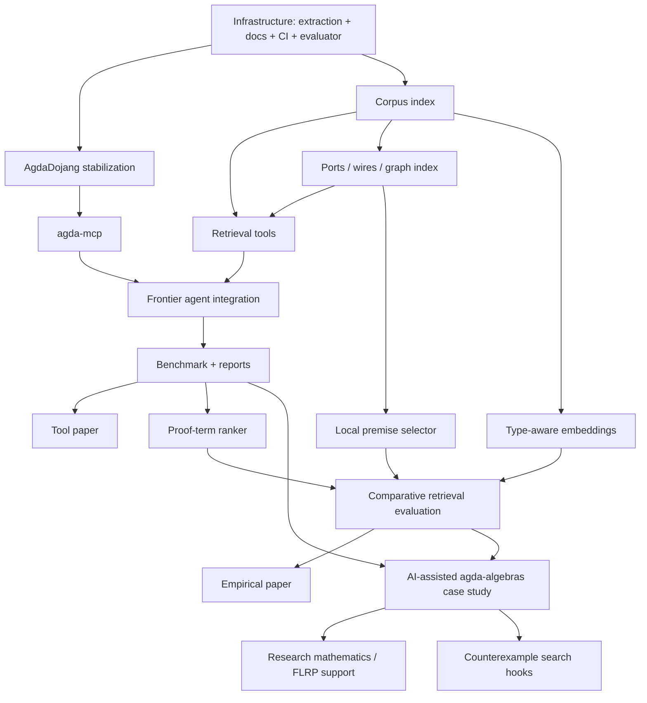

<!-- File: docs/PLAN.md -->

# PLAN.md — Agda-Native AI Reasoning Environment

**Version:** 2.2 (living document)
**Date:** 2026-03-07

**Companion docs:**

* `MANIFESTO.md` (why — the Agda-native AI reasoning environment vision)
* `PLAN.md` (what / when / how)
* `docs/representation.md` (data contracts)
* `docs/HowToRun.md` (how to run)

---

## 0. North Star

Build the **Agda-native reasoning environment**, the missing interaction layer
between frontier AI models and the Agda proof assistant, augmented by *local,
specialized models* for retrieval, ranking, and routine proof completion.
Create an environment where any sufficiently capable LLM can reason effectively
with Agda.

In practical terms, this will be achieved by developing and integrating four essential components.

1. **interaction** — a programmatic interface to Agda proof states and hole filling;
2. **retrieval** — a structured corpus and search layer over Agda libraries;
3. **evaluation** — deterministic fixtures, logs, and success metrics;
4. **selective learning** — local specialist models for narrow tasks where they are genuinely useful.

The long-term horizon remains ambitious,

> *an AI system that assists with proof development, library growth, counterexample discovery, and eventually mathematical exploration*,

but the near-term deliverable is much sharper,

> *a reproducible, publishable Agda-native environment in which Agda remains the final oracle of correctness*.


### What success looks like

1.  **Interaction foundation**.  `agda-dojang` exposes a stable, testable action surface for goal inspection, hole filling, and diagnostics.
2.  **Bridge foundation**.  `agda-mcp` lets frontier agents interact with Agda through a standard protocol.
3.  **Retrieval foundation**.  Canonical corpus extraction and derived views support useful search over theorems, definitions, dependencies, and interfaces.
4.  **Evaluation foundation**.  A fixed benchmark of proof obligations runs deterministically and produces machine-readable reports.
5.  **Demonstration**.  Real proofs in `agda-algebras` and fixture modules are completed with AI assistance and typecheck reproducibly.
6. **Publication**.  At least one tool paper and one empirical paper emerge from the above.

---

## 1. Guiding Principles

### 1.1 Build the environment, not the brain

Frontier LLMs improve monthly.  Our job is to give them the best possible interface
to Agda, not to train a competing general reasoner.

The environment consists of four main components.

+  **interaction layer** (`agda-dojang`),
+  **bridge layer** (`agda-mcp`),
+  **retrieval layer** (structured corpus + search),
+  **evaluation layer** (fixtures, metrics, deterministic reports, benchmarks,
   typecheck-based scoring).

This will provide a laboratory for Agda-native AI experimentation.

### 1.2 Local models are specialist tools

We still care about local models — but only where they are well motivated.

Where a small, domain-specific model outperforms a general LLM, we train and
run locally.

**Examples**.

+  premise selection,
+  type-aware embeddings,
+  proof-term ranking,
+  *routine* proof completion.

Local models are *tools in the environment*, not replacements for the frontier model.

(Potential target hardware: NVIDIA Jetson AGX Orin 64GB, or equivalent desktop GPU;
constrains us to models ≤ 7B–13B (QLoRA fine-tuning) or ≤ 30B (quantized inference);
for specialized tasks (ranking, embeddings), 1B–3B models are likely sufficient.)

### 1.3 Keep the canonical schema tiny

The canonical JSONL row should remain small and stable:

+  identity (`prettyQname`, module, location),
+  statement (`type`, `typeAst`, `typeAstVersion`),
+  optional body (`body`, `hasBody`),
+  dependencies (`dependencies`).

Anything richer is a **derived view** produced by ETL.

### 1.4 Version anything structural

Structural encodings must be explicitly versioned. We prefer additive evolution to
breaking change.

For instance, `typeAstVersion` already exists; we'll keep that approach, but add
future versions as new fields or values, limiting breaking changes to major
milestones/versions.


### 1.5 Agda remains the final arbiter

All external tools — frontier LLMs, local models, SMT solvers, retrieval
engines — are *supporting actors*.  They propose candidates. **Agda verifies**.

Frontier models propose, local models rank or retrieve, other tools may suggest
examples or counterexamples, but Agda is the source of truth.

### 1.6 Publishable increments matter

Each phase should produce something that is independently useful---a tool, a dataset,
an evaluation result, or a paper-ready experiment.

---

## 2. Architecture Snapshot

```
┌──────────────────────────────────────────────────────────┐
│                    User / Editor                         │
│            (Emacs agda2-mode / VSCode / CLI)             │
└──────────────────────┬───────────────────────────────────┘
                       │
                       ▼
┌──────────────────────────────────────────────────────────┐
│              Frontier LLM Agent                          │
│         (Claude Code / Codex CLI / etc.)                 │
│                                                          │
│  Handles: strategy, planning, novel reasoning,           │
│           error interpretation, proof decomposition      │
└──────────────────────┬───────────────────────────────────┘
                       │ MCP
                       ▼
┌──────────────────────────────────────────────────────────┐
│                   agda-mcp server                        │
│                                                          │
│ Proof state tools:   get-goal, fill-hole, check-file,    │
│                      get-diagnostics                     │
│                                                          │
│ Search / retrieval   find-by-type, find-by-name,         │
│   tools:             dependency-neighbors,               │
│                      premise-select (neural)             │
│                                                          │
│  Context / file      get-file, list-modules,             │
│    tools:            inspect-dependency-graph            │
└────────┬────────────────────────────┬────────────────────┘
         │                            │
         ▼                            ▼
┌─────────────────┐     ┌───────────────────────────────────┐
│   AgdaDojang    │     │  Local models (GPU / Jetson)      │
│                 │     │                                   │
│ Programmatic    │     │  |- premise selector (QUILL-like) │
│ interaction     │     │  |- type-aware embeddings         │
│ with Agda:      │     │  |- proof-term ranker             │
│ |- get goal     │     │  |- routine proof completer (7B)  │
│ |- fill hole    │     │                                   │
│ |- type-check   │     │  (Optional — system works         │
│ |- diagnostics  │     │   without these, just slower)     │
└────────┬────────┘     └───────────────────────────────────┘
         │
         ▼
┌─────────────────┐
│      Agda       │
│  (typechecker   │
│   = oracle)     │
└─────────────────┘
```

**Key design property**.  The system works end-to-end with just `agda-dojang`,
`agda-mcp`, a frontier LLM, and Agda.  Local models are optional accelerators and
experimental components---they can improve performance and retrieval quality, reduce
API costs, and enable offline/low-connectivity use---but they are not prerequisites. 

---

## 3. Data Extraction and Representation

### 3.1 Why extract data?

Data extraction serves three purposes (none of which is "train a general-purpose prover").

1.  **Retrieval corpus**.  `agda-mcp` server's search tools need a structured, queryable
    index of Agda libraries (types, dependencies, interfaces) for search, navigation,
    and prompt context; this is the primary consumer of canonical JSONL rows.
2.  **Evaluation source**.  We need curated proof obligations, known solutions, and
    graph views for reproducible experiments.
3.  **Specialized model training**.  Premise selection, embedding, and ranking models
    are trained on corpus data; these are narrow tasks where small models trained on
    domain-specific data can outperform general LLMs.

### 3.2 Canonical rows vs. derived views

**Canonical definition rows** are the stable base layer.
They are designed to support indexing, joins, debugging, derived dataset
construction, and compatibility across experiments.

**Derived views** are where experimentation happens.  Some planned or existing
examples are the following:

+  structural AST views;
+  ports / wires / interface descriptions;
+  graph edge lists;
+  fixture proof-completion datasets;
+  embedding pairs;
+  candidate-ranking examples.

### 3.4 Relationship to AGDA2TRAIN

Our extractor and AGDA2TRAIN are complementary rather than redundant.

+  **agda-native extractor** (`agda-strux`) is definition-level, compact, stable, and retrieval-friendly.
+  **Agda2Train** is interaction-state-level, larger, and ideal for premise-selection or proof-step learning.

A future collaboration should treat these as two views of the same ecosystem:

+  **Agda2Train** for subterm/proof-state learning,
+  **agda-native extraction pipeline** for indexing, retrieval, graph analysis, and prompt context.


|                       | agda-strux                                  | AGDA2TRAIN                                  |
|-----------------------|---------------------------------------------|---------------------------------------------|
| **Granularity**       | One row per definition                      | Many states per definition (sub-term level) |
| **Primary use**       | Retrieval, graph, LLM context               | Training neural proof-step predictors       |
| **Unique strength**   | Ports/wires, dependency graph, clean schema | Full typing context at every sub-term       |
| **Output size**       | Compact                                     | Very large                                  |
| **Human readability** | High                                        | Low                                         |


---

## 4. Roadmap

## Phase 0 — Solid infrastructure (current)

**Goal**.  Make corpus extraction, validation, and evaluation boringly reliable.

### Deliverables

+  canonical JSONL extraction works on `agda-algebras` and stdlib slices;
+  extraction can resume and emit diagnosable manifests/logs;
+  `docs/representation.md` is current and accurate;
+  the deterministic proof-completion evaluator works on committed fixtures;
+  CI passes; `clone → nix develop → tests → extraction → eval` is documented and
   reproducible.

### Existing issue threads carried forward

+ extraction reliability / resumability / docs;
+ structural AST and ETL chain;
+ schema correctness (`prettyQname`, operator cases);
+ evaluator + fixture policy + bridge integration.

### Exit criterion

A new collaborator can reproduce the extraction and fixture evaluation story without
tribal knowledge.

---

## Phase 1 — agda-dojang + agda-mcp + first end-to-end proofs (near-term, 2–4 weeks)

**Goal**. Expose Agda cleanly to general-purpose agents and demonstrate real proof completion.

### Deliverables

1.  **Rename and stabilize AgdaDojang**.

    +  rename `agda-jang` → `agda-dojang`;
    +  preserve the existing deterministic bridge/evaluator behavior;
    +  tighten tests around the goal/context reporting and candidate-check loop.

2.  **Implement `agda-mcp`**.  A thin MCP wrapper over AgdaDojang with tools such as:

    + `get-goal`: inspect the type of a hole and its local context;
    + `fill-hole`: propose a candidate term and get typecheck feedback;
    + `check-file`: load/reload a file and get all diagnostics;
    + `search-by-name`: find definitions matching a name pattern;
    + `search-by-type`: find definitions with compatible type signatures;
    + `get-dependencies`: retrieve the dependency neighborhood of a definition.
    + `get-diagnostics`: retrieve error/success rates, other candidate feedback.

3.  **Frontier-agent integration**. Demonstrate Claude Code or another MCP-capable
    agent using `agda-mcp` to solve holes in fixture modules and a small
    `agda-algebras` slice.  Document what works and what doesn't.

4.  **Baseline benchmark**.  Curate 20–50 proof obligations from agda-algebras (holes
    with known solutions). Measure: success rate, number of iterations, wall-clock time.

5.  **Tool paper draft**.  Working title: "AgdaDojang / AgdaMCP: An Agda-Native
    Environment for AI-Assisted Proof Development."

### Exit criterion

A frontier agent can solve a nontrivial benchmark slice through the MCP interface with reproducible reports.

### Issue mapping

+ Update #23 (AgdaDojang ↔ policy integration) to target MCP protocol.
+ New issue: agda-mcp server implementation.
+ New issue: baseline evaluation benchmark (20–50 proof obligations).
+ New issue: Claude Code integration testing and documentation.


---


## Phase 2 — Retrieval and local specialists (medium-term, 4–10 weeks)

**Goal**. Improve proof success and usability through better, structure-aware
retrieval and training specialized, targeted local models.

### Deliverables

1.  **Ports / wires / graph layer**.  Carry forward the current ports/wires issue
    into the new public repo.

    **Output**: interface descriptions, body references, dependency edges,
    retrieval-friendly derived tables.

2.  **Retrieval inside `agda-mcp`**.  Build search tools using

    + exact and fuzzy name search,
    + type-signature matching,
    + graph-based retrieval and dependency neighborhoods,
    + later: structure-aware (neural) premise selection.

3.  **Train Local Models**.  For each of the examples below, try running it locally
    on Jetson or equivalent desktop GPU, and through the MCP interface, to see if it improves
    retrieval quality and proof success.  Compare with CPU performance.

    +  **Local premise selector**.  Train or adapt a QUILL-like premise selector for
       Agda corpora.

    +  **Proof-term ranker**.  Train/fine-tune a lightweight model (1B–3B) to rank
       candidate proof terms by likelihood of type-checking and predicts which
       candidates are most promising before invoking Agda.  This reduces Agda
       invocations in the propose-check-refine loop.

    +  **Type-aware embeddings**.  Build a small embedding model for semantic
       similarity across Agda types/definitions.

4.  **Comparative evaluation**.  Measure improvement from retrieval and local models
    vs. Phase 1 baseline (frontier model alone).

    Compare

    +  text-only retrieval,
    +  type-based retrieval,
    +  graph-based retrieval,
    +  local-model-enhanced retrieval,
    +  hybrid frontier + local systems.

5.  **Research paper draft**.  Working title: "Structure-Aware Retrieval for
    AI-Assisted Proof Development in Agda" — compare retrieval strategies (text-based
    vs. type-based vs. neural premise selection) on proof completion tasks.


### Exit criterion

Retrieval and ranking measurably improve the baseline benchmark over Phase 1.


---

## Phase 3 — Research mathematics and counterexample workflows (longer-term)

**Goal**.  Use the system to do real mathematics — formalize new results in universal
algebra and related areas with AI assistance.

### Deliverables

1.  **AI-assisted extension of `agda-algebras`**.   Use the environment to formalize
    and streamline results relevant to your active mathematical agenda; e.g., formalize
    results relevant to the finite lattice representation problem (FLRP).  Document
    the experience.

2.  **Conjecture and lemma exploration**.  Given a set of results, use the agent to suggest
    plausible extensions and attempt to prove or refute them; this can be an experimental
    capability, rather than a primary deliverable.

3.  **Counterexample search hooks**. Integrate optional external tools such as GAP,
    Mace4, or SMT-based finite-model search where appropriate, as additional MCP
    tools for searching for finite countermodels.

4.  **Mathematics Paper** or **Case-study Writeup**.  Write a paper with AI-assisted
    formal proofs, demonstrating the system on real research-level mathematics, and/or
    document what the system can and cannot do on research-flavored problems.

### Exit criterion

At least one credible AI-assisted formalization case study exists beyond fixture demos.

---

## Phase 4 — Routine local proof completion (stretch)

**Goal**.  Train a local 7B model (QLoRA on Jetson) that handles routine proof
obligations without calling the frontier model; support a local-only or mostly-local
mode for predictable obligations.

This is viable once we have enough successful proof completions from Phases 1–3 to
generate training data.  The model learns patterns like "this is a homomorphism
proof, apply the standard strategy" and handles the predictable 60% of proof
obligations locally, reserving the frontier model for genuinely novel situations.

**Deliverable**.  A local proof completion model that runs on Jetson (or equivalent
desktop GPU), with measured success rate on routine obligations vs. frontier model;
compare local-only, frontier-only, and hybrid modes; assess practical value on modest
hardware.

### Exit criterion

A local routine-completion model is useful enough to justify its maintenance cost.

---

## 5. Current Issue Map: What Carries Forward

We do **not** want to drag the entire old issue tracker into the public repo unchanged. We do want to preserve the best technical threads.

### Carry forward directly

+  structural AST / converter / ETL chain;
+  `prettyQname` correctness fixes;
+  extraction reliability / resumability / docs;
+  deterministic evaluator + fixture policy backend;
+  ports / wires / graph-view experiments;
+  AgdaJang-to-policy integration, reframed as AgdaDojang + MCP.

### Reframe or merge

+  FastAPI model-server issues → merge into `agda-mcp` / bridge discussion;
+  tactic-vocabulary / next-tactic / distribution-target issues → reframe as optional local-model experiments;
+  higher-level "AI mathematician" issues → move to longer-term research backlog.

### Defer

+  SMT-as-oracle-tactic work;
+  deep reflection-driven automation;
+  grand conjecture-generation pipelines;
+  anything that presumes a general-purpose locally trained prover.

---

## 6. Dependency Graph



---

## 7. Now / Next / Later

### NOW (1–2 weeks)

1. Finalize manifesto / plan / public narrative.
2. Decide the new public repository structure (`agda-native`).
3. Rename `agda-jang` → `agda-dojang` in docs and package names.
4. Preserve and verify the deterministic evaluator and fixture demo.
5. Finish or cleanly restate the extraction / ETL / representation chain.
6. Draft the `agda-mcp` API surface.

### NEXT (2–6 weeks)

1. Create the curated public repository.
2. Land AgdaDojang rename and compatibility shims if needed.
3. Implement first version of `agda-mcp`.
4. Run agent experiments on fixtures and a small `agda-algebras` slice.
5. Curate the public benchmark set.
6. Start the tool paper outline.

### LATER (6+ weeks)

1. Add graph-based retrieval and ports/wires.
2. Explore collaboration on premise selection.
3. Train first local specialist models.
4. Build a research-level case study in universal algebra.

---

## 8. Data Views and Derived Products

### 8.1 Canonical layer

Always present:

* identity,
* type string,
* structural AST,
* dependencies,
* optional body.

### 8.2 Derived retrieval layer

Examples:

* dependency edge lists,
* ports/wires,
* interface summaries,
* bounded neighborhoods,
* search indexes.

### 8.3 Derived evaluation layer

Examples:

* fixture proof-completion tasks,
* candidate logs,
* solved outputs,
* failure categories,
* success-rate dashboards.

### 8.4 Derived local-model datasets

Examples:

* premise-selection pairs,
* embedding pairs,
* candidate-ranking examples,
* routine-completion traces.

---

## 9. Research Hooks That Are Worth Keeping

These are intellectually interesting directions that should remain visible, but not block the main line.

### 9.1 Ports / wires / local interaction structure

This remains one of the most distinctive ideas in the project. It is worth keeping because it can influence:

* retrieval,
* curriculum,
* graph analytics,
* and structure-aware learning.

### 9.2 Cubical / equality-heavy tasks

We should design at least one benchmark slice that genuinely probes the “Why Agda?” thesis.

### 9.3 Counterexample workflows

Counterexample search should remain in scope, but as a focused supporting capability rather than as the main architecture.

---

## 10. Maintenance

This plan should remain short enough to guide action.

Update it when:

* a phase meaningfully changes,
* a new public milestone is created,
* the architecture changes,
* or an experimental direction graduates into a real deliverable.

The issue tracker should not be allowed to become the plan. The plan should explain the issue tracker.

---

## 11. Explicitly Dropped or Deferred from the Old Plan

The following are no longer central:

* training a general-purpose local Agda prover;
* FastAPI as the main integration story;
* next-tactic / next-step modeling as the identity of the project;
* broad AI-mathematician behaviors as near-term deliverables;
* deep SMT / reflection-driven automation.

These directions are deferred for sequencing reasons, not because they are
uninteresting; in fact, they may become some of the most Agda-distinctive research
directions once the core environment is stable.
