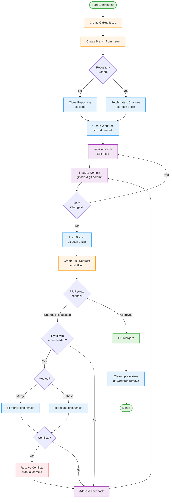

# Development Workflow Guide

This guide describes the recommended workflow for contributing to the agda-ai-prover project using GitHub issues, branches, and git worktrees.

**Looking for quick commands?** See the [Workflow Cheatsheet](WORKFLOW-Cheatsheet.md) for a condensed reference guide.

**Want a visual overview?** See the [Workflow Flowchart](#workflow-flowchart) at the bottom of this page for a graphical depiction of the complete workflow.

---

## Table of Contents

1. [Creating a GitHub Issue](#1-creating-a-github-issue)
2. [Creating a Development Branch](#2-creating-a-development-branch)
3. [Cloning the Repository](#3-cloning-the-repository)
4. [Working with Git Worktrees](#4-working-with-git-worktrees)
5. [Pushing Changes and Creating Pull Requests](#5-pushing-changes-and-creating-pull-requests)
6. [Syncing, Rebasing, and Resolving Conflicts](#6-syncing-rebasing-and-resolving-conflicts)
7. [Appendix: SSH Key Setup](#appendix-ssh-key-setup-for-github)
8. [Workflow Flowchart](#workflow-flowchart)

---

## 1. Creating a GitHub Issue

### How to Create an Issue

1. Navigate to the [agda-ai-prover repository](https://github.com/formalverification/agda-ai-prover) on GitHub.
2. Click the **"Issues"** tab near the top of the page.
3. Click the green **"New issue"** button.
4. Fill in the issue form with a clear title and description.
5. Click **"Submit new issue"**.

### Issue Best Practices

Writing a good issue helps maintainers and contributors understand what needs to be done. Here are some guidelines:

**Clear and Descriptive Title**
- Use a concise title that summarizes the issue.
- Start with a tag in brackets if applicable (e.g., `[bug]`, `[feature]`, `[doc]`, `[refactor]`).
- Example: `[bug] Parser fails on nested dependent types`

**Detailed Description**
- **What**: Clearly describe the problem or feature request.
- **Why**: Explain why this issue matters and what problem it solves.
- **How** (optional): If you have ideas about implementation, include them.
- **Context**: Add relevant information like error messages, screenshots, or links to related issues.

**Reproducible Steps** (for bugs)
- List the exact steps needed to reproduce the problem.
- Include code snippets, commands, or configuration that triggers the issue.
- Specify your environment (OS, Agda version, etc.) if relevant.

**Expected vs. Actual Behavior**
- Describe what you expected to happen.
- Describe what actually happened.

**Labels and Assignees**
- Add appropriate labels to categorize the issue (bug, enhancement, documentation, etc.).
- Assign the issue to yourself if you plan to work on it, or leave it unassigned for others.

---

## 2. Creating a Development Branch

Once you've created an issue, GitHub makes it easy to create a branch specifically for working on that issue.

### Steps to Create a Branch from an Issue

1. **Open the issue** you created (or want to work on).

2. **Look at the right sidebar** of the issue page.

3. **Find the "Development" section** (you may need to scroll down slightly).

4. **Click "Create a branch"** link.
   - A dialog box will appear with branch creation options.

5. **Configure the branch**.
   - **Branch name**: GitHub suggests a name based on the issue title.
   - **Best practice**: Keep the issue number as a prefix (e.g., `99-fix-foobar`).
   - You can edit the branch name if needed.
   - **Repository**: Ensure the correct repository is selected.
   - **Branch source**: Typically, this should be `main` (the default branch).

6. **Click "Create branch"** or use the "Checkout locally" option.
   - The dialog provides commands to checkout the branch locally.
   - You can copy the branch name to your clipboard for later use.

### Branch Naming Best Practices

-  **Include the issue number**.
   Start with the issue number followed by a hyphen (e.g., `99-`)
-  **Use descriptive names**.
   Briefly describe what the branch is for (e.g., `99-fix-parser-bug`).
-  **Use hyphens, not spaces**.
   Separate words with hyphens (e.g., `feature-name`, not `feature name`).
-  **Keep it concise**.
   Aim for 2-5 words after the issue number.
-  **Use lowercase**.
   Branch names are case-sensitive, but lowercase is conventional.

**Examples:**
- `42-add-pytorch-model`
- `15-fix-jsonl-export`
- `7-update-readme`
- `103-refactor-proof-parser`

---

## 3. Cloning the Repository

Before you can work on code locally, you need to clone the repository to your machine.

### Prerequisites

You'll need:
- Git installed on your system
- A GitHub account
- SSH keys configured (see [Appendix](#appendix-ssh-key-setup-for-github) if you haven't set this up yet)

### Cloning with SSH (Recommended)

SSH is the recommended method because it's more secure and doesn't require entering your password repeatedly.

```bash
# Clone the repository using SSH
git clone git@github.com:formalverification/agda-ai-prover.git

# Navigate into the cloned repository
cd agda-ai-prover
```

### Cloning with HTTPS (Alternative)

If you prefer HTTPS or don't have SSH keys set up:

```bash
# Clone the repository using HTTPS
git clone https://github.com/formalverification/agda-ai-prover.git

# Navigate into the cloned repository
cd agda-ai-prover
```

**Note**: With HTTPS, you may need to enter your GitHub username and personal access token (not your password) when pushing changes.

### Verify Your Clone

After cloning, verify that everything worked:

```bash
# Check the remote configuration
git remote -v

# This should show:
# origin  git@github.com:formalverification/agda-ai-prover.git (fetch)
# origin  git@github.com:formalverification/agda-ai-prover.git (push)
```

---

## 4. Working with Git Worktrees

Git worktrees allow you to work on multiple branches simultaneously without switching back and forth. Each worktree is a separate directory with its own checked-out branch.

### Why Use Worktrees?

- **Work on multiple issues concurrently**. Keep each issue isolated in its own directory.
- **No context switching**. You don't need to stash or commit incomplete work to switch branches.
- **Clean builds**. Each worktree has its own build artifacts and state.
- **Easy comparison**. View different branches side-by-side.

### Setting Up a Worktree

Let's say you want to work on issue #99, which has a branch named `99-fix-foobar` that already exists on the remote repository.

#### Step 1: Fetch the Latest Branches

First, make sure you have the latest information about remote branches:

```bash
cd agda-ai-prover  # Your main repository directory
git fetch origin
```

#### Step 2: Create the Worktree

```bash
git worktree add -b 99-fix-foobar ../worktrees/99-fix-foobar origin/99-fix-foobar
```

**What this command does:**
- `git worktree add` creates a new worktree.
- `-b 99-fix-foobar` creates a new local branch named `99-fix-foobar`.
- `../worktrees/99-fix-foobar` is the directory where the worktree will be created (relative to your current location).
- `origin/99-fix-foobar` is the remote branch to track.

**Directory structure after this command:**
```
your-projects/
├── agda-ai-prover/          # Main repository (typically on main branch)
└── worktrees/
    └── 99-fix-foobar/       # Worktree for issue 99
```

#### Alternative: Creating a New Branch

If you're creating a brand new branch (not tracking a remote branch):

```bash
git worktree add -b 99-new-feature ../worktrees/99-new-feature main
```

This creates a new branch `99-new-feature` starting from the `main` branch.

### Working in a Worktree

```bash
cd ../worktrees/99-fix-foobar  # Navigate to your worktree.
git branch                     # Verify you're on the correct branch.

# Start making changes
# ... edit files ...

# Stage and commit your changes
git add .
git commit -m "Fix foobar issue"
```

### Managing Worktrees

```bash
# List all worktrees
git worktree list

# Remove a worktree (after you're done with it)
# First, navigate out of the worktree directory
cd ../../agda-ai-prover
git worktree remove ../worktrees/99-fix-foobar

# If the worktree directory was deleted manually, clean it up with:
git worktree prune
```

### Best Practices for Worktrees

- **Organize worktrees in a dedicated directory**. Use a `../worktrees/` directory to keep them organized.
- **Match directory names to branch names**. This makes it easy to know which directory contains which branch.
- **Clean up when done**. Remove worktrees after merging your PR to avoid clutter.
- **Don't nest worktrees**. Create worktrees alongside your main repository, not inside it.

---

## 5. Pushing Changes and Creating Pull Requests

After making changes in your worktree, you'll want to push them to GitHub and create a Pull Request (PR).

### Pushing Your Changes

#### Step 1: Stage and Commit Your Changes

```bash
git status                                    # Check which files have changed.
git add path/to/file1.agda path/to/file2.py   # Stage specific files;
git add .                                     # or stage all changes.

# Commit with a descriptive message:
git commit -m "Implement proof automation for theorem X"
```

#### Commit Message Best Practices

- Use the imperative mood; e.g., "Add feature" not "Added feature."
- Keep the first line under 50 characters.
- Add a blank line, then a detailed description if needed.
- Reference the issue number; e.g., "Fix parsing bug (closes #99)."

#### Step 2: Push to GitHub

```bash
# Push your branch to the remote repository
git push origin 99-fix-foobar

# If this is your first push on this branch, you might need:
git push -u origin 99-fix-foobar
```

### Creating a Pull Request

#### Method 1: Using the GitHub Link (Easiest)

After pushing, Git often displays a link in the terminal:

```
remote: Create a pull request for '99-fix-foobar' on GitHub by visiting:
remote:   https://github.com/formalverification/agda-ai-prover/pull/new/99-fix-foobar
```

Click or copy-paste this link into your browser to create the PR.

#### Method 2: Through GitHub Web Interface

1. Navigate to the repository on GitHub.
2. Click the **"Pull requests"** tab.
3. Click **"New pull request"**.
4. Select your branch (`99-fix-foobar`) as the "compare" branch.
5. Ensure `main` is selected as the "base" branch.
6. Review the changes.
7. Click **"Create pull request"**.

### Writing a Good Pull Request Description

- **Title**: Clear and concise summary of what the PR does
- **Description**: 
  - Explain **what** changes were made.
  - Explain **why** these changes were necessary.
  - Reference the original issue; e.g., "Closes #99" or "Fixes #99".
  - Describe any **testing** you did.
  - Note any **breaking changes** or **migration steps** required.
  - Add **screenshots** if UI changes are involved.

### PR Best Practices

- **Keep PRs focused**.  One PR should address one issue or feature.
- **Request reviews**.  Tag relevant maintainers or contributors for review.
- **Respond to feedback**.  Address review comments promptly and respectfully.
- **Keep it updated**.  If the base branch changes, rebase or merge to keep your PR current.
- **Use draft PRs**.  If work is not ready for review, create a draft PR to share progress.

---

## 6. Syncing, Rebasing, and Resolving Conflicts

As you work on your branch, the main branch may receive new commits. You'll need to integrate these changes to avoid conflicts when merging your PR.

### Fetching Updates from the Remote

Regularly fetch the latest changes:

```bash
git fetch origin                     # Fetch all branches from the remote.
git log --oneline main..origin/main  # Check if there are updates to main.
```

### Syncing Your Branch with Main

There are two main approaches: **merging** and **rebasing**.

#### Option 1: Merging (Simpler, Preserves History)

Merging creates a new commit that combines changes from main into your branch.

```bash
git checkout 99-fix-foobar      # Make sure you're on your feature branch.
git merge origin/main           # Merge the latest main into your branch.
git push origin 99-fix-foobar   # If there are no conflicts, push the changes.
```

**Pros**: 
- Preserves complete history
- Safer for beginners
- Good when multiple people work on the same branch

**Cons**: 
- Creates merge commits that can clutter history
- Less linear history

#### Option 2: Rebasing (Cleaner History)

Rebasing replays your commits on top of the latest main branch.

```bash
git checkout 99-fix-foobar      # Make sure you're on your feature branch.
git rebase origin/main          # Rebase onto the latest main.

# If there are no conflicts, push the changes:
git push origin 99-fix-foobar --force-with-lease
```

**Important**: Use `--force-with-lease` instead of `--force` when pushing after a rebase. This prevents accidentally overwriting someone else's work.

**Pros**: 
- Creates a linear, cleaner history
- Easier to understand the sequence of changes
- No merge commits

**Cons**: 
- Rewrites history (can be confusing for beginners)
- Requires force-pushing
- Not recommended if others are working on the same branch

### Resolving Merge Conflicts

Conflicts occur when both your branch and main have modified the same lines of code. Git cannot automatically decide which changes to keep.

#### Identifying Conflicts

When you try to merge or rebase, Git will tell you if there are conflicts:

```bash
CONFLICT (content): Merge conflict in src/ProofParser.agda
Automatic merge failed; fix conflicts and then commit the result.
```

#### Understanding Conflict Markers

Git marks conflicts in your files like this:

```agda
<<<<<<< HEAD
-- Your changes
theorem : ∀ x → x ≡ x
=======
-- Changes from main
lemma : ∀ x → x ≡ x
>>>>>>> origin/main
```

- `<<<<<<< HEAD`: Start of your changes (HEAD refers to your current branch)
- `=======`: Separator between conflicting versions
- `>>>>>>> origin/main`: End of changes from main

#### Resolving Conflicts Manually

1. **Open the conflicting file** in your text editor.
2. **Find the conflict markers** (`<<<<<<<`, `=======`, `>>>>>>>`).
3. **Decide which changes to keep**; keep yours, keep theirs, or combine both.
4. **Remove the conflict markers**.
5. **Save the file**.

   ```agda
   -- After resolution:
   theorem : ∀ x → x ≡ x  -- Keeping my version
   ```

6. **Mark the file as resolved**.

   ```bash
   git add src/ProofParser.agda
   ```

7. **Complete the merge or rebase**.

   ```bash
   git commit -m "Merge main into 99-fix-foobar"     # (for merge)
   git rebase --continue                             # (for rebase)
   ```

8. **Push the changes**.

   ```bash
   git push origin 99-fix-foobar                     # (for merge)
   git push origin 99-fix-foobar --force-with-lease  # (for rebase)
   ```

### Using a Merge Tool (Recommended for Complex Conflicts)

Merge tools provide a visual interface for resolving conflicts, making the process much easier.

#### Installing Meld (Cross-Platform)

+  **Linux**  
   ```bash
   sudo apt install meld  # Debian/Ubuntu
   sudo dnf install meld  # Fedora
   ```

+  **MacOS**  
   ```bash
   brew install meld
   ```

+  **Windows**  
   Download from [https://meldmerge.org](https://meldmerge.org)

#### Configuring Git to Use Meld

```bash
git config --global merge.tool meld
git config --global mergetool.meld.path /usr/bin/meld  # Adjust path as needed
```

#### Using Meld to Resolve Conflicts

```bash
# After a conflict occurs, run:
git mergetool
```

This opens Meld with a visual interface for resolving conflicts:

**Understanding Meld's Interface**

When using `git mergetool` with Meld, you'll typically see:

1. **Left pane**: Your changes (LOCAL - the current branch you're on)
2. **Middle pane**: The common ancestor or base version (if available)
3. **Right pane**: The incoming changes (REMOTE - from the branch you're merging)
4. **Bottom pane** (if shown): The output/result file where you resolve conflicts

**How to use Meld**

- Review the differences highlighted in each pane.
- The conflict markers will be visible in the output pane.
- Choose which changes to keep by clicking the arrow buttons, or manually edit the output pane.
- You can copy chunks from the left pane (your changes) or right pane (their changes).
- Manually edit the output to combine changes or write a custom resolution.
- Save the file (Ctrl+S or Cmd+S) when done.
- Close Meld - Git automatically marks the file as resolved.

Note that you shouldn't need to change anything in the left pane or the right pane, as those will not matter in the end.  Make changes to the middle pane (by bring things in from the left or right, or by manually editing the contents) and save the changes by clicking the down arrow icon above the middle pane.  When you close Meld, whatever you saved in the middle pane will be the new version of the file in the repository.

**After using Meld:**
```bash
git status               # Check that conflicts are resolved.

# Complete the merge or rebase:
git commit               # (for merge)
git rebase --continue    # (for rebase)
```

### Other Useful Merge Tools

- **kdiff3**: Another three-way merge tool (similar to Meld)
- **Beyond Compare**: Commercial tool with advanced features
- **VS Code**: Built-in merge conflict resolver (click "Merge Editor" when conflicts appear)
- **IntelliJ/PyCharm**: Built-in visual merge tool

### Aborting a Merge or Rebase

If things go wrong and you want to start over:

```bash
git merge --abort    # Abort a merge.
git rebase --abort   # Abort a rebase.
```

This returns your repository to the state before you started the merge or rebase.

### Best Practices for Conflict Resolution

- **Sync frequently**. Regularly merge or rebase to minimize conflicts.
- **Understand both versions**. Read the conflicting code carefully before deciding.
- **Test after resolving**. Always test your code after resolving conflicts.
- **Ask for help**. If you're unsure which changes to keep, consult with the original authors.
- **Use a merge tool**. For complex conflicts, visual merge tools save time and reduce errors.
- **Keep PRs small**. Smaller PRs have fewer conflicts and are easier to review.

---

## Appendix: SSH Key Setup for GitHub

SSH keys provide a secure way to authenticate with GitHub without entering your password every time.

### Checking for Existing SSH Keys

```bash
# Check if you already have SSH keys
ls -la ~/.ssh
```

Look for files named `id_rsa.pub`, `id_ecdsa.pub`, or `id_ed25519.pub`.

If you see these files, you already have SSH keys and can skip to [Adding Your SSH Key to GitHub](#adding-your-ssh-key-to-github).

### Generating a New SSH Key

#### Step 1: Create the Key Pair

```bash
# Generate a new SSH key (using Ed25519 algorithm, recommended)
ssh-keygen -t ed25519 -C "your_email@example.com"

# If your system doesn't support Ed25519, use RSA:
ssh-keygen -t rsa -b 4096 -C "your_email@example.com"
```

Replace `your_email@example.com` with your GitHub email address.

#### Step 2: Choose a Location and Passphrase

When prompted:

```
Enter file in which to save the key (/home/you/.ssh/id_ed25519):
```

Press **Enter** to accept the default location or specify a custom path if you have multiple keys.

```
Enter passphrase (empty for no passphrase):
```

Enter a **strong passphrase** for additional security (recommended) or press **Enter** for no passphrase (less secure but more convenient).

### Adding Your SSH Key to the SSH Agent

The SSH agent manages your keys and passphrases so you don't have to enter them repeatedly.

```bash
# Start the SSH agent in the background
eval "$(ssh-agent -s)"

# Add your SSH private key to the agent
ssh-add ~/.ssh/id_ed25519

# If you used RSA:
ssh-add ~/.ssh/id_rsa
```

### Adding Your SSH Key to GitHub

#### Step 1: Copy Your Public Key

```bash
# Copy the public key to your clipboard
# On Linux (with xclip):
xclip -selection clipboard < ~/.ssh/id_ed25519.pub

# On macOS:
pbcopy < ~/.ssh/id_ed25519.pub

# On Windows (Git Bash):
cat ~/.ssh/id_ed25519.pub | clip

# Or just display it and copy manually:
cat ~/.ssh/id_ed25519.pub
```

#### Step 2: Add the Key to Your GitHub Account

1. Go to [GitHub](https://github.com) and log in.
2. Click your **profile picture** in the top-right corner.
3. Click **"Settings"**.
4. In the left sidebar, click **"SSH and GPG keys"**.
5. Click **"New SSH key"** or **"Add SSH key"**.
6. In the "Title" field, add a descriptive label (e.g., "Personal Laptop" or "Work Desktop").
7. Select "Authentication Key" as the key type.
8. Paste your public key into the "Key" field.
9. Click **"Add SSH key"**.
10. Confirm your GitHub password if prompted.

### Testing Your SSH Connection

```bash
# Test your SSH connection to GitHub
ssh -T git@github.com

# You should see a message like:
# Hi username! You've successfully authenticated, but GitHub does not provide shell access.
```

If you see this message, your SSH key is correctly configured!

### Troubleshooting SSH

**"Permission denied (publickey)" error:**
- Ensure your public key is added to GitHub
- Check that the SSH agent is running: `eval "$(ssh-agent -s)"`
- Verify your key is added to the agent: `ssh-add -l`
- If not listed, add it: `ssh-add ~/.ssh/id_ed25519`

**"Bad permissions" error:**
```bash
# Fix permissions on your SSH directory
chmod 700 ~/.ssh
chmod 600 ~/.ssh/id_ed25519
chmod 644 ~/.ssh/id_ed25519.pub
```

### Using Multiple SSH Keys

If you need different keys for different GitHub accounts or services:

```bash
# Create a config file
nano ~/.ssh/config

# Add configuration for each host:
Host github.com
  HostName github.com
  User git
  IdentityFile ~/.ssh/id_ed25519

Host github-work
  HostName github.com
  User git
  IdentityFile ~/.ssh/id_ed25519_work
```

Then clone with the custom host:
```bash
git clone git@github-work:organization/repository.git
```

---

## Workflow Flowchart

The following diagram provides a graphical depiction of the complete Git/GitHub workflow for contributing to this repository:



**Color Key:**
- 🟢 **Green**: Start and completion points
- 🟡 **Yellow**: GitHub web interface actions
- 🔵 **Blue**: Git operations (local commands)
- 🟣 **Purple**: Code editing and commits
- 🔴 **Red**: Conflict resolution

---

## Additional Resources

- [GitHub Docs: About Issues](https://docs.github.com/en/issues/tracking-your-work-with-issues/about-issues)
- [GitHub Docs: About Pull Requests](https://docs.github.com/en/pull-requests/collaborating-with-pull-requests/proposing-changes-to-your-work-with-pull-requests/about-pull-requests)
- [Git Documentation: git-worktree](https://git-scm.com/docs/git-worktree)
- [GitHub Docs: Connecting to GitHub with SSH](https://docs.github.com/en/authentication/connecting-to-github-with-ssh)
- [Meld Merge Tool Documentation](https://meldmerge.org/)

---

## Questions or Feedback?

If you have questions about this workflow or suggestions for improvement, please [open an issue](https://github.com/formalverification/agda-ai-prover/issues) or reach out to the maintainers.

Happy coding! 🚀
