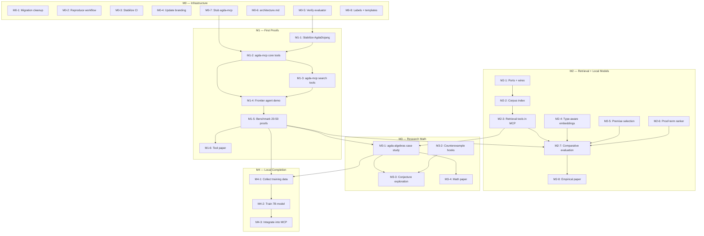

# agda-native-air — GitHub Project Roadmap

**Project Title:** Agda-Native AI Reasoning Environment  
**Repository:** `formalverification/agda-native-air`  
**Date:** 2026-03-13  

---


<!-- markdown-toc start - Don't edit this section. Run M-x markdown-toc-refresh-toc -->
**Table of Contents**

- [agda-native-air — GitHub Project Roadmap](#agda-native-air--github-project-roadmap)
  - [Project Description](#project-description)
  - [Milestones](#milestones)
    - [Milestone 0 — Solid Infrastructure](#milestone-0--solid-infrastructure)
    - [Milestone 1 — AgdaDojang + AgdaMCP + First End-to-End Proofs](#milestone-1--agdadojang--agdamcp--first-end-to-end-proofs)
    - [Milestone 2 — Retrieval Layer + Local Models](#milestone-2--retrieval-layer--local-models)
    - [Milestone 3 — Research Mathematics & Counterexample Workflows](#milestone-3--research-mathematics--counterexample-workflows)
    - [Milestone 4 — Routine Local Proof Completion (Stretch)](#milestone-4--routine-local-proof-completion-stretch)
  - [Issues](#issues)
    - [Milestone 0 — Solid Infrastructure](#milestone-0--solid-infrastructure-1)
      - [Issue M0-1: Complete migration cleanup — move non-core work to `experiments/`](#issue-m0-1-complete-migration-cleanup--move-non-core-work-to-experiments)
      - [Issue M0-2: Verify and document the `clone → nix develop → test → eval` workflow](#issue-m0-2-verify-and-document-the-clone--nix-develop--test--eval-workflow)
      - [Issue M0-3: Stabilize CI — add smoke target and ensure all jobs are green](#issue-m0-3-stabilize-ci--add-smoke-target-and-ensure-all-jobs-are-green)
      - [Issue M0-4: Remove stale references and update docs for `agda-native-air` branding](#issue-m0-4-remove-stale-references-and-update-docs-for-agda-native-air-branding)
      - [Issue M0-5: Preserve and verify deterministic fixture-based proof completion](#issue-m0-5-preserve-and-verify-deterministic-fixture-based-proof-completion)
      - [Issue M0-6: Write `docs/architecture.md` — document the three-layer system](#issue-m0-6-write-docsarchitecturemd--document-the-three-layer-system)
      - [Issue M0-7: Stub `agda-mcp/` directory with README and roadmap](#issue-m0-7-stub-agda-mcp-directory-with-readme-and-roadmap)
      - [Issue M0-8: Seed labels and issue templates for the repo](#issue-m0-8-seed-labels-and-issue-templates-for-the-repo)
    - [Milestone 1 — AgdaDojang + AgdaMCP + First End-to-End Proofs](#milestone-1--agdadojang--agdamcp--first-end-to-end-proofs-1)
      - [Issue M1-1: Stabilize AgdaDojang — tighten tests and document the action space](#issue-m1-1-stabilize-agdadojang--tighten-tests-and-document-the-action-space)
      - [Issue M1-2: Implement `agda-mcp` server — core proof-state tools](#issue-m1-2-implement-agda-mcp-server--core-proof-state-tools)
      - [Issue M1-3: Implement `agda-mcp` search tools — name and type search](#issue-m1-3-implement-agda-mcp-search-tools--name-and-type-search)
      - [Issue M1-4: Frontier agent integration — Claude Code + agda-mcp end-to-end demo](#issue-m1-4-frontier-agent-integration--claude-code--agda-mcp-end-to-end-demo)
      - [Issue M1-5: Curate baseline benchmark — 20–50 proof obligations from `agda-algebras`](#issue-m1-5-curate-baseline-benchmark--2050-proof-obligations-from-agda-algebras)
      - [Issue M1-6: Tool paper draft — "AgdaDojang / AgdaMCP: An Agda-Native Environment for AI-Assisted Proof Development"](#issue-m1-6-tool-paper-draft--agdadojang--agdamcp-an-agda-native-environment-for-ai-assisted-proof-development)
    - [Milestone 2 — Retrieval Layer + Local Models](#milestone-2--retrieval-layer--local-models-1)
      - [Issue M2-1: Emit `ports` + `wires` from agda-strux for knowledge-graph view](#issue-m2-1-emit-ports--wires-from-agda-strux-for-knowledge-graph-view)
      - [Issue M2-2: Build corpus index and graph from `agda-strux` output](#issue-m2-2-build-corpus-index-and-graph-from-agda-strux-output)
      - [Issue M2-3: Add retrieval tools to `agda-mcp` — corpus-backed search](#issue-m2-3-add-retrieval-tools-to-agda-mcp--corpus-backed-search)
      - [Issue M2-4: Train type-aware embedding model for semantic search](#issue-m2-4-train-type-aware-embedding-model-for-semantic-search)
      - [Issue M2-5: Train or integrate premise selection model (QUILL-like)](#issue-m2-5-train-or-integrate-premise-selection-model-quill-like)
      - [Issue M2-6: Train proof-term ranker — cheap filter before Agda invocations](#issue-m2-6-train-proof-term-ranker--cheap-filter-before-agda-invocations)
      - [Issue M2-7: Comparative retrieval evaluation — text vs. type vs. neural](#issue-m2-7-comparative-retrieval-evaluation--text-vs-type-vs-neural)
      - [Issue M2-8: Empirical paper draft — "Structure-Aware Retrieval for AI-Assisted Proof Development in Agda"](#issue-m2-8-empirical-paper-draft--structure-aware-retrieval-for-ai-assisted-proof-development-in-agda)
    - [Milestone 3 — Research Mathematics & Counterexample Workflows](#milestone-3--research-mathematics--counterexample-workflows-1)
      - [Issue M3-1: AI-assisted extension of `agda-algebras` — case study](#issue-m3-1-ai-assisted-extension-of-agda-algebras--case-study)
      - [Issue M3-2: Counterexample search hooks — integrate GAP / Mace4 / SMT as MCP tools](#issue-m3-2-counterexample-search-hooks--integrate-gap--mace4--smt-as-mcp-tools)
      - [Issue M3-3: Conjecture exploration workflow — experimental](#issue-m3-3-conjecture-exploration-workflow--experimental)
      - [Issue M3-4: Mathematics paper or case-study writeup](#issue-m3-4-mathematics-paper-or-case-study-writeup)
    - [Milestone 4 — Routine Local Proof Completion (Stretch)](#milestone-4--routine-local-proof-completion-stretch-1)
      - [Issue M4-1: Collect training data from successful proof completions](#issue-m4-1-collect-training-data-from-successful-proof-completions)
      - [Issue M4-2: Train routine proof completion model (7B, QLoRA on Jetson)](#issue-m4-2-train-routine-proof-completion-model-7b-qlora-on-jetson)
      - [Issue M4-3: Integrate local model into agda-mcp as optional completion backend](#issue-m4-3-integrate-local-model-into-agda-mcp-as-optional-completion-backend)
    - [Summary: Issue Index by Milestone](#summary-issue-index-by-milestone)
      - [M0 — Solid Infrastructure (8 issues)](#m0--solid-infrastructure-8-issues)
      - [M1 — AgdaDojang + AgdaMCP + First Proofs (6 issues)](#m1--agdadojang--agdamcp--first-proofs-6-issues)
      - [M2 — Retrieval + Local Models (8 issues)](#m2--retrieval--local-models-8-issues)
      - [M3 — Research Mathematics (4 issues)](#m3--research-mathematics-4-issues)
      - [M4 — Local Proof Completion (3 issues)](#m4--local-proof-completion-3-issues)
  - [Dependency Graph (Mermaid)](#dependency-graph-mermaid)
  - [Mapping from Prior-Repo Issues](#mapping-from-prior-repo-issues)
  - [How to Create This Project on GitHub](#how-to-create-this-project-on-github)
    - [Prerequisites](#prerequisites)
    - [Quick start](#quick-start)
    - [Notes](#notes)

<!-- markdown-toc end -->


## Project Description

Build the missing interaction layer between frontier AI models and the Agda proof
assistant.  The system has three core components — `agda-dojang` (interaction),
`agda-mcp` (MCP bridge), and `agda-strux` (structured corpus extraction) — plus
an optional local-model layer for specialized tasks.  The goal is an environment
where any sufficiently capable LLM can reason effectively with Agda.

---

## Milestones

### Milestone 0 — Solid Infrastructure

**Description:**  
Complete the migration from the prior private codebase to `agda-native-air`.  Stabilize
extraction, evaluation, CI, and documentation so that a new collaborator can
reproduce the full workflow without tribal knowledge.

**Exit criterion:** `clone → nix develop → tests → extraction → eval` is documented,
reproducible, and passes CI.

---

### Milestone 1 — AgdaDojang + AgdaMCP + First End-to-End Proofs

**Description:**  
Build the `agda-mcp` server, connect a frontier coding agent (Claude Code / Codex CLI)
to Agda, and get real proofs type-checking through the MCP interface.  Produce a
baseline benchmark and a tool paper draft.

**Exit criterion:** A frontier agent can solve a nontrivial benchmark slice through
the `agda-mcp` interface with reproducible reports.

---

### Milestone 2 — Retrieval Layer + Local Models

**Description:**  
Add structure-aware retrieval to `agda-mcp` (type-based search, dependency graph
navigation, neural premise selection).  Train narrow local models for premise
selection, type-aware embeddings, and proof-term ranking.

**Exit criterion:** Retrieval and ranking measurably improve the baseline benchmark
from Milestone 1.

---

### Milestone 3 — Research Mathematics & Counterexample Workflows

**Description:**  
Use the system for real mathematics — extend `agda-algebras` with AI assistance,
explore FLRP-relevant formalizations, and integrate counterexample search tools.

**Exit criterion:** At least one credible AI-assisted formalization case study exists
beyond fixture demos.

---

### Milestone 4 — Routine Local Proof Completion (Stretch)

**Description:**  
Train a local 7B model (QLoRA on Jetson) that handles routine proof obligations
without calling the frontier model.  This becomes viable once Milestones 1–3 generate
enough training data.

**Exit criterion:** A local routine-completion model is useful enough to justify its
maintenance cost.

---

## Issues

Below, each issue is tagged with its milestone (**M0**, **M1**, etc.), suggested
labels, and a full issue body ready for GitHub.


---
---

## Milestone 0 — Solid Infrastructure

---

### Issue M0-1: Complete migration cleanup — move non-core work to `experiments/`

**Labels:** `migration`, `cleanup`  
**Milestone:** 0 — Solid Infrastructure

#### Description

Move non-core files from the migration into `experiments/` or `experiments/archive/`
to keep the top-level repo focused on the three primary components (agda-dojang,
agda-strux, agda-mcp).

#### Tasks

- [ ] Move legacy ML pipeline training scripts (not used by current smoke tests) to
      `experiments/archive/ml-pipeline/`
- [ ] Move older policy backends to `experiments/archive/`
- [ ] Move researchy derived-view experiments to `experiments/`
- [ ] Move older roadmap material about conjecture generation to `experiments/archive/`
- [ ] Verify CI still passes after moves
- [ ] Update any remaining cross-references in docs

#### Acceptance criteria

- [ ] `experiments/` directory exists with a README explaining its contents
- [ ] Top-level directory layout matches `docs/public-history.md` §6
- [ ] CI passes; no broken imports or Make targets

---

### Issue M0-2: Verify and document the `clone → nix develop → test → eval` workflow

**Labels:** `docs`, `reproducibility`, `good first issue`  
**Milestone:** 0 — Solid Infrastructure

#### Description

A new collaborator should be able to follow a single document and reproduce the full
extraction + evaluation story.  Currently `docs/HowToRun.md` exists but may have
stale references from the migration.

#### Tasks

- [ ] Walk through `docs/HowToRun.md` on a clean checkout and fix any errors
- [ ] Verify `nix develop` provides all required tools (Agda, GHC, sbt, Python)
- [ ] Verify `make backend-test` (agda-strux Haskell tests) passes
- [ ] Verify `make eval-proof-completion-smoke` runs end-to-end
- [ ] Verify extraction path: document current status clearly (working / WIP / known issues)
- [ ] Add a "Quick Start" section at the top of HowToRun.md with ≤ 5 commands

#### Acceptance criteria

- [ ] A reviewer can follow the doc from scratch without asking for help
- [ ] Each Make target mentioned in docs either works or has a clear status note

---

### Issue M0-3: Stabilize CI — add smoke target and ensure all jobs are green

**Labels:** `ci`, `infrastructure`  
**Milestone:** 0 — Solid Infrastructure

#### Description

Ensure the CI workflow (`.github/workflows/`) covers the four core test lanes:
Scala proof-parser, Scala ETL, Python ml-pipeline, and Haskell backend.  Add a
top-level smoke target that exercises the minimum end-to-end path.

#### Tasks

- [ ] Audit current CI workflow against the four test jobs
- [ ] Fix any failures or stale references from the migration
- [ ] Add `make ci-smoke` (or equivalent) that runs the minimal suite locally
- [ ] Ensure CI is time-bounded (< 15 min total)
- [ ] Add CI badge to README.md

#### Acceptance criteria

- [ ] CI passes on `main` with all four lanes green
- [ ] `make ci-smoke` exists and passes locally
- [ ] CI badge appears in README

---

### Issue M0-4: Remove stale references and update docs for `agda-native-air` branding

**Labels:** `docs`, `cleanup`  
**Milestone:** 0 — Solid Infrastructure

#### Description

Scrub all docs, Makefiles, and source comments for residual stale branding
and old issue numbers.  Replace with `agda-native-air`, `AgdaDojang`,
`agda-dojang`, `agda-mcp` as appropriate.

#### Tasks

- [x] Search docs, Makefiles, and source files for stale references
- [x] Fix all occurrences (rename or remove as appropriate)
- [x] Remove or update old issue references (e.g., `#23`, `#65` from the old repo)
- [x] Ensure `docs/representation.md` is current
- [x] Remove FastAPI-first framing from any surviving docs

#### Acceptance criteria

- [x] Stale branding (`agda-ai-prover`, old `agda-jang`, `AgdaJang`) returns zero results outside `docs/public-history.md` and `CHANGELOG`
- [x] No doc references to issue numbers from the old repo without context

---

### Issue M0-5: Preserve and verify deterministic fixture-based proof completion

**Labels:** `eval`, `agda-dojang`, `infrastructure`  
**Milestone:** 0 — Solid Infrastructure

#### Description

The evaluator + fixture suite from the old repo is a critical asset.  Verify that
the deterministic proof-completion pipeline still works end-to-end after migration.

#### Tasks

- [ ] Verify `make eval-proof-completion-smoke` passes
- [ ] Verify `make eval-proof-completion` passes (if fixtures are present)
- [ ] Ensure fixture files exist under `data/fixtures/` (or equivalent)
- [ ] Confirm evaluation report schema is documented
- [ ] Add a brief section to `docs/HowToRun.md` explaining how to run the evaluator

#### Acceptance criteria

- [ ] `make eval-proof-completion-smoke` passes deterministically (same output on repeated runs)
- [ ] At least one fixture hole is solved (typechecks) in the smoke run
- [ ] Fixtures and their gold solutions are committed and documented

---

### Issue M0-6: Write `docs/architecture.md` — document the three-layer system

**Labels:** `docs`  
**Milestone:** 0 — Solid Infrastructure

#### Description

Create a standalone architecture document that explains the three-layer system
(agda-dojang, agda-mcp, agda-strux) with the ASCII diagram from PLAN.md, component
roles, data flow, and how local models fit in.

#### Tasks

- [ ] Create `docs/architecture.md`
- [ ] Include the system architecture diagram from PLAN.md §2
- [ ] Document each layer's role, inputs, outputs, and current status
- [ ] Explain the "works without local models" design property
- [ ] Link to MANIFESTO.md for vision and PLAN.md for roadmap
- [ ] Link from README.md

#### Acceptance criteria

- [ ] `docs/architecture.md` exists, is linked from README
- [ ] A newcomer can read it and understand how the pieces fit together

---

### Issue M0-7: Stub `agda-mcp/` directory with README and roadmap

**Labels:** `agda-mcp`, `docs`  
**Milestone:** 0 — Solid Infrastructure

#### Description

Create the `agda-mcp/` directory structure with a README that describes the planned
MCP server, its tool surface, and how it wraps `agda-dojang`.  This gives the MCP
work a home before implementation begins in Milestone 1.

#### Tasks

- [ ] Create `agda-mcp/README.md`
- [ ] Document the planned tool surface: `get-goal`, `fill-hole`, `check-file`,
      `search-by-name`, `search-by-type`, `get-dependencies`, `get-diagnostics`
- [ ] Reference the MCP protocol specification
- [ ] Note language choice (Haskell, wrapping agda-dojang) and rationale
- [ ] Include a "Status: not yet implemented" banner

#### Acceptance criteria

- [ ] `agda-mcp/README.md` exists and is referenced from `docs/architecture.md`
- [ ] Planned tool surface is enumerated with brief descriptions

---

### Issue M0-8: Seed labels and issue templates for the repo

**Labels:** `meta`, `good first issue`  
**Milestone:** 0 — Solid Infrastructure

#### Description

Set up standard GitHub infrastructure: issue labels, issue templates, and a
CODEOWNERS file (optional).

#### Tasks

- [ ] Create labels: `agda-dojang`, `agda-mcp`, `agda-strux`, `eval`, `docs`, `ci`,
      `infrastructure`, `retrieval`, `local-models`, `research`, `good first issue`,
      `migration`, `cleanup`, `paper`
- [ ] Create issue template for bug reports
- [ ] Create issue template for feature requests (with milestone field)
- [ ] Optionally add `.github/CODEOWNERS`

#### Acceptance criteria

- [ ] Labels exist on the repo
- [ ] At least one issue template is committed

---
---

## Milestone 1 — AgdaDojang + AgdaMCP + First End-to-End Proofs

---

### Issue M1-1: Stabilize AgdaDojang — tighten tests and document the action space

**Labels:** `agda-dojang`, `infrastructure`  
**Milestone:** 1 — AgdaDojang + AgdaMCP + First Proofs

#### Description

Before building the MCP layer, ensure AgdaDojang's core loop (goal inspection →
candidate proposal → typecheck feedback) is solid, well-tested, and documented.

Carries forward the spirit of old issues #6 (tests) and #20 (tactic vocabulary),
reframed for the new architecture.

#### Tasks

- [ ] Add regression tests covering: fixture loading, goal/context extraction,
      candidate proposal, typecheck pass/fail
- [ ] Document the action space (refine, apply, intro, etc.) in `agda-dojang/README.md`
- [ ] Add at least 3 fixture Agda files with holes of varying difficulty
- [ ] Ensure all tests pass in CI with bounded runtime
- [ ] Verify the bridge/evaluator deterministic behavior is preserved

#### Acceptance criteria

- [ ] `make test-agda-dojang` (or equivalent) runs ≥ 5 tests and passes
- [ ] Action space is documented with examples
- [ ] At least one fixture hole is solved by the scripted policy backend

---

### Issue M1-2: Implement `agda-mcp` server — core proof-state tools

**Labels:** `agda-mcp`, `agda-dojang`  
**Milestone:** 1 — AgdaDojang + AgdaMCP + First Proofs

#### Description

Implement the `agda-mcp` MCP server as a thin wrapper over AgdaDojang.  The first
version exposes only the proof-state tools; search/retrieval tools come in M2.

#### Planned tool surface (v0)

- `get-goal`: inspect the type of a hole and its local context
- `fill-hole`: propose a candidate term and get typecheck feedback
- `check-file`: load/reload a file and get all diagnostics
- `get-diagnostics`: retrieve error/success rates and candidate feedback

#### Tasks

- [ ] Choose MCP server framework (e.g., `mcp` Haskell library, or a thin HTTP/stdio bridge)
- [ ] Implement the four core tools listed above
- [ ] Define a stable JSON schema for requests and responses
- [ ] Add integration tests: start server, send tool calls, verify responses
- [ ] Document how to run the server locally

#### Acceptance criteria

- [ ] `agda-mcp` server starts and responds to tool calls
- [ ] All four core tools return well-formed JSON responses
- [ ] At least one hole is filled successfully via MCP tool calls in a test
- [ ] Server is documented in `agda-mcp/README.md`

---

### Issue M1-3: Implement `agda-mcp` search tools — name and type search

**Labels:** `agda-mcp`, `agda-strux`, `retrieval`  
**Milestone:** 1 — AgdaDojang + AgdaMCP + First Proofs

#### Description

Add search/retrieval tools to `agda-mcp` that allow the agent to find relevant
definitions from the corpus.  This is a basic version; neural premise selection
comes in M2.

#### Planned tools

- `search-by-name`: find definitions matching a name pattern (substring/regex)
- `search-by-type`: find definitions with compatible type signatures (exact or approximate match)
- `get-dependencies`: retrieve the dependency neighborhood of a definition

#### Tasks

- [ ] Build an in-memory index from `agda-strux` JSONL output
- [ ] Implement `search-by-name` with substring matching
- [ ] Implement `search-by-type` with at least string-level matching (structural matching is stretch)
- [ ] Implement `get-dependencies` using the `dependencies` field from JSONL
- [ ] Add integration tests with the corpus index

#### Acceptance criteria

- [ ] All three tools return relevant results on `agda-algebras` fixtures
- [ ] Agent can discover relevant lemmas for a proof goal via search tools

---

### Issue M1-4: Frontier agent integration — Claude Code + agda-mcp end-to-end demo

**Labels:** `agda-mcp`, `eval`  
**Milestone:** 1 — AgdaDojang + AgdaMCP + First Proofs

#### Description

Demonstrate a frontier coding agent (Claude Code or Codex CLI) using `agda-mcp` to
solve holes in fixture modules and a small `agda-algebras` slice.  Document what
works, what doesn't, and common failure modes.

#### Tasks

- [ ] Configure Claude Code (or equivalent) to connect to the `agda-mcp` server
- [ ] Run the agent on fixture modules with known solutions
- [ ] Run the agent on a small `agda-algebras` slice (5–10 proof obligations)
- [ ] Record: success/failure, number of iterations, wall-clock time, failure categories
- [ ] Write up findings in `docs/` or a `reports/` directory
- [ ] Document the agent configuration and setup steps

#### Acceptance criteria

- [ ] At least one non-trivial proof obligation is solved end-to-end by the agent
- [ ] A reproducible report exists documenting success rate and failure modes
- [ ] Setup instructions exist for others to replicate the demo

---

### Issue M1-5: Curate baseline benchmark — 20–50 proof obligations from `agda-algebras`

**Labels:** `eval`, `agda-strux`  
**Milestone:** 1 — AgdaDojang + AgdaMCP + First Proofs

#### Description

Curate a benchmark suite of 20–50 proof obligations from `agda-algebras` with known
solutions.  These serve as the standard evaluation set for all subsequent experiments.

#### Tasks

- [ ] Select proof obligations of varying difficulty (easy routine → moderate UA reasoning)
- [ ] Ensure each obligation has: stable module path, hole identifier, gold solution
- [ ] Commit fixtures under `data/benchmarks/agda-algebras-v0/`
- [ ] Create a benchmark runner that scores: success rate, iterations, wall-clock time
- [ ] Add `make eval-benchmark` target
- [ ] Document selection criteria and difficulty distribution

#### Acceptance criteria

- [ ] ≥ 20 benchmark obligations are committed with gold solutions
- [ ] `make eval-benchmark` runs deterministically and produces a JSON report
- [ ] Benchmark includes obligations of at least 3 difficulty levels

---

### Issue M1-6: Tool paper draft — "AgdaDojang / AgdaMCP: An Agda-Native Environment for AI-Assisted Proof Development"

**Labels:** `paper`, `docs`  
**Milestone:** 1 — AgdaDojang + AgdaMCP + First Proofs

#### Description

Write the first draft of a tool paper describing AgdaDojang and AgdaMCP, the
architecture, the benchmark results, and positioning relative to LeanDojo and
Numina-Lean-Agent.

#### Tasks

- [ ] Draft paper outline (intro, architecture, implementation, evaluation, related work, conclusion)
- [ ] Write architecture section referencing MANIFESTO and PLAN
- [ ] Include benchmark results from M1-5
- [ ] Include qualitative analysis from M1-4 (what works, what fails, why)
- [ ] Position relative to LeanDojo, Numina-Lean-Agent, and KMB (Agda2Train + QUILL)
- [ ] Identify target venue (ITP, ICFP, CAV, or workshop)

#### Acceptance criteria

- [ ] A complete draft exists (≥ 8 pages) in `papers/tool-paper/`
- [ ] Paper includes quantitative evaluation and architecture diagram
- [ ] Related work section covers at least 5 comparable systems

---
---

## Milestone 2 — Retrieval Layer + Local Models

---

### Issue M2-1: Emit `ports` + `wires` from agda-strux for knowledge-graph view

**Labels:** `agda-strux`, `retrieval`  
**Milestone:** 2 — Retrieval + Local Models

#### Description

Add optional fields `ports`, `refsFromBody`, and `wires` to the canonical JSONL
output.  These enable graph-based retrieval, curriculum heuristics, and structured
training tasks.

Carries forward old issue #61.

#### Tasks

- [ ] Implement `ports` extraction by peeling top-level Π-binders from `typeAst`
- [ ] Implement `refsFromBody` as heuristic identifier extraction from `body`
- [ ] Implement `wires = dedupe(dependencies ∪ refsFromBody)`
- [ ] Add fixture module with binders and where-lemma references
- [ ] Add regression tests asserting non-empty ports and correct wires
- [ ] Ensure backward compatibility (new fields are optional)

#### Acceptance criteria

- [ ] `ports`, `refsFromBody`, `wires` appear in extraction output for relevant definitions
- [ ] Existing required fields are unchanged
- [ ] Tests pass; fixtures committed

---

### Issue M2-2: Build corpus index and graph from `agda-strux` output

**Labels:** `agda-strux`, `retrieval`  
**Milestone:** 2 — Retrieval + Local Models

#### Description

Build an offline index from the JSONL corpus that supports fast lookup by name, type
signature, and graph neighborhood.  This index is loaded by `agda-mcp` at startup.

#### Tasks

- [ ] Design index data structures (inverted index for names/types, adjacency list for wires)
- [ ] Implement index builder as a Make target: `make build-corpus-index`
- [ ] Serialize the index to a binary format for fast loading
- [ ] Add graph statistics output: SCCs, fan-in/fan-out, connected components
- [ ] Document the index schema and query capabilities

#### Acceptance criteria

- [ ] `make build-corpus-index` produces an index from `agda-algebras` JSONL
- [ ] Index supports name search, type search, and k-hop neighborhood queries
- [ ] Graph statistics are reported (number of nodes, edges, SCCs)

---

### Issue M2-3: Add retrieval tools to `agda-mcp` — corpus-backed search

**Labels:** `agda-mcp`, `retrieval`  
**Milestone:** 2 — Retrieval + Local Models

#### Description

Upgrade the M1-3 search tools to use the offline corpus index.  Add `dependency-neighbors`
and improve `search-by-type` with structural matching.

#### Tasks

- [ ] Load corpus index at `agda-mcp` startup
- [ ] Upgrade `search-by-name` to use inverted index (faster than substring scan)
- [ ] Upgrade `search-by-type` to support structural matching via `typeAst`
- [ ] Add `dependency-neighbors`: given a definition, return k-hop neighborhood from the graph
- [ ] Benchmark query latency on `agda-algebras` corpus

#### Acceptance criteria

- [ ] Search tools return results in < 100ms on `agda-algebras` corpus
- [ ] `dependency-neighbors` returns structurally relevant results
- [ ] Agent integration demo (M1-4 style) shows improved success with better retrieval

---

### Issue M2-4: Train type-aware embedding model for semantic search

**Labels:** `local-models`, `retrieval`  
**Milestone:** 2 — Retrieval + Local Models

#### Description

Train a small encoder (~100M–400M parameters) on (type, relevant-lemma) pairs from
the corpus.  The resulting embeddings power approximate nearest-neighbor search in
`agda-mcp`.

#### Tasks

- [ ] Generate training pairs from the dependency graph and proof bodies
- [ ] Implement training script (sentence-transformer variant, PyTorch)
- [ ] Train on `agda-algebras` + stdlib subset
- [ ] Evaluate: retrieval recall@k on held-out definitions
- [ ] Export model for inference (ONNX or TorchScript for Jetson compatibility)
- [ ] Integrate into `agda-mcp` as optional embedding-based search

#### Acceptance criteria

- [ ] Model achieves measurably better recall@10 than TF-IDF baseline on held-out set
- [ ] Model size fits in Jetson AGX Orin memory with room for other models
- [ ] Integration with `agda-mcp` is optional (server works without the model)

---

### Issue M2-5: Train or integrate premise selection model (QUILL-like)

**Labels:** `local-models`, `retrieval`, `research`  
**Milestone:** 2 — Retrieval + Local Models

#### Description

Train (or integrate) a premise selection model that, given a goal type, ranks which
library lemmas are most likely useful.  This is a key opportunity for collaboration
with Kogkalidis/Melkonian.

#### Tasks

- [ ] Evaluate feasibility of using QUILL directly (check code availability, compatibility)
- [ ] If QUILL is not directly usable: train a simpler ranker (classifier on type pairs)
- [ ] Generate premise-selection training data from the corpus (goal → used lemmas)
- [ ] Evaluate on held-out proof obligations from the M1-5 benchmark
- [ ] Integrate as optional `premise-select` tool in `agda-mcp`
- [ ] Document collaboration opportunities with KMB in the README

#### Acceptance criteria

- [ ] Premise selection model exists and returns ranked lemma lists
- [ ] Model improves benchmark success rate when used as retrieval backend
- [ ] Integration path with QUILL is documented (even if not yet implemented)

---

### Issue M2-6: Train proof-term ranker — cheap filter before Agda invocations

**Labels:** `local-models`  
**Milestone:** 2 — Retrieval + Local Models

#### Description

Train a small classifier (1B–3B) that predicts whether a candidate proof term will
typecheck, without actually invoking Agda.  This reduces expensive Agda calls during
the propose-check-refine loop.

#### Tasks

- [ ] Collect training data: (goal, context, candidate, did_it_typecheck) pairs from M1 runs
- [ ] Implement a binary classifier (fine-tuned small LM or simple MLP on embeddings)
- [ ] Evaluate: precision/recall on held-out candidates
- [ ] Integrate into the propose-check loop as an optional pre-filter
- [ ] Measure end-to-end speedup (fewer Agda invocations per solved proof)

#### Acceptance criteria

- [ ] Ranker achieves > 70% precision at 80% recall on held-out candidates
- [ ] Integration reduces average Agda invocations per proof by a measurable amount
- [ ] Works on Jetson AGX Orin 64GB

---

### Issue M2-7: Comparative retrieval evaluation — text vs. type vs. neural

**Labels:** `eval`, `retrieval`, `paper`  
**Milestone:** 2 — Retrieval + Local Models

#### Description

Run a systematic comparison of retrieval strategies on the M1-5 benchmark:
text-based (TF-IDF), type-based (structural matching), and neural premise selection.
Measure impact on proof completion success rate.

#### Tasks

- [ ] Define evaluation protocol: for each benchmark obligation, measure retrieval
      recall@k and downstream proof success
- [ ] Run benchmark with each retrieval strategy independently
- [ ] Run benchmark with hybrid strategies (combine scores)
- [ ] Analyze results: which strategy helps which difficulty level?
- [ ] Write up results for the empirical paper

#### Acceptance criteria

- [ ] All three strategies are evaluated on the same benchmark
- [ ] Results table shows per-strategy success rate and retrieval metrics
- [ ] Statistical analysis includes confidence intervals or significance tests

---

### Issue M2-8: Empirical paper draft — "Structure-Aware Retrieval for AI-Assisted Proof Development in Agda"

**Labels:** `paper`, `research`  
**Milestone:** 2 — Retrieval + Local Models

#### Description

Write the empirical paper comparing retrieval strategies for AI-assisted Agda proof
development.  This is the second publication target.

#### Tasks

- [ ] Draft paper outline
- [ ] Include M2-7 comparative evaluation results
- [ ] Discuss the role of proof terms as retrieval signals (Hypothesis H1)
- [ ] Position relative to Lean retrieval work (ReProver, LeanDojo search)
- [ ] Discuss KMB collaboration and QUILL integration
- [ ] Identify target venue

#### Acceptance criteria

- [ ] Complete draft in `papers/retrieval-paper/`
- [ ] Paper includes quantitative comparison of ≥ 3 retrieval strategies

---
---

## Milestone 3 — Research Mathematics & Counterexample Workflows

---

### Issue M3-1: AI-assisted extension of `agda-algebras` — case study

**Labels:** `research`, `eval`  
**Milestone:** 3 — Research Mathematics

#### Description

Use the full system (agda-mcp + retrieval + frontier agent) to formalize and
streamline results in universal algebra.  Focus on areas relevant to the FLRP
or the active mathematical agenda.

#### Tasks

- [ ] Identify 3–5 candidate results for AI-assisted formalization
- [ ] Attempt each with the agent, recording the full interaction
- [ ] Document: what the agent did well, where it struggled, human intervention needed
- [ ] Commit successful formalizations to `agda-algebras` (or a fork)
- [ ] Write up the experience as a case study

#### Acceptance criteria

- [ ] At least 2 non-trivial results are formalized with AI assistance
- [ ] Detailed interaction logs exist for each attempt
- [ ] Case study document explains the process and lessons learned

---

### Issue M3-2: Counterexample search hooks — integrate GAP / Mace4 / SMT as MCP tools

**Labels:** `agda-mcp`, `research`  
**Milestone:** 3 — Research Mathematics

#### Description

Add optional MCP tools for searching for finite countermodels using external tools
(GAP for group-theoretic computations, Mace4 for finite model search, or SMT solvers).

#### Tasks

- [ ] Survey available counterexample tools and their API/CLI interfaces
- [ ] Implement at least one as an MCP tool (e.g., `search-countermodel`)
- [ ] Define the input format: translate Agda goal types into tool-compatible queries
- [ ] Test on known conjectures with known counterexamples
- [ ] Document limitations and supported fragment

#### Acceptance criteria

- [ ] At least one counterexample tool is callable via `agda-mcp`
- [ ] Tool successfully finds a counterexample for a known false conjecture

---

### Issue M3-3: Conjecture exploration workflow — experimental

**Labels:** `research`  
**Milestone:** 3 — Research Mathematics

#### Description

Given a set of formalized results, use the agent to suggest plausible extensions
(conjectures) and attempt to prove or refute them.  This is exploratory rather than
a core deliverable.

#### Tasks

- [ ] Define a small "conjecture suggestion" prompt template
- [ ] Run the agent on a cluster of related `agda-algebras` definitions
- [ ] Collect suggested conjectures (as Agda types)
- [ ] Attempt proof/refutation for each
- [ ] Categorize: proved / refuted / open / nonsensical
- [ ] Document the process and success rate

#### Acceptance criteria

- [ ] At least 10 conjectures are generated and attempted
- [ ] Results are documented with categories and analysis

---

### Issue M3-4: Mathematics paper or case-study writeup

**Labels:** `paper`, `research`  
**Milestone:** 3 — Research Mathematics

#### Description

Write a paper with AI-assisted formal proofs demonstrating the system on
research-level mathematics, and/or documenting what the system can and cannot do.

#### Tasks

- [ ] Incorporate M3-1 case study results
- [ ] Include any successful conjecture exploration results from M3-3
- [ ] Discuss the FLRP connection if relevant formalizations were attempted
- [ ] Position as a contribution to both AI-for-math and universal algebra communities
- [ ] Identify target venue (LICS, CSL, Algebra Universalis, or similar)

#### Acceptance criteria

- [ ] Complete draft exists in `papers/`
- [ ] Paper includes at least one formally verified result produced with AI assistance

---
---

## Milestone 4 — Routine Local Proof Completion (Stretch)

---

### Issue M4-1: Collect training data from successful proof completions

**Labels:** `local-models`, `eval`  
**Milestone:** 4 — Local Proof Completion

#### Description

Aggregate successful proof completions from Milestones 1–3 into a training dataset
for the routine completion model.

#### Tasks

- [ ] Design the training record schema: (goal, context, successful_term, iterations, source)
- [ ] Write a collector that extracts records from evaluation logs and interaction traces
- [ ] Run collection over all M1–M3 benchmark and case-study data
- [ ] Report dataset statistics: size, difficulty distribution, domain coverage
- [ ] Store under `data/training/routine-completion/`

#### Acceptance criteria

- [ ] Training dataset has ≥ 200 successful completion examples
- [ ] Dataset is documented with schema and statistics

---

### Issue M4-2: Train routine proof completion model (7B, QLoRA on Jetson)

**Labels:** `local-models`  
**Milestone:** 4 — Local Proof Completion

#### Description

Fine-tune a 7B LLM (QLoRA) on the collected training data.  The model should handle
predictable proof obligations (e.g., "this is a homomorphism proof — apply the
standard strategy") without calling the frontier model.

#### Tasks

- [ ] Select base model (CodeLlama-7B, DeepSeek-Coder-7B, or similar)
- [ ] Implement QLoRA training pipeline targeting Jetson AGX Orin 64GB
- [ ] Train on the M4-1 dataset
- [ ] Evaluate: success rate on routine subset of M1-5 benchmark
- [ ] Compare: local-only vs. frontier-only vs. hybrid modes
- [ ] Document model size, training time, inference latency

#### Acceptance criteria

- [ ] Model runs on Jetson AGX Orin with acceptable latency (< 30s per completion)
- [ ] Success rate on routine obligations is ≥ 50% (vs. baseline without the model)
- [ ] Comparison report exists for all three modes

---

### Issue M4-3: Integrate local model into agda-mcp as optional completion backend

**Labels:** `agda-mcp`, `local-models`  
**Milestone:** 4 — Local Proof Completion

#### Description

Add a `local-complete` tool to `agda-mcp` that uses the M4-2 model for routine
completions.  The agent can choose between local and frontier completion based on
estimated difficulty.

#### Tasks

- [ ] Add inference endpoint for the local model (HTTP or in-process)
- [ ] Implement `local-complete` MCP tool
- [ ] Add difficulty estimation heuristic (e.g., based on goal complexity, type depth)
- [ ] Implement routing logic: try local first for "easy" goals, fall back to frontier
- [ ] Measure end-to-end performance of hybrid mode

#### Acceptance criteria

- [ ] `local-complete` tool works end-to-end via MCP
- [ ] Hybrid mode reduces frontier API calls by a measurable amount
- [ ] System still works if local model is unavailable (graceful fallback)

---
---

## Summary: Issue Index by Milestone

### M0 — Solid Infrastructure (8 issues)

| ID | Title | Labels |
|-----|-------|--------|
| M0-1 | Complete migration cleanup | migration, cleanup |
| M0-2 | Verify `clone → nix develop → test → eval` workflow | docs, reproducibility |
| M0-3 | Stabilize CI | ci, infrastructure |
| M0-4 | Remove stale references, update branding | docs, cleanup |
| M0-5 | Preserve fixture-based proof completion | eval, dojang |
| M0-6 | Write `docs/architecture.md` | docs |
| M0-7 | Stub `agda-mcp/` directory | mcp, docs |
| M0-8 | Seed labels and issue templates | meta |

### M1 — AgdaDojang + AgdaMCP + First Proofs (6 issues)

| ID | Title | Labels |
|-----|-------|--------|
| M1-1 | Stabilize AgdaDojang | dojang, infrastructure |
| M1-2 | Implement agda-mcp core proof-state tools | mcp, dojang |
| M1-3 | Implement agda-mcp search tools | mcp, strux, retrieval |
| M1-4 | Frontier agent integration demo | mcp, eval |
| M1-5 | Curate baseline benchmark (20–50 obligations) | eval, strux |
| M1-6 | Tool paper draft | paper, docs |

### M2 — Retrieval + Local Models (8 issues)

| ID | Title | Labels |
|-----|-------|--------|
| M2-1 | Emit ports + wires from agda-strux | strux, retrieval |
| M2-2 | Build corpus index and graph | strux, retrieval |
| M2-3 | Add retrieval tools to agda-mcp | mcp, retrieval |
| M2-4 | Train type-aware embedding model | local-models, retrieval |
| M2-5 | Train/integrate premise selection (QUILL) | local-models, retrieval |
| M2-6 | Train proof-term ranker | local-models |
| M2-7 | Comparative retrieval evaluation | eval, retrieval, paper |
| M2-8 | Empirical paper draft | paper, research |

### M3 — Research Mathematics (4 issues)

| ID | Title | Labels |
|-----|-------|--------|
| M3-1 | AI-assisted agda-algebras case study | research, eval |
| M3-2 | Counterexample search hooks | mcp, research |
| M3-3 | Conjecture exploration workflow | research |
| M3-4 | Mathematics paper | paper, research |

### M4 — Local Proof Completion (3 issues)

| ID | Title | Labels |
|-----|-------|--------|
| M4-1 | Collect training data from completions | local-models, eval |
| M4-2 | Train routine completion model (Jetson) | local-models |
| M4-3 | Integrate local model into agda-mcp | mcp, local-models |

**Total: 29 issues across 5 milestones.**

---

## Dependency Graph (Mermaid)



---

## Mapping from Prior-Repo Issues

For reference, here is how old issues map to the new project:

| Old Issue | Status | New Issue | Notes |
|-----------|--------|-----------|-------|
| #6 (dojang tests) | Open → | M1-1 | Reframed for AgdaDojang |
| #8 (Nix flake) | Open → | M0-2 | Part of reproducibility |
| #15 (FP refactor) | Open → | Defer | Nice-to-have, not blocking |
| #20 (tactic vocabulary) | Open → | M1-1 | Merged into AgdaDojang stabilization |
| #21 (proof step target) | Open → | Defer | Subsumed by MCP + frontier model approach |
| #22 (next-tactic model) | Open → | Defer | Subsumed; local models are M2/M4 |
| #23 (FastAPI integration) | Closed ✓ | M1-2 | Reframed as MCP |
| #24 (editor integration) | Open → | Defer | Comes after M1-4; agent IS the editor integration |
| #25-29 (conjecture pipeline) | Open → | M3-1, M3-3 | Simplified; frontier model handles strategy |
| #61 (ports + wires) | Open → | M2-1 | Carried forward directly |
| #65 (trace → steps) | Open → | Defer | Not needed for MCP approach |
| #84-96 (proof completion) | Closed ✓ | M0-5, M1-5 | Evaluator preserved; benchmark expanded |

---

## How to Create This Project on GitHub

Use the companion script `gh_project_populate.py` to create milestones, labels,
and issues from this file.

### Prerequisites

- Python 3.8+
- `gh` CLI installed and authenticated
- The `agda-native-air` repo must already exist

### Quick start

The following commands assume the GitHub project/issue generation script is at
`scripts/python/gh_project_populate.py` and the Markdown file containing the
label/project/issue descriptions is `docs/roadmap.md`.

```zsh
# 1. Dry run — see what would be created:
python3 scripts/python/gh_project_populate.py docs/roadmap.md --repo formalverification/agda-native-air --dry-run

# 2. Create everything (will prompt for confirmation):
python3 scripts/python/gh_project_populate.py docs/roadmap.md --repo formalverification/agda-native-air

# 3. Or create in stages:
python3 scripts/python/gh_project_populate.py docs/roadmap.md --repo formalverification/agda-native-air --labels-only

python3 scripts/python/gh_project_populate.py docs/roadmap.md --repo formalverification/agda-native-air --milestones-only

python3 scripts/python/gh_project_populate.py docs/roadmap.md --repo formalverification/agda-native-air --issues-only

# 4. Resume if interrupted (e.g., start from issue M1-3):
python3 scripts/python/gh_project_populate.py docs/roadmap.md --repo formalverification/agda-native-air --issues-only --start-from M1-3
```

### Notes

- The script uses `env -u GH_TOKEN -u GITHUB_TOKEN` by default to work around
  token precedence issues.  Use `--no-env-prefix` to disable this.
- A 1.5-second delay between API calls avoids rate limiting (adjustable with `--delay`).
- Labels and milestones are idempotent — re-running skips existing ones.
- Issue titles are prefixed with `[M0-1]`, `[M1-2]`, etc. for easy identification.

